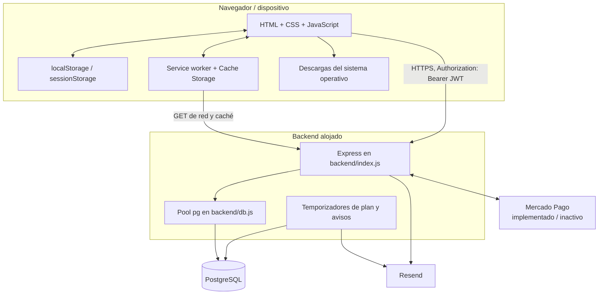

# Arquitectura técnica de CuidaDiario PRO B2B

**Corte de reconstrucción:** 6 de octubre de 2026, incluyendo cierre productivo de P0-C y P1-A/P1-B/P1-C/P1-D1/P1-D2/P1-D3; P1 completo está desplegado, verificado, documentado y cerrado
**Naturaleza:** descripción del código y de evidencia externa proporcionada; no es un diseño objetivo ni una certificación integral de producción.

Etiquetas: **[VERIFICADO]** comprobado en código o evidencia externa identificada; **[INFERIDO]** conclusión técnica no observada directamente; **[NO VERIFICADO]** requiere evidencia adicional; **[PENDIENTE]** brecha abierta; **[FUTURO]** diseño aún no implementado; **[COMPARTIDO - NO TOCAR B2C]** puede afectar ambos productos. Cuando se dice “exclusivo B2B” en prosa, la superficie pertenece sólo a PRO.

## 1. Vista de contexto



El proceso Node, la conexión PostgreSQL, la política CORS, el runner de migraciones y algunos helpers/proveedores son **[COMPARTIDO - NO TOCAR B2C]**. El aislamiento lógico B2B se apoya en nombres de tabla con sufijo `_b2b`, rutas `/api/b2b/`, la marca `b2b` del JWT y el filtro `institucion_id`.

## 2. Frontend B2B

### 2.1 Tecnología y despliegue observable

- HTML, CSS y JavaScript sin framework de componentes.
- PWA mediante `frontend/manifest.json` y `frontend/sw.js`.
- Dominio personalizado publicado: `cuidadiario-pro.edensoftwork.com`, también declarado en `frontend/CNAME`.
- Backend configurado en el cliente: URL HTTPS de Railway dentro de `frontend/js/api-b2b.js`.
- No existe un proceso de compilación frontend en el repositorio inspeccionado.

**[VERIFICADO]** El repositorio GitHub `edensoftwarework/cuidadiario-pro` usa GitHub Pages con **Deploy from a branch**, `main`, `/(root)`. La validación P0-1 acreditó que los archivos públicos correspondían al commit aprobado. Cloudflare administra/proxifica el DNS mediante un CNAME proxied; el target completo no se verificó. La pantalla mostraba **DNS Check in Progress** y “Enforce HTTPS” no disponible, mientras el acceso HTTPS público funcionó. No se observó Cloudflare Pages. Siguen **[NO VERIFICADO]** logs, región, retención y comportamiento efectivo de caché/proxy del frontend.

### 2.2 Páginas y controladores

| Página / entrada | Controlador principal | Responsabilidad |
|---|---|---|
| `index.html`, `landing.html` | scripts embebidos/estáticos | Entrada y presentación pública. |
| `login.html`, `register.html`, `reset-password.html`, `verify-email.html` | scripts embebidos + `api-b2b.js` | Identidad y recuperación/verificación. |
| `pages/onboarding.html` | `onboarding.js` | Alta/configuración inicial de institución. |
| `pages/dashboard.html` | `dashboard.js` | Resumen operacional. |
| `pages/pacientes.html` | `pacientes.js` | Listado, alta y egreso de residentes. |
| `pages/paciente.html` | `paciente.js` | Ficha y módulos operativos/clínicos del residente. |
| `pages/cuidador.html` | `cuidador.js` | Vista del personal de cuidado. |
| `pages/familiar.html` | `familiar.js` | Vista familiar condicionada por secciones habilitadas. |
| `pages/staff.html` | `staff.js` | Equipo, roles y asignaciones. |
| `pages/catalogo.html` | `catalogo.js` | Inventario y reposiciones. |
| `pages/reportes.html` | `reportes.js` | Reportes agregados. |
| `pages/configuracion.html` | `configuracion.js` | Institución, cuenta, permisos, plan y caché. |
| `admin-panel.html` | script embebido | Operación administrativa por clave separada. |

`api-b2b.js` centraliza HTTP, JWT y purga de caché GET B2B heredada. P0-3 retiró el productor/consumidor/sincronizador de mutaciones offline: una clave heredada `cd_offline_queue` no se lee ni se toca. P1-C separa el token/contexto del operador secundario y lo envía en `X-B2B-Operator-Token`. `utils-b2b.js` centraliza la guardia de página, roles, permisos visibles, navegación, campana, estado del plan, identificación de estación compartida y helpers de renderizado contextual seguro. Los controles visuales no sustituyen a los controles del backend.

Las 15 entradas B2B cargan `api-b2b.js` antes de `maintenance-b2b-v2.js`. El guard toma la base del binding global léxico `API_B2B.BASE_URL`, consulta sin credenciales y con `cache: no-store` el endpoint de estado, bloquea visualmente la UI cuando el backend informa mantenimiento y vuelve a consultar cada 5 s. No usa `localStorage`, Cache Storage ni `sw.js` como estado operativo.

Desde P1-B, `api-b2b.js` admite headers adicionales sólo por llamada y genera `Idempotency-Key` UUID para toma, completar tarea y subir documento. La misma key sólo se reutiliza si el llamador la conserva para reintentar el mismo intento; no hay reintento automático ni lectura de `cd_offline_queue`. **[VERIFICADO EN PRODUCCIÓN / CERRADO — 03/10/2026].**

## 3. Persistencia en el navegador

### 3.1 Claves confirmadas

| Superficie | Clave/patrón | Contenido | Persistencia después de logout |
|---|---|---|---|
| `localStorage` | `cd_pro_token` | JWT B2B. El cliente comprueba estructura, claim `b2b`, `exp` y `nbf`; la firma/autenticidad sólo puede validarla el backend. | En el código local P0-2 se elimina con logout, 401 o al cargar si falta/es localmente inválido o vencido. |
| `localStorage` | `cd_pro_user` | Perfil/sesión actual. | En el código local P0-2 se elimina con logout, 401 o ausencia de token localmente válido. |
| `localStorage` | `cd_pro_last_user` | Copia heredada del último perfil, antes usada para acceso offline. | P0-2 deja de escribirla/restaurarla y la elimina selectivamente al cargar, logout o 401. |
| `localStorage` | `cd_api_/api/b2b...` | Copia heredada de respuestas GET B2B creada por versiones anteriores. | **[VERIFICADO EN PRODUCCIÓN — 29/09/2026]:** se elimina selectivamente al cargar `api-b2b.js`; no se crean ni leen copias nuevas. Otras claves `cd_api_` se conservan. |
| `localStorage` | `cd_offline_queue` | Copia heredada que puede contener método, ruta, cuerpo, datos de salud y operaciones DELETE. | P0-3 la conserva byte a byte en cuarentena: el cliente no la lee, parsea, migra, ejecuta, transmite ni borra automáticamente. **[CERRADO — lógica controlada y gate productivo proporcional aprobados el 30/09/2026]** |
| `localStorage` | `stock_modelo`, `cd_shared_mode`, `cd_perm_config` | Preferencias operativas/compatibilidad. | Permanece salvo borrado explícito. |
| `sessionStorage` | `cd_active_worker` | Selección nominal heredada de estación compartida. | P1-C la elimina y no vuelve a usarla como identidad; P0-2 también la quita en logout/401. |
| `localStorage` | `cd_workers_recientes_${institucion_id}` | Nombres recientes del selector heredado. | P1-C elimina selectivamente la clave de la institución al iniciar la UI compartida; no se usa para autenticar. |
| `sessionStorage` | `cd_operator_token` | Token opaco exclusivamente de operador secundario; el servidor conserva sólo SHA-256. | Sólo la pestaña actual. Se elimina al volver al titular, finalizar/cambiar turno, por 60 min de inactividad, logout/401, expiración a 8 h o invalidación entre pestañas. El principal no usa esta clave. **[P1-C VERIFICADO EN PRODUCCIÓN — 04/10/2026]** |
| `sessionStorage` | `cd_operator_context`, `cd_operator_last_activity` | ID/nombre/rol/expiración públicos del operador y marca local de actividad humana. | Mismo ciclo que el token; no contiene PIN. **[P1-C VERIFICADO EN PRODUCCIÓN — 04/10/2026]** |
| Cache Storage | caché del service worker | Estáticos y respuestas GET no-B2B admitidas por su estrategia. Las entradas `/api/b2b/` heredadas se purgan por URL. | **[VERIFICADO EN PRODUCCIÓN — 29/09/2026]:** GET B2B network-only; estáticos y API no-B2B conservan su estrategia. |
| Historial/URL | token de verificación o recuperación | Query string usada por las páginas correspondientes. | Puede permanecer en historial, sincronización o registros del navegador. |
| Descargas | archivo exportado o documento | JSON o binario descargado. | Fuera del control posterior de la aplicación. |

**[VERIFICADO EN ENTORNO CONTROLADO — 30/09/2026]:** `removeToken()` elimina exclusivamente `cd_pro_token`, `cd_pro_user`, la clave heredada `cd_pro_last_user`, `sessionStorage.cd_active_worker` y las copias GET B2B cubiertas por P0-1. No borra ni reescribe `cd_offline_queue`, preferencias, nombres recientes de estación, claves no-B2B/B2C ni Cache Storage de forma indiscriminada. La acción separada de “limpiar caché” de configuración conserva su comportamiento anterior.

### 3.2 Flujo offline P0-2/P0-3 desplegado

```mermaid
sequenceDiagram
    participant UI as Pantalla B2B
    participant API as api-b2b.js
    participant LS as localStorage
    participant BE as Backend
    UI->>API: GET
    API->>LS: purga copias cd_api_/api/b2b... heredadas al cargar
    API->>BE: petición autenticada sólo por red
    BE-->>API: JSON no persistido por el cliente
    Note over API,LS: Sin red, GET B2B falla; no devuelve una copia anterior
    UI->>API: POST / PATCH / DELETE sin red
    API->>BE: intenta POST / PATCH / DELETE sólo por red
    BE--xAPI: fallo de red
    API-->>UI: error explícito; no simula persistencia
    Note over API,LS: cd_offline_queue heredada no se lee, modifica ni transmite
```

La implementación heredada generaba `_qid` sólo en el navegador, admitía DELETE y no separaba elementos por identidad o institución. **[VERIFICADO EN ENTORNO CONTROLADO — 30/09/2026]:** P0-3 retiró `_offlineQueue`, `_syncOfflineQueue`, sus timers/eventos y la falsa confirmación visual. POST/PATCH/DELETE requieren red y propagan el error real. La clave heredada permanece deliberadamente en cuarentena, sin procedimiento automático de recuperación o eliminación; cualquier reconciliación futura exige revisión humana.

**[VERIFICADO EN PRODUCCIÓN / CERRADO — 30/09/2026]:** el login offline heredado fue retirado. `login.html` no reconstruye `cd_pro_user`, la guardia protegida falla cerrada sin token localmente vigente y `verify-email.html` ya no recrea `cd_pro_last_user`. Logout y 401 dejan la misma ausencia de identidad local y selección activa de estación. La comprobación del cliente no valida firma ni estado remoto; P0-4 aporta la revalidación autoritativa ya desplegada en el backend.

La batería `frontend/tests/p0-2-session.test.js` aprobó 88 aserciones deterministas y `p0-3-offline-queue.test.js` aprobó 37. La suite real P0-A aprobó 15 aserciones en Chrome 153.0.8010.48 con perfil temporal y servidor sintético local: tres mutaciones offline fallaron, la cola conservó exactamente sus bytes y reconexión/reload generaron cero mutaciones automáticas. Esta lógica no se repitió exhaustivamente en producción. El commit `9ec220c` fue desplegado el 30/09/2026 y el gate productivo proporcional confirmó el código publicado, retiro de identidad heredada, preservación byte a byte de cola sintética tras `online`, cero requests al backend y cero mutaciones. P0-2/P0-3 quedan **CERRADOS**.

### 3.3 Service worker

**[VERIFICADO EN PRODUCCIÓN — 29/09/2026]:** `frontend/sw.js` reconoce exclusivamente `pathname === '/api/b2b'` o rutas iniciadas por `/api/b2b/` antes de las ramas genéricas y las atiende con `networkOnly`, sin escritura ni fallback de Cache Storage. En activación recorre las entradas y elimina sólo las que cumplen esa condición. Mantiene `networkFirstWithCache` para otras rutas `/api/` y hosts Railway/Render, `cacheFirst` para estáticos y `staleWhileRevalidate` para HTML. Conserva cachés API/no-B2B y cachés ajenas; la limpieza histórica de cachés estáticas propias obsoletas continúa.

La regresión final local del paquete conserva 35 aserciones automatizadas aprobadas en `frontend/tests/p0-1-cache.test.js`; la suite controlada de navegador, ampliada con regresiones P0-2 y control de assets, aprobó 69 aserciones. La verificación post-despliegue P0-1 mantiene sus 23 aserciones históricas en `frontend/tests/p0-1-production-readonly.test.js`. La prueba de producción utilizó Chrome 153.0.8010.48, perfil temporal, estado ficticio y cero llamadas al backend; confirmó instalación, activación, control y purga selectiva reales. Los SHA-256 normalizados de `sw.js` (`6e0ad212…a2eb`) y `js/api-b2b.js` (`92a1237d…bce3`) coincidieron entonces entre producción, el commit `ffb8ef595ed57a920dc9f0b1ee6e7927e13b8636` y los archivos P0-1 aprobados. El gate posterior del commit `9ec220c` volvió a acreditar P0-1 dentro del paquete consolidado.

El paquete P0-2/P0-3/P0-8 modifica los bytes del service worker para disparar su ciclo de actualización, incluye exactamente una vez `login.html` y `admin-panel.html` en `STATIC_ASSETS`, y sustituye por un enlace estático el antiguo `javascript:` de la página offline, conservando `CACHE_NAME = cuidadiario-pro-v6`. El `install` existente recarga `STATIC_ASSETS` con `cache: reload` dentro del mismo caché, por lo que navegadores instalados reciben los assets B2B nuevos sin eliminar entradas estáticas ajenas/no-B2B. No cambia `CACHE_NAME_API`, `isB2BApiUrl`, `networkOnly`, la purga selectiva ni las estrategias de request. **[VERIFICADO EN PRODUCCIÓN MEDIANTE GATE PROPORCIONAL — 30/09/2026; COMPARTIDO - NO TOCAR B2C]**

**[BLOQUEANTE FRONTEND P1 RESUELTO EN ENTORNO CONTROLADO — 01/10/2026; DESPLEGADO 03/10/2026]:** se modificó únicamente el comentario identificador del paquete en `frontend/sw.js`, de P0-2/P0-3/P0-8 a P0-2/P0-3/P0-8/P1-B. El cambio de bytes fuerza el ciclo estándar de actualización del service worker sin cambiar `CACHE_NAME`, rutas ni estrategias; su `install` existente vuelve a solicitar `STATIC_ASSETS` con `cache: reload` y sustituye `js/api-b2b.js` dentro de `cuidadiario-pro-v6`. Un arnés Chrome real con perfil temporal instaló primero el SW P0 exacto por hash (`27449291…18ad`) y un cliente P0 equivalente sin idempotencia, publicó luego los bytes P1 y observó `updatefound`, activación y control del nuevo SW (`66688605…b3b8`). El cliente servido por el navegador terminó con SHA-256 `c458e23e…6b7b79`, idéntico al archivo P1, y emitió tres UUID `Idempotency-Key` contra un mock local. Las 43 verificaciones del upgrade, las 69 de P0-1 en Chrome, las 15 integradas P0-A y las regresiones determinísticas conservaron network-only B2B, purga selectiva, sesión fail-closed, cuarentena de cola, XSS y comportamiento no-B2B. El frontend P1 se promovió en `c452c23dfd28baccd9f93cc58936523db793ae0e` y P1-B quedó **CERRADO EN PRODUCCIÓN**.

**[RECONCILIADO Y REVALIDADO — 02/10/2026]:** el byte `/P1-B` había sido sustituido en la copia controlada por la versión P0 productiva durante los traslados recientes. Se restauró únicamente ese comentario sobre el `sw.js` productivo vigente; el diff contra producción vuelve a ser de una sola línea y el hash raw resultante es `0AB12582…e4d32` (LF normalizado `8E05D1C…c5bd8c`). El arnés conservó sus 43 aserciones y sólo endureció launch/teardown/diagnóstico para el sandbox Windows. Edge 154.0.4258.48 verificó el upgrade P0→P1 completo en loopback, incluido `updatefound=1`, control del nuevo worker, cliente P1 efectivo (`c458e23e…6b7b79`), tres UUID, purga/network-only B2B, preservación no-B2B y offline fail-closed. Perfil temporal eliminado y cero servicios externos.

### 3.4 Renderizado B2B seguro desplegado (P0-8)

P0-8 fue probado exhaustivamente en entorno controlado y no se reprodujeron payloads XSS contra producción. El gate productivo proporcional del 30/09/2026 acreditó que el commit `9ec220c` y los artefactos aprobados son los servidos, que los controladores nuevos llegan mediante el service worker y que el sitio público inicia sin regresión evidente. P0-8 queda **CERRADO** sin afirmar que la matriz local fue repetida en producción.

**[VERIFICADO EN ENTORNO CONTROLADO — 30/09/2026; NO EN PRODUCCIÓN]:** los renderizados dinámicos B2B fueron clasificados por contexto. El contenido no confiable se inserta mediante `textContent` o `escapeHtml`; IDs y números se normalizan; handlers inline sólo reciben IDs normalizados o parámetros internos; notificaciones aceptan únicamente rutas HTTP(S) del mismo origen; checkout sólo HTTPS en hosts Mercado Pago permitidos; teléfono/e-mail sólo generan enlace si satisfacen su gramática acotada. HTML constante, clases mapeadas, iconos internos y el documento de exportación con escape propio quedan como excepciones tratadas, no como entrada cruda.

`frontend/tests/p0-8-xss.test.js` aprobó 82 aserciones deterministas. `p0-a-browser.test.js` inyectó texto, cierres de etiqueta, comillas, `<script>`, SVG/event handlers y URLs maliciosas en renderizadores reales de la ficha, toasts y notificaciones: el contador de ejecución y el número de nodos/handlers activos permanecieron en cero; texto clínico, Unicode y HTML benigno se conservaron como texto. No se modificó contenido persistido ni se accedió al backend.

### 3.5 Mantenimiento B2B coordinado

**[VERIFICADO EN PRODUCCIÓN — 02/10/2026]** `GET /api/b2b/maintenance-status` es público, no consulta PostgreSQL, no expone identidad/configuración y responde `Cache-Control: no-store`; su único dato es `{ maintenance: boolean }`, derivado de `B2B_MAINTENANCE_MODE === '1'`. El endpoint fue desplegado en el commit backend `c598d557f96a43a2ece07f820b8f52c0091d85a0`.

El guard corregido se publicó en `ac3e46c9506c02ec62d650fdec4292d8bae7d6a1` con nombre nuevo `maintenance-b2b-v2.js`, porque la versión defectuosa podía permanecer en cachés. La URL canónica entregó exactamente el asset aprobado (`SHA-256 0D4081BD7D3A8BC5BABE0CBAF008076F3A6F514408E64DF238F542892190A978`) y el micro-gate definitivo probó OFF→ON→OFF en una misma pestaña y en aperturas nuevas. La pestaña abierta detectó ON aproximadamente 5,5 s después de que el monitor detectó el endpoint ON; Reintentar mantuvo el bloqueo mientras ON y retiró el overlay al volver a OFF. B2C/no-B2B quedó normal y no hubo requests mutantes al backend.

Dos intentos previos se abortaron y revirtieron de forma segura: `3dffdcb`→`9251203` dependía de publicar un `sw.js` diferente y la URL canónica mantuvo el worker anterior bajo `max-age=14400`; `a20694e`→`855831f` usaba `globalThis.API_B2B`, aunque `API_B2B` es un `const` global léxico y no una propiedad de `globalThis`, por lo que caía en `unavailable`. El diseño definitivo separa `B2B_MAINTENANCE_MODE` —capa visual— de `B2B_P1_BRIDGE_MODE` —barrera backend de mutaciones P1—. Durante la ventana P1 se verificaron ambos mecanismos; el cierre dejó las dos variables en `0`, el backend sano y `maintenance:false`. `sw.js` no es el interruptor.

## 4. Backend

### 4.1 Proceso y dependencias

El backend es una aplicación CommonJS/Express concentrada en `backend/index.js`. Usa:

- `express` para HTTP;
- `pg` para PostgreSQL;
- `bcrypt` para hashes de contraseña;
- `jsonwebtoken` para sesiones;
- `cors` para origen cruzado;
- `web-push`, usado por código no B2B;
- `fetch` nativo para Resend y Mercado Pago.

El cuerpo JSON y URL-encoded admite hasta 10 MB, necesario actualmente porque los documentos viajan como base64 dentro de JSON.

### 4.2 Inicio y migraciones

El arranque ejecuta `runMigrations()` y luego `runB2BP1Migrations(pool)` antes de abrir el puerto. El runner histórico contiene DDL y transformaciones de B2C y B2B en el mismo archivo/proceso: **[COMPARTIDO - NO TOCAR B2C]**. El runner P1 separado usa `schema_migrations_b2b`, valida checksums y bloquea el arranque ante error o divergencia. Las cinco migraciones hasta P1-D3 están verificadas en producción; `p1d3_001_institution_lifecycle` es aditiva/idempotente y quedó registrada con su checksum aprobado.

Consecuencias documentales:

- el esquema histórico descrito en `MODELO_DATOS_B2B.md` sigue combinando reconstrucción de código y evidencia externa;
- las cuatro migraciones P1 fueron comprobadas en producción por journal, checksums y definiciones estructurales exactas;
- la cuarta migración P1-C también fue comprobada previamente sobre una restauración PostgreSQL 18.1 aislada del dump fresco y luego aplicada/verificada en PostgreSQL 17.11 productivo;
- el servidor P1 no acepta tráfico antes de completar ambos runners;
- cualquier futura migración B2B debe aislar su SQL, ser aditiva e idempotente y no alterar tablas no B2B.

### Arquitectura P1-A/P1-B desplegada

`backend/b2b-p1.js` separa el runner y los helpers P1 del esquema compartido. El arranque ejecuta primero las migraciones heredadas y luego el runner P1; un error/checksum divergente impide abrir el puerto. Cada mutación cubierta usa un único client con `BEGIN/COMMIT/ROLLBACK` para estado de negocio, ledger e idempotencia. Locks `FOR UPDATE`, condiciones de stock y lock de institución para cuota documental serializan las carreras críticas. **[VERIFICADO EN PRODUCCIÓN / CERRADO — 03/10/2026].**

El ledger no expone rutas normales de modificación. Un trigger rechaza `UPDATE` y `DELETE`; esto es defensa append-only, no inmutabilidad absoluta frente a un administrador de base. La identidad proviene de `req.b2bUser` revalidado; `_quien` queda como dato no autoritativo y no entra al ledger. Los snapshots/diffs usan allowlists y excluyen contraseñas, hashes, JWT, tokens, secretos, Authorization y bytes/base64.

`B2B_P1_BRIDGE_MODE=1` es la vía de continuidad: conserva revalidación P0, permite lecturas y login, bloquea mutaciones `/api/b2b/*` y `POST /api/admin/set-plan` con 503, y mantiene los filtros `deleted_at IS NULL`. No revierte esquema ni datos y no vuelve a DELETE físico. Se verificó durante la ventana productiva y quedó nuevamente en `0` al cerrar. Mercado Pago B2B permaneció inactivo y su saga/webhook no se amplió por el acoplamiento externo/compartido documentado.

**[GATE DEFINITIVO SOBRE RESTAURACIÓN FRESCA — 01/10/2026]:** el runner P1 real se ejecutó sobre una restauración aislada del dump manual de producción. No hubo colisiones P1; 32 tablas y todos sus conteos/fingerprints heredados permanecieron iguales; B2C/no-B2B conservó además su fingerprint estructural. `p1_001`, `p1_002` y `p1_003` midieron aproximadamente 32/9/1 ms, ~100 ms con bootstrap/journal; el segundo run tomó ~2 ms. `p1_002` mantiene `ACCESS EXCLUSIVE` sobre sus 13 tablas hasta COMMIT y puede validar CHECK; `p1_003` agrega columnas nullable metadata-only a seis tablas. No se requiere `CREATE INDEX CONCURRENTLY`: los cuatro índices P1 se crean sobre tablas nuevas vacías y el runner es transaccional. SQL compatible con PG17, probado en PG18.1. Este gate predeploy fue seguido por el gate productivo final `PASS|3|13|13|18|35|4|1|1|0|`; no hubo drift P1.

El bridge no cubre el runner, jobs/timers, SQL administrativo ni el bloque directo de sincronización B2B de Mercado Pago. Con una sola réplica y rollout/drenaje Railway **[NO VERIFICADO]**, no se lo considera suficiente para evitar una escritura pre-P1 en vuelo. La estrategia de disponibilidad es **C — ventana coordinada breve**; backend P1 primero, smoke estructural/read-only, frontend P1 después. Tras la primera operación con soft-delete, el backend pre-P1 es un rollback inseguro.

### Arquitectura P1-D2 desplegada

`backend/b2b-p1d2.js` encapsula la exportación institucional completa sin migraciones ni mutaciones. `GET /api/b2b/institutional-export` exige el middleware B2B vigente y rol principal `admin_institucion`; si existe operador secundario, también debe conservar rol administrador. La identidad e institución activas se revalidan dentro de una transacción `REPEATABLE READ READ ONLY` antes de consultar cualquier familia.

### Arquitectura P1-D3 desplegada y cerrada

`backend/b2b-p1d3.js` agrega la máquina mínima `active → offboarding_prepared → retained`. D2 continúa generando el ZIP dentro de su snapshot read-only y, sólo después de cerrarlo y calcular hash/tamaño, registra una evidencia técnica UUID en `institucion_exportaciones_b2b`; no almacena el ZIP ni contenido clínico. El administrador principal, sin operador secundario activo, confirma contraseña, motivo, frase deliberada y receipt del mismo tenant para preparar la baja. En `offboarding_prepared` la institución sigue activa y D2/operación normal continúan disponibles.

La efectivización transaccional fija `activa=FALSE` y `lifecycle_state='retained'`, revoca lógicamente sesiones P1-C y anula tokens de reset/verificación. El middleware central revalida estado/tenant en cada request, por lo que JWT anteriores, lecturas, mutaciones, documentos, reportes y D2 quedan bloqueados. Login y flujos laterales también exigen estado operativo; jobs B2B y actualizaciones Mercado Pago latentes excluyen instituciones retenidas. No existe endpoint de reactivación ni purga automática en este alcance. `retention_review_at` sólo agenda revisión humana: nunca autoriza un `DELETE`.

El backend `865e56025c9b763b0c9664cdf5ec4e165f32d4e4` y el frontend `52260dd13c05ec68b79a58ffe24bb9063ce753ed` quedaron desplegados el 06/10/2026. El gate PostgreSQL 17.11 read-only confirmó las cinco migraciones/checksums, estructura P1-A/B/C/D3 y el tenant productivo Los Aromos `id=30` en `active`, `activa=TRUE`, sin offboarding. Un ABORT previo fue el comportamiento fail-closed correcto de una búsqueda textual ambigua; la identificación se corrigió sólo en el gate, nunca en datos. No se ejecutaron `prepare`, `finalize`, `DELETE` ni purga.

Las consultas son allowlists explícitas con `institucion_id`; el grafo de residentes, usuarios, asignaciones, recursos y operadores se valida antes de entregar. El ZIP se escribe incrementalmente en un directorio temporal no público, un archivo por vez, y se elimina después de enviar, ante error o cancelación. Los documentos se decodifican individualmente a rutas físicas basadas en ID; sus nombres originales quedan sólo como metadato. `manifest.json`, `manifest.sha256` y `checksums.sha256` permiten verificar versión, conteos, migraciones, exclusiones y hash/tamaño de cada payload. Las respuestas usan `private, no-store`, y no se registra contenido sensible. **[IMPLEMENTADO / DESPLEGADO / VERIFICADO EN PRODUCCIÓN / CERRADO — 06/10/2026].** Backend `1c50efce685e59ac89fbf762364741d39ffd28dd`; frontend `b86342ea07bf0bc5619b96bff77ead61a1ca50f8`.

### 4.3 Despliegue Railway verificado externamente

La inspección manual del 15/09/2026 confirmó:

| Elemento | Evidencia observada |
|---|---|
| Workspace/proyecto/entorno | Un único proyecto relevante: `resilient-nature`; entorno `production`. |
| Servicios | `Postgres` y `cuidadiario-backend`, ambos Online. |
| Región y réplicas | Ambos servicios en `US East (Virginia, USA)`, una réplica cada uno. |
| Persistencia | Volumen PostgreSQL `postgres-volume`. |
| Base compartida | Una misma instancia contiene tablas `*_b2b` y tablas no B2B. **[COMPARTIDO - NO TOCAR B2C]** |
| Red PostgreSQL | Private Networking `postgres.railway.internal`; también Public Networking/TCP Proxy hacia PostgreSQL 5432. |
| Red backend | Private Networking `cuidadiario-backend.railway.internal`; dominio público `cuidadiario-backend-production.up.railway.app` hacia puerto 8080. |
| Origen/despliegue | GitHub `edensoftwarework/cuidadiario-backend`, rama `main`, auto-deploy al hacer push. |
| Runtime | Builder Railway/Railpack; Node observado 22.22.3. |
| Acceso al workspace | Un miembro observado con rol Admin; 2FA figuraba Off. |

La inspección no abrió Console, no ejecutó SQL, no habilitó Query Statistics y no accedió a contenidos clínicos.

Después de esa fotografía, el backend productivo avanzó a `db4d2bd756c339e010333bd96e173673388710f4` para cerrar P0-4/P0-5/P0-6/P0-7, a `c598d557f96a43a2ece07f820b8f52c0091d85a0` para incorporar el endpoint de mantenimiento y finalmente a `6502be8b87aacfbb396530e09dbbbf939a6651fc` para P1-A/P1-B. Las tres migraciones P1 quedaron registradas con sus checksums aprobados y el gate estructural productivo final dio `PASS|3|13|13|18|35|4|1|1|0|`. Al cierre, `/health` estaba sano, `B2B_P1_BRIDGE_MODE=0`, `B2B_MAINTENANCE_MODE=0` y el endpoint respondía `maintenance:false`.

### 4.4 Base y transporte

`backend/db.js` construye un pool PostgreSQL con `PGHOST`, `PGUSER`, `PGPASSWORD`, `PGDATABASE` y `PGPORT`; configura TLS con `rejectUnauthorized: false`. Railway confirmó externamente la topología, región y réplica descritas arriba. La ruta efectiva usada por el pool, la validación/cifrado efectivo extremo a extremo, alta disponibilidad real y controles del proxy público siguen **[NO VERIFICADO]**.

La pantalla de backups indicó `No backup schedule`. Se observaron dos snapshots manuales llamados `Pre-Security-Patch Backup`, de aproximadamente 243 MB cada uno: uno de unos 23 días y otro de alrededor de un mes al momento de la inspección. La interfaz indicó que backups programados/PITR requerían plan Pro en esa configuración. No se intentó restaurarlos y no se demostró PITR activo, política de retención ni restaurabilidad: **[NO VERIFICADO]**.

**[VERIFICADO — RECUPERACIÓN LÓGICA 28/09/2026]** Mediante `DATABASE_PUBLIC_URL` se generó desde Windows un dump lógico completo en formato custom, `cuidadiario_produccion_2026-09-28.dump`. Producción informó PostgreSQL 17.11; se utilizó `pg_dump` 18.6. `pg_restore --list` informó base original `railway`, 314 entradas TOC, compresión gzip, formato CUSTOM y las versiones anteriores. El archivo se restauró con `pg_restore`, sin errores ni advertencias, en una PostgreSQL local aislada `cuidadiario_restore_test`. `\dt` mostró tablas B2B y B2C del origen compartido **[COMPARTIDO - NO TOCAR B2C]** y se comprobaron únicamente conteos agregados B2B. No se restauró sobre Railway ni se modificó producción.

Esta evidencia acredita una ruta funcional `PostgreSQL de producción -> pg_dump -> archivo independiente -> pg_restore -> PostgreSQL aislado`. **[NO VERIFICADO]** No acredita los snapshots Railway, PITR, automatización, frecuencia/retención, RPO/RTO ni la custodia, cifrado o plazo de conservación del dump local. El archivo se conserva localmente y, por ser una copia completa de la base compartida, debe tratarse como activo sensible **[COMPARTIDO - NO TOCAR B2C]**.

La fotografía de PostgreSQL mostró base ~23,8 MB, tablas ~14,2 MB, WAL ~32 MB, cache hit 99,99 %, 1 conexión activa de 500, `Tables w/ Bloat = 0` y `XID Freeze Risk = 0`. `documentos_b2b` aparecía con ~13,3 MB y 2 filas. Son métricas puntuales, no garantías históricas ni validación del contenido.

## 5. Autenticación y sesión

### 5.1 Flujo actual

1. El registro crea institución y administrador, guarda hash bcrypt y envía verificación.
2. El login valida usuario activo, institución activa y contraseña.
3. Emite un JWT de 30 días con identidad, institución, rol y marca `b2b: true`.
4. `authB2BMiddleware` valida firma, exige literalmente `b2b: true` y recarga en PostgreSQL el usuario y su institución.
5. El middleware falla cerrado si el usuario o la institución no existen/están inactivos, si el e-mail ya no está verificado, si el rol actual no es uno de los cuatro admitidos o si la institución vigente difiere del claim. Los guards siguientes reciben identidad, rol y permisos actuales, no los datos descriptivos obsoletos del JWT.
6. Rutas particulares aplican roles, permiso configurable, acceso al residente y/o plan.

**[VERIFICADO EN PRODUCCIÓN / CERRADO — 30/09/2026]:** P0-4 se probó exhaustivamente con JWT sintéticos y cambios de estado entre requests contra PostgreSQL efímero, y el commit exacto `db4d2bd756c339e010333bd96e173673388710f4` aprobó el gate productivo no destructivo. Un fallo de revalidación autoritativa responde 401; una falla de la consulta de estado responde 503 y no concede acceso. La clave JWT y helpers generales siguen siendo **[COMPARTIDO - NO TOCAR B2C]**; no se cambió `JWT_SECRET`, su contrato ni el middleware B2C. El código conserva un valor de respaldo inseguro si falta `JWT_SECRET`, pendiente fuera de P0-C por su impacto compartido. La variable `JWT_SECRET` fue observada sólo por nombre en producción; no se observó `JWT_SECRET_B2B` ni se reprodujo secreto alguno.

Existe un limitador de intentos de autenticación en memoria. Se reinicia con el proceso y no coordina múltiples instancias.

### 5.2 Roles

| Rol | Propósito actual |
|---|---|
| `admin_institucion` | Administración integral de la institución y plan. |
| `medico` | Operación sobre residentes/datos habilitada por permisos de equipo. |
| `cuidador_staff` | Operación de cuidado habilitada por permisos de equipo y asignaciones. |
| `familiar` | Lectura de residentes asignados y secciones familiares habilitadas. |

Los defaults de `permisos_equipo` permiten a médico/personal ver todos los residentes y permiten crear/editar residentes, pero no egresar, borrar, administrar catálogo/equipo o asignar. El administrador puede modificar esta matriz. Para familiares, las secciones predeterminadas visibles son medicamentos, citas, tareas, síntomas, signos, contactos y documentos; notas queda deshabilitada por defecto.

### 5.3 Estación compartida e identidad P1-C

**[VERIFICADO EN PRODUCCIÓN / CERRADO — 04/10/2026]:** el principal autenticado aparece por defecto como “Registrando como” y opera normalmente sin PIN, fila duplicada ni sesión/timeout de operador. “Cambiar” permite ceder la estación a otra persona registrada en `operadores_b2b`; sólo entonces se valida PIN de seis dígitos, se entrega un token aleatorio de 32 bytes y se guarda únicamente su SHA-256. La sesión secundaria se vincula a institución, principal, operador y versión de credencial, dura hasta 8 horas y vence tras 60 minutos sin actividad. Cero operadores configurados es válido y no bloquea al principal.

El JWT continúa identificando al **principal** (`req.b2bPrincipal`): cuenta institucional revalidada, tenant y propietario de las FK históricas. En `shared_mode`, sin header secundario `req.b2bUser` continúa siendo el principal. Con `X-B2B-Operator-Token` explícito y válido, el **operador secundario** determina rol efectivo y `operador_b2b_id`; un token inválido no cae silenciosamente al principal. Crear/editar operadores y una operación exclusivamente administradora requieren principal administrador; un operador administrador no puede elevar un principal no administrador y una cuenta familiar no puede activar operadores. Volver al titular revoca/elimina el contexto secundario sin PIN.

No se creó una tabla de asignaciones por operador. Para evitar heredar alcance nominal del principal, un contexto de operador usa `assignment_user_id=null`: si su rol no tiene permiso institucional para ver todos los residentes, la autorización por asignación falla cerrada. Esta decisión preserva seguridad pero deja pendiente un diseño explícito si en el futuro se requieren asignaciones individuales de operadores.

El frontend guarda token/contexto/actividad únicamente en `sessionStorage`, valida el contexto en refresh, muestra un indicador permanente y usa `BroadcastChannel` para invalidar otras pestañas al activar/cambiar/finalizar. Un PIN incorrecto conserva la sesión principal. PIN y token no se escriben en `localStorage` ni Cache Storage. **[DESPLEGADO / VERIFICADO EN PRODUCCIÓN — 04/10/2026]:** backend `24b234af0e48b7017b3d9f5a0b32f26e67b26dd3`, frontend `7bb50132bdccdb62f8c02d0691b4bf98c4310d6b`; `maintenance=0`, bridge `0` y login público operativo.

El gate postdeploy read-only confirmó migración/estructura, cero backfill y P1-A/P1-B intactos. El total `base_constraints=10` corresponde exactamente a ocho constraints heredados más dos FK P1-C; el `10/8` inicial fue un falso negativo corregido únicamente en el gate. Tras aplicar la migración, una anomalía requiere forward-fix con mantenimiento/bridge, no rollback automático al runtime pre-P1-C. B2C no fue modificado.

## 6. Autorización y aislamiento

Controles disponibles:

- `authB2BMiddleware`: JWT B2B y revalidación de usuario/institución/rol/verificación vigentes;
- contexto de operador P1-C en `shared_mode`: token opaco vigente, mismo tenant/principal, operador activo y versión de credencial; rol efectivo del operador y separación de asignaciones;
- `requireB2BRole(...)`: lista de roles;
- `checkB2BPacienteAccess(...)`: institución, rol/permisos y asignación activa;
- `checkB2BCanDo(...)`: acciones configurables;
- `checkB2BFamiliarCanSee(...)`: secciones familiares;
- `authorizeB2BPatientList(...)`: exige contexto de residente a roles restringidos y conserva listados globales sólo para quien tiene alcance institucional;
- `loadAndAuthorizeB2BPatientResource(...)`: resuelve un recurso por allowlist, tenant y residente antes de una mutación;
- `checkB2BCatalogLink(...)`: valida vínculos de catálogo institucionales o del mismo residente;
- `setB2BSensitiveNoStore(...)`: aplica `private, no-store, max-age=0`, `Pragma: no-cache` y `Expires: 0` a documentos;
- `requireActivePlan`: habilitación de determinadas altas/acciones.

**[VERIFICADO EN PRODUCCIÓN / CERRADO — 30/09/2026]:** P0-5/P0-6/P0-7 aplican estos helpers a documentos, listas clínicas/operativas, catálogo/reposiciones, dashboard/reportes y mutaciones por ID. La matriz completa fue ejecutada sólo en el entorno aislado; producción recibió un smoke proporcional sin datos reales ni mutaciones. Familiar y personal sin alcance institucional no amplían resultados omitiendo `paciente_id`; los agregados familiares respetan sus secciones; los IDs inexistentes, cross-tenant, no asignados o con padre no resoluble fallan antes de escribir. El administrador conserva listados globales legítimos dentro de su tenant. El detalle ruta por ruta está en `MAPA_API_B2B.md`.

### 6.1 Evidencia controlada P0-C

El arnés `backend/tests/p0-c-authorization.test.js` inicia PostgreSQL 18 en un directorio temporal, ligado sólo a `127.0.0.1` y una base `cuidadiario_p0c_test_*`; crea un esquema mínimo y datos exclusivamente ficticios; firma JWT con un secreto local; carga la aplicación Express real y ejecuta requests HTTP locales. `backend/db.js` sólo bajo `P0C_TEST_MODE=1` rechaza hosts/bases/secreto no sintéticos y variables de proveedores/producción, además de desactivar TLS para el loopback efímero. El modo normal del pool no cambió.

La ejecución final aprobó 9 aserciones unitarias y 223 HTTP (232 totales), con cero intentos externos. Una tabla B2C y su login sintético verificaron que el camino compartido continuara funcionando; asignaciones deliberadamente inconsistentes entre tenants no ampliaron el listado; formato Bearer/claim B2B inválidos fueron rechazados y una indisponibilidad simulada de la tabla de identidad respondió 503. No se cambió código, esquema ni funcionalidad B2C. No hubo migraciones ni datos reales.

### 6.2 Gate productivo P0-C

El 30/09/2026 `origin/main` quedó en `db4d2bd756c339e010333bd96e173673388710f4`. Railway publicó para ese mismo SHA un estado `success` y el identificador de deployment `af85a53b-67e5-4ed5-8a50-773cc8525b32`. Tres respuestas 200 de `/health` mostraron uptime creciente; el endpoint protegido sin token devolvió 401; la familia documental devolvió 401 con las tres cabeceras no-store; y una lectura con token sintético inexistente devolvió 400, confirmando acceso PostgreSQL sin alcanzar actualización. No se enviaron métodos mutadores, credenciales ni identificadores reales. Los logs internos no fueron accesibles sin autenticación, por lo que no se afirma haberlos inspeccionado; durante la ventana no hubo 5xx, reinicios ni incompatibilidades evidentes.

## 7. Dominio y persistencia servidor

Antes de P1 se reconstruyeron 17 tablas B2B principales y la institución como raíz del tenant. P1-A/P1-B agregó `schema_migrations_b2b`, `auditoria_eventos_b2b` y `operaciones_idempotentes_b2b` sin sustituir tablas heredadas. P1-C agregó `operadores_b2b`, `operador_sesiones_b2b` y referencias anulables de operador; no reescribió historia. Los documentos se guardan en la columna `documentos_b2b.datos` como base64; no se observó object storage. No existe caché servidor B2B ni almacenamiento de archivos local confirmado.

La línea base anterior a P1 mezclaba:

- desactivación lógica para usuarios, residentes, asignaciones, medicamentos, tareas y catálogo;
- borrado físico para citas, síntomas, signos vitales, contactos, notas y documentos;
- historiales append-only parciales para administraciones, cumplimientos y reposiciones;
- sobreescritura sin versión para la mayoría de las ediciones.

P1-A/P1-B sustituyó hacia adelante esos seis borrados físicos por soft-delete, agregó versión prospectiva a 13 tablas y un ledger general allowlisted para las mutaciones cubiertas. No se afirma auditoría histórica retroactiva ni registro general de lecturas/accesos. Los detalles están en `MODELO_DATOS_B2B.md`.

P1-A/P1-B/P1-C están cerrados, P1-D1 está cerrado para su alcance actual y P1-D2/P1-D3 están cerrados. **P1-D y P1 están completos, desplegados, verificados, documentados y cerrados.** No existe un bloque P1-E.

**Gate predeploy P1-C final y cierre productivo.** El dump oficial del 04/10 restauró sin warnings en PostgreSQL 18.1 aislado. El gate estructural aprobó 185/185 y las regresiones del candidato ajustado 808/808: principal por defecto, operador secundario con PIN, 8 h/60 min, preservación P1-A/P1-B, B2C/no-B2B y upgrade real del service worker. Producción PostgreSQL 17.11 aprobó preflight y gate postdeploy read-only; el frontend y el smoke público también quedaron verificados.

## 8. Reportes, exportación y documentos

- `GET /api/b2b/reportes` devuelve métricas agregadas y actividad según filtros.
- `GET /api/b2b/reporte/export` conserva el reporte JSON institucional parcial heredado.
- `GET /api/b2b/institutional-export` genera para administrador un ZIP institucional completo, tenant-safe y verificable; incluye documentos, archivados/egresados, operadores sanitizados y ledger JSONL/CSV. **[VERIFICADO EN PRODUCCIÓN / CERRADO — 06/10/2026].**
- `POST /api/b2b/documentos` recibe base64, MIME, nombre y tamaño y los persiste en PostgreSQL.
- `GET /api/b2b/documentos/:id/download` devuelve el archivo autenticado para descarga.

P0-5, ya desplegado, hace que listar/subir/descargar/eliminar aplique `no-store`; descarga y eliminación resuelven primero documento, tenant, residente/asignación y sección familiar. El borrado conserva además la regla existente de administrador o subidor. Acceso denegado o recurso ajeno/inexistente no devuelve bytes y usa 404 para evitar enumeración. **[VERIFICADO EN PRODUCCIÓN / CERRADO — 30/09/2026].**

**[VERIFICADO EN PRODUCCIÓN — 29/09/2026]:** las respuestas GET B2B no quedan en `localStorage` ni Cache Storage; respuestas no-B2B conservan su estrategia. Una descarga/exportación todavía puede permanecer en el sistema operativo, copias de seguridad o sincronización del dispositivo fuera del control de la aplicación.

El export P1-D2 no es un backup PostgreSQL ni incorpora un importador automático. Excluye hashes/credenciales/tokens, sesiones secundarias e idempotencia; representa `schema_migrations_b2b` sólo por versión/checksum y no consulta `_migrations` ni tablas B2C. El único ZIP del gate productivo se validó localmente y se eliminó después; las descargas operativas futuras continúan requiriendo custodia institucional porque el ZIP no incorpora cifrado propio.

## 9. Integraciones externas

### 9.1 Resend

Casos B2B confirmados:

- verificación del administrador: nombre, e-mail, institución y URL con token;
- recuperación de contraseña: e-mail y URL con token;
- reenvío de verificación: nombre, e-mail y URL con token;
- bienvenida al personal: nombre, e-mail, institución, rol y URL de login;
- recordatorio de prueba: e-mail y nombre de institución, y contexto del vencimiento.

No se encontró envío de datos de residentes o contenido clínico a Resend. El helper y la credencial pueden ser **[COMPARTIDO - NO TOCAR B2C]**.

### 9.2 Mercado Pago

La creación B2B de preaprobación envía plan/motivo, monto, moneda, frecuencia, retorno, e-mail del pagador y el ID de institución como referencia externa. El webhook consulta la preaprobación y actualiza campos de plan/suscripción B2B. No se encontró envío de datos de residentes o datos clínicos.

El propietario confirmó que, al 15/09/2026, esta funcionalidad no está habilitada en el frontend B2B ni es utilizada por Los Aromos. Debe tratarse como integración **implementada pero inactiva/latente**, no como proveedor B2B operativo confirmado. La presencia de variables por nombre tampoco demuestra credenciales válidas, webhooks activos ni tráfico actual.

Los helpers/configuración de Mercado Pago conviven con código de otro producto: **[COMPARTIDO - NO TOCAR B2C]**.

### 9.3 Web push

El código de push encontrado consulta tablas sin sufijo `_b2b` y rutas no B2B. No hay evidencia de suscripciones o notificaciones web push de CuidaDiario PRO. Cualquier intervención en este bloque queda fuera de alcance salvo que primero se diseñe una integración B2B separada. **[COMPARTIDO - NO TOCAR B2C]**.

## 10. Configuración conocida por nombre

Railway mostró, sólo por nombre, variables PostgreSQL como `DATABASE_PUBLIC_URL`, `DATABASE_URL`, `PGDATA`, `PGDATABASE`, `PGHOST`, `PGPASSWORD`, `PGPORT`, `PGUSER`, `POSTGRES_DB`, `POSTGRES_PASSWORD` y `POSTGRES_USER`, además de otras administradas por Railway.

En el backend se observaron por nombre `BACKEND_URL`, `DATABASE_URL`, `EMAIL_FROM`, `FRONTEND_URL`, `FRONTEND_URL_PRO`, `JWT_SECRET`, `MP_ACCESS_TOKEN`, `MP_WEBHOOK_SECRET`, `PAYPAL_CLIENT_ID`, `PAYPAL_CLIENT_SECRET`, `PAYPAL_MODE`, variables `PG*`, `RESEND_API_KEY`, `SMTP_FROM`, `SUPERADMIN_KEY`, `VAPID_EMAIL`, `VAPID_PRIVATE_KEY` y `VAPID_PUBLIC_KEY`. La ventana P1 utilizó además `B2B_MAINTENANCE_MODE` y `B2B_P1_BRIDGE_MODE`; ambas terminaron explícitamente en `0` después de los gates productivos.

La presencia no acredita valor correcto, rotación, alcance mínimo, vigencia u operación del proveedor. Las variables PayPal/VAPID no demuestran una funcionalidad B2B y pertenecen a superficies compartidas o fuera de alcance: **[COMPARTIDO - NO TOCAR B2C]**. Ningún valor fue inspeccionado ni debe copiarse a documentación.

## 11. Límites de esta reconstrucción

Ni el repositorio ni la inspección externa parcial permiten determinar:

- definición completa del esquema, consistencia o contenido de las filas; sólo se observó la coexistencia de tablas B2B/no B2B y métricas agregadas;
- éxito histórico de cada migración;
- restaurabilidad de los snapshots Railway, PITR activo, automatización, retención o borrado de backups; la restauración lógica independiente del 28/09/2026 sí está **[VERIFICADO]**;
- cifrado efectivo más allá de las superficies/configuración observadas;
- valores, suficiencia y rotación de secretos;
- contenido y retención de logs conservados por Railway/hosting/proveedores; los logs internos del deploy P0-C no se inspeccionaron, aunque su estado final y smoke sí se verificaron;
- dominio/CDN frontend efectivo y sus políticas;
- accesos efectivos a PostgreSQL, Resend y Mercado Pago, más allá del único miembro Admin observado en Railway;
- copias ya descargadas en dispositivos de usuarios.

Estas verificaciones se mantienen como pendientes en `ESTADO_Y_PLAN_B2B.md`.
