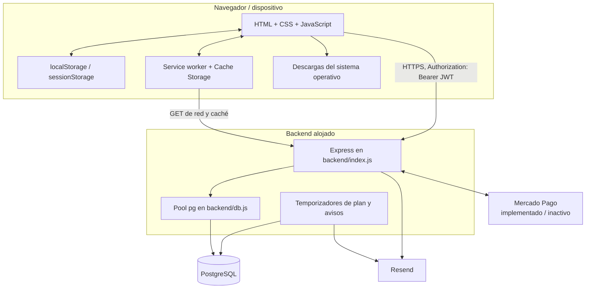

# Arquitectura técnica de CuidaDiario PRO B2B

**Corte de reconstrucción:** 30 de septiembre de 2026, incluyendo inspección manual parcial de Railway del 15/09 y recuperación lógica independiente del 28/09  
**Naturaleza:** descripción del código y de evidencia externa proporcionada; no es un diseño objetivo ni una certificación integral de producción.

Etiquetas: **[VERIFICADO]** comprobado en código o evidencia externa identificada; **[INFERIDO]** conclusión técnica no observada directamente; **[NO VERIFICADO]** requiere evidencia adicional; **[PENDIENTE]** brecha abierta; **[FUTURO]** diseño aún no implementado; **[COMPARTIDO - NO TOCAR B2C]** puede afectar ambos productos. Cuando se dice “exclusivo B2B” en prosa, la superficie pertenece sólo a PRO.

## 1. Vista de contexto



El proceso Node, la conexión PostgreSQL, la política CORS, el runner de migraciones y algunos helpers/proveedores son **[COMPARTIDO - NO TOCAR B2C]**. El aislamiento lógico B2B se apoya en nombres de tabla con sufijo `_b2b`, rutas `/api/b2b/`, la marca `b2b` del JWT y el filtro `institucion_id`.

## 2. Frontend B2B

### 2.1 Tecnología y despliegue observable

- HTML, CSS y JavaScript sin framework de componentes.
- PWA mediante `frontend/manifest.json` y `frontend/sw.js`.
- Dominio personalizado publicado: `cuidadiario-pro.edensoftwork.com`, también declarado en `frontend/CNAME`.
- Backend configurado en el cliente: URL HTTPS de Railway dentro de `frontend/js/api-b2b.js`.
- No existe un proceso de compilación frontend en el repositorio inspeccionado.

**[VERIFICADO]** El repositorio GitHub `edensoftwarework/cuidadiario-pro` usa GitHub Pages con **Deploy from a branch**, `main`, `/(root)`. La validación P0-1 acreditó que los archivos públicos correspondían al commit aprobado. Cloudflare administra/proxifica el DNS mediante un CNAME proxied; el target completo no se verificó. La pantalla mostraba **DNS Check in Progress** y “Enforce HTTPS” no disponible, mientras el acceso HTTPS público funcionó. No se observó Cloudflare Pages. Siguen **[NO VERIFICADO]** logs, región, retención y comportamiento efectivo de caché/proxy del frontend.

### 2.2 Páginas y controladores

| Página / entrada | Controlador principal | Responsabilidad |
|---|---|---|
| `index.html`, `landing.html` | scripts embebidos/estáticos | Entrada y presentación pública. |
| `login.html`, `register.html`, `reset-password.html`, `verify-email.html` | scripts embebidos + `api-b2b.js` | Identidad y recuperación/verificación. |
| `pages/onboarding.html` | `onboarding.js` | Alta/configuración inicial de institución. |
| `pages/dashboard.html` | `dashboard.js` | Resumen operacional. |
| `pages/pacientes.html` | `pacientes.js` | Listado, alta y egreso de residentes. |
| `pages/paciente.html` | `paciente.js` | Ficha y módulos operativos/clínicos del residente. |
| `pages/cuidador.html` | `cuidador.js` | Vista del personal de cuidado. |
| `pages/familiar.html` | `familiar.js` | Vista familiar condicionada por secciones habilitadas. |
| `pages/staff.html` | `staff.js` | Equipo, roles y asignaciones. |
| `pages/catalogo.html` | `catalogo.js` | Inventario y reposiciones. |
| `pages/reportes.html` | `reportes.js` | Reportes agregados. |
| `pages/configuracion.html` | `configuracion.js` | Institución, cuenta, permisos, plan y caché. |
| `admin-panel.html` | script embebido | Operación administrativa por clave separada. |

`api-b2b.js` centraliza HTTP, JWT y purga de caché GET B2B heredada. P0-3 retiró el productor/consumidor/sincronizador de mutaciones offline: una clave heredada `cd_offline_queue` no se lee ni se toca. `utils-b2b.js` centraliza la guardia de página, roles, permisos visibles, navegación, campana, estado del plan, modo de estación compartida y helpers de renderizado contextual seguro. Los controles visuales no sustituyen a los controles del backend.

## 3. Persistencia en el navegador

### 3.1 Claves confirmadas

| Superficie | Clave/patrón | Contenido | Persistencia después de logout |
|---|---|---|---|
| `localStorage` | `cd_pro_token` | JWT B2B. El cliente comprueba estructura, claim `b2b`, `exp` y `nbf`; la firma/autenticidad sólo puede validarla el backend. | En el código local P0-2 se elimina con logout, 401 o al cargar si falta/es localmente inválido o vencido. |
| `localStorage` | `cd_pro_user` | Perfil/sesión actual. | En el código local P0-2 se elimina con logout, 401 o ausencia de token localmente válido. |
| `localStorage` | `cd_pro_last_user` | Copia heredada del último perfil, antes usada para acceso offline. | P0-2 deja de escribirla/restaurarla y la elimina selectivamente al cargar, logout o 401. |
| `localStorage` | `cd_api_/api/b2b...` | Copia heredada de respuestas GET B2B creada por versiones anteriores. | **[VERIFICADO EN PRODUCCIÓN — 29/09/2026]:** se elimina selectivamente al cargar `api-b2b.js`; no se crean ni leen copias nuevas. Otras claves `cd_api_` se conservan. |
| `localStorage` | `cd_offline_queue` | Copia heredada que puede contener método, ruta, cuerpo, datos de salud y operaciones DELETE. | P0-3 la conserva byte a byte en cuarentena: el cliente local no la lee, parsea, migra, ejecuta, transmite ni borra automáticamente. **[VERIFICADO EN ENTORNO CONTROLADO; NO EN PRODUCCIÓN]** |
| `localStorage` | `stock_modelo`, `cd_shared_mode`, `cd_perm_config` | Preferencias operativas/compatibilidad. | Permanece salvo borrado explícito. |
| `sessionStorage` | `cd_active_worker` | Identidad nominal elegida en estación compartida para la sesión. | P0-2 la elimina con logout, 401 o sesión localmente inválida; otras claves de `sessionStorage` se preservan. |
| `localStorage` | `cd_workers_recientes_${institucion_id}` | Nombres recientes del selector de estación; no es la selección activa. | Permanece; P0-2 no la modifica. |
| Cache Storage | caché del service worker | Estáticos y respuestas GET no-B2B admitidas por su estrategia. Las entradas `/api/b2b/` heredadas se purgan por URL. | **[VERIFICADO EN PRODUCCIÓN — 29/09/2026]:** GET B2B network-only; estáticos y API no-B2B conservan su estrategia. |
| Historial/URL | token de verificación o recuperación | Query string usada por las páginas correspondientes. | Puede permanecer en historial, sincronización o registros del navegador. |
| Descargas | archivo exportado o documento | JSON o binario descargado. | Fuera del control posterior de la aplicación. |

**[VERIFICADO EN ENTORNO CONTROLADO — 30/09/2026]:** `removeToken()` elimina exclusivamente `cd_pro_token`, `cd_pro_user`, la clave heredada `cd_pro_last_user`, `sessionStorage.cd_active_worker` y las copias GET B2B cubiertas por P0-1. No borra ni reescribe `cd_offline_queue`, preferencias, nombres recientes de estación, claves no-B2B/B2C ni Cache Storage de forma indiscriminada. La acción separada de “limpiar caché” de configuración conserva su comportamiento anterior.

### 3.2 Flujo offline del paquete local P0-2/P0-3

```mermaid
sequenceDiagram
    participant UI as Pantalla B2B
    participant API as api-b2b.js
    participant LS as localStorage
    participant BE as Backend
    UI->>API: GET
    API->>LS: purga copias cd_api_/api/b2b... heredadas al cargar
    API->>BE: petición autenticada sólo por red
    BE-->>API: JSON no persistido por el cliente
    Note over API,LS: Sin red, GET B2B falla; no devuelve una copia anterior
    UI->>API: POST / PATCH / DELETE sin red
    API->>BE: intenta POST / PATCH / DELETE sólo por red
    BE--xAPI: fallo de red
    API-->>UI: error explícito; no simula persistencia
    Note over API,LS: cd_offline_queue heredada no se lee, modifica ni transmite
```

La implementación heredada generaba `_qid` sólo en el navegador, admitía DELETE y no separaba elementos por identidad o institución. **[VERIFICADO EN ENTORNO CONTROLADO — 30/09/2026]:** P0-3 retiró `_offlineQueue`, `_syncOfflineQueue`, sus timers/eventos y la falsa confirmación visual. POST/PATCH/DELETE requieren red y propagan el error real. La clave heredada permanece deliberadamente en cuarentena, sin procedimiento automático de recuperación o eliminación; cualquier reconciliación futura exige revisión humana.

**[VERIFICADO EN ENTORNO CONTROLADO — 30/09/2026]:** el login offline heredado fue retirado. `login.html` no reconstruye `cd_pro_user`, la guardia protegida falla cerrada sin token localmente vigente y `verify-email.html` ya no recrea `cd_pro_last_user`. Logout y 401 dejan la misma ausencia de identidad local y selección activa de estación. Esto no revalida criptográficamente el JWT ni el estado remoto de usuario/institución: P0-4 continúa pendiente.

La batería `frontend/tests/p0-2-session.test.js` aprobó 88 aserciones deterministas y `p0-3-offline-queue.test.js` aprobó 37. La suite real P0-A aprobó 15 aserciones en Chrome 153.0.8010.48 con perfil temporal y servidor sintético local: tres mutaciones offline fallaron, la cola conservó exactamente sus bytes y reconexión/reload generaron cero mutaciones automáticas. No se invocó backend. P0-2/P0-3 quedan **VERIFICADOS EN ENTORNO CONTROLADO**, no en producción.

### 3.3 Service worker

**[VERIFICADO EN PRODUCCIÓN — 29/09/2026]:** `frontend/sw.js` reconoce exclusivamente `pathname === '/api/b2b'` o rutas iniciadas por `/api/b2b/` antes de las ramas genéricas y las atiende con `networkOnly`, sin escritura ni fallback de Cache Storage. En activación recorre las entradas y elimina sólo las que cumplen esa condición. Mantiene `networkFirstWithCache` para otras rutas `/api/` y hosts Railway/Render, `cacheFirst` para estáticos y `staleWhileRevalidate` para HTML. Conserva cachés API/no-B2B y cachés ajenas; la limpieza histórica de cachés estáticas propias obsoletas continúa.

La regresión final local del paquete conserva 35 aserciones automatizadas aprobadas en `frontend/tests/p0-1-cache.test.js`; la suite controlada de navegador, ampliada con regresiones P0-2 y control de assets, aprobó 69 aserciones. La verificación post-despliegue P0-1 mantiene sus 23 aserciones históricas en `frontend/tests/p0-1-production-readonly.test.js`. La prueba de producción utilizó Chrome 153.0.8010.48, perfil temporal, estado ficticio y cero llamadas al backend; confirmó instalación, activación, control y purga selectiva reales. Los SHA-256 normalizados de `sw.js` (`6e0ad212…a2eb`) y `js/api-b2b.js` (`92a1237d…bce3`) coincidieron entonces entre producción, el commit `ffb8ef595ed57a920dc9f0b1ee6e7927e13b8636` y los archivos P0-1 aprobados; esos hashes no describen el paquete local posterior aún no desplegado.

El paquete local P0-2/P0-3/P0-8 modifica los bytes del service worker para disparar su ciclo de actualización, incluye exactamente una vez `login.html` y `admin-panel.html` en `STATIC_ASSETS` porque ambos cambiaron, y sustituye por un enlace estático el antiguo `javascript:` de la página offline, conservando `CACHE_NAME = cuidadiario-pro-v6`. El `install` existente recarga `STATIC_ASSETS` con `cache: reload` dentro del mismo caché, por lo que navegadores instalados reciben los assets B2B nuevos sin eliminar entradas estáticas ajenas/no-B2B. No cambia `CACHE_NAME_API`, `isB2BApiUrl`, `networkOnly`, la purga selectiva ni las estrategias de request. Esta compatibilidad local **[COMPARTIDO - NO TOCAR B2C]** está verificada sólo en entorno controlado; no está desplegada.

### 3.4 Renderizado B2B seguro local (P0-8)

**[VERIFICADO EN ENTORNO CONTROLADO — 30/09/2026; NO EN PRODUCCIÓN]:** los renderizados dinámicos B2B fueron clasificados por contexto. El contenido no confiable se inserta mediante `textContent` o `escapeHtml`; IDs y números se normalizan; handlers inline sólo reciben IDs normalizados o parámetros internos; notificaciones aceptan únicamente rutas HTTP(S) del mismo origen; checkout sólo HTTPS en hosts Mercado Pago permitidos; teléfono/e-mail sólo generan enlace si satisfacen su gramática acotada. HTML constante, clases mapeadas, iconos internos y el documento de exportación con escape propio quedan como excepciones tratadas, no como entrada cruda.

`frontend/tests/p0-8-xss.test.js` aprobó 82 aserciones deterministas. `p0-a-browser.test.js` inyectó texto, cierres de etiqueta, comillas, `<script>`, SVG/event handlers y URLs maliciosas en renderizadores reales de la ficha, toasts y notificaciones: el contador de ejecución y el número de nodos/handlers activos permanecieron en cero; texto clínico, Unicode y HTML benigno se conservaron como texto. No se modificó contenido persistido ni se accedió al backend.

## 4. Backend

### 4.1 Proceso y dependencias

El backend es una aplicación CommonJS/Express concentrada en `backend/index.js`. Usa:

- `express` para HTTP;
- `pg` para PostgreSQL;
- `bcrypt` para hashes de contraseña;
- `jsonwebtoken` para sesiones;
- `cors` para origen cruzado;
- `web-push`, usado por código no B2B;
- `fetch` nativo para Resend y Mercado Pago.

El cuerpo JSON y URL-encoded admite hasta 10 MB, necesario actualmente porque los documentos viajan como base64 dentro de JSON.

### 4.2 Inicio y migraciones

El servidor comienza a escuchar y luego ejecuta `runMigrations()`. Ese runner contiene DDL y transformaciones de B2C y B2B en el mismo archivo/proceso: **[COMPARTIDO - NO TOCAR B2C]**. Parte del DDL B2B usa `CREATE TABLE IF NOT EXISTS`, `ALTER TABLE ... ADD COLUMN IF NOT EXISTS` y capturas que ignoran errores; dos migraciones horarias usan la tabla genérica `_migrations`.

Consecuencias documentales:

- el esquema descrito en `MODELO_DATOS_B2B.md` es el esquema **pretendido por el código**;
- no se ha comprobado que cada sentencia haya corrido con éxito en producción;
- el servidor puede aceptar tráfico antes de terminar las migraciones;
- cualquier futura migración B2B debe aislar su SQL, ser aditiva e idempotente y no alterar tablas no B2B.

### 4.3 Despliegue Railway verificado externamente

La inspección manual del 15/09/2026 confirmó:

| Elemento | Evidencia observada |
|---|---|
| Workspace/proyecto/entorno | Un único proyecto relevante: `resilient-nature`; entorno `production`. |
| Servicios | `Postgres` y `cuidadiario-backend`, ambos Online. |
| Región y réplicas | Ambos servicios en `US East (Virginia, USA)`, una réplica cada uno. |
| Persistencia | Volumen PostgreSQL `postgres-volume`. |
| Base compartida | Una misma instancia contiene tablas `*_b2b` y tablas no B2B. **[COMPARTIDO - NO TOCAR B2C]** |
| Red PostgreSQL | Private Networking `postgres.railway.internal`; también Public Networking/TCP Proxy hacia PostgreSQL 5432. |
| Red backend | Private Networking `cuidadiario-backend.railway.internal`; dominio público `cuidadiario-backend-production.up.railway.app` hacia puerto 8080. |
| Origen/despliegue | GitHub `edensoftwarework/cuidadiario-backend`, rama `main`, auto-deploy al hacer push. |
| Runtime | Builder Railway/Railpack; Node observado 22.22.3. |
| Acceso al workspace | Un miembro observado con rol Admin; 2FA figuraba Off. |

La inspección no abrió Console, no ejecutó SQL, no habilitó Query Statistics y no accedió a contenidos clínicos.

### 4.4 Base y transporte

`backend/db.js` construye un pool PostgreSQL con `PGHOST`, `PGUSER`, `PGPASSWORD`, `PGDATABASE` y `PGPORT`; configura TLS con `rejectUnauthorized: false`. Railway confirmó externamente la topología, región y réplica descritas arriba. La ruta efectiva usada por el pool, la validación/cifrado efectivo extremo a extremo, alta disponibilidad real y controles del proxy público siguen **[NO VERIFICADO]**.

La pantalla de backups indicó `No backup schedule`. Se observaron dos snapshots manuales llamados `Pre-Security-Patch Backup`, de aproximadamente 243 MB cada uno: uno de unos 23 días y otro de alrededor de un mes al momento de la inspección. La interfaz indicó que backups programados/PITR requerían plan Pro en esa configuración. No se intentó restaurarlos y no se demostró PITR activo, política de retención ni restaurabilidad: **[NO VERIFICADO]**.

**[VERIFICADO — RECUPERACIÓN LÓGICA 28/09/2026]** Mediante `DATABASE_PUBLIC_URL` se generó desde Windows un dump lógico completo en formato custom, `cuidadiario_produccion_2026-09-28.dump`. Producción informó PostgreSQL 17.11; se utilizó `pg_dump` 18.6. `pg_restore --list` informó base original `railway`, 314 entradas TOC, compresión gzip, formato CUSTOM y las versiones anteriores. El archivo se restauró con `pg_restore`, sin errores ni advertencias, en una PostgreSQL local aislada `cuidadiario_restore_test`. `\dt` mostró tablas B2B y B2C del origen compartido **[COMPARTIDO - NO TOCAR B2C]** y se comprobaron únicamente conteos agregados B2B. No se restauró sobre Railway ni se modificó producción.

Esta evidencia acredita una ruta funcional `PostgreSQL de producción -> pg_dump -> archivo independiente -> pg_restore -> PostgreSQL aislado`. **[NO VERIFICADO]** No acredita los snapshots Railway, PITR, automatización, frecuencia/retención, RPO/RTO ni la custodia, cifrado o plazo de conservación del dump local. El archivo se conserva localmente y, por ser una copia completa de la base compartida, debe tratarse como activo sensible **[COMPARTIDO - NO TOCAR B2C]**.

La fotografía de PostgreSQL mostró base ~23,8 MB, tablas ~14,2 MB, WAL ~32 MB, cache hit 99,99 %, 1 conexión activa de 500, `Tables w/ Bloat = 0` y `XID Freeze Risk = 0`. `documentos_b2b` aparecía con ~13,3 MB y 2 filas. Son métricas puntuales, no garantías históricas ni validación del contenido.

## 5. Autenticación y sesión

### 5.1 Flujo actual

1. El registro crea institución y administrador, guarda hash bcrypt y envía verificación.
2. El login valida usuario activo, institución activa y contraseña.
3. Emite un JWT de 30 días con identidad, institución, rol y marca `b2b: true`.
4. `authB2BMiddleware` valida firma y marca B2B; bloquea un claim `email_verified` explícitamente falso.
5. Rutas particulares aplican roles, permiso configurable, acceso al residente y/o plan.

El middleware no vuelve a consultar en cada petición si usuario, institución, rol o verificación continúan vigentes. Un token ya emitido puede conservar claims obsoletos hasta su vencimiento. La clave JWT y helpers son **[COMPARTIDO - NO TOCAR B2C]**; el código contiene un valor de respaldo inseguro si falta `JWT_SECRET`. La variable `JWT_SECRET` sí fue observada por nombre en producción; no se observó `JWT_SECRET_B2B`. No se verificó ni se reproduce su valor.

Existe un limitador de intentos de autenticación en memoria. Se reinicia con el proceso y no coordina múltiples instancias.

### 5.2 Roles

| Rol | Propósito actual |
|---|---|
| `admin_institucion` | Administración integral de la institución y plan. |
| `medico` | Operación sobre residentes/datos habilitada por permisos de equipo. |
| `cuidador_staff` | Operación de cuidado habilitada por permisos de equipo y asignaciones. |
| `familiar` | Lectura de residentes asignados y secciones familiares habilitadas. |

Los defaults de `permisos_equipo` permiten a médico/personal ver todos los residentes y permiten crear/editar residentes, pero no egresar, borrar, administrar catálogo/equipo o asignar. El administrador puede modificar esta matriz. Para familiares, las secciones predeterminadas visibles son medicamentos, citas, tareas, síntomas, signos, contactos y documentos; notas queda deshabilitada por defecto.

### 5.3 Estación compartida

El modo compartido mantiene una sola sesión autenticada y permite elegir un nombre de trabajador en el navegador. Algunas altas registran el usuario autenticado como ID y aceptan `_quien` como nombre visible. No hay reautenticación individual del trabajador seleccionado. En consecuencia, el nombre mostrado no prueba por sí solo quién operó.

## 6. Autorización y aislamiento

Controles disponibles:

- `authB2BMiddleware`: JWT B2B;
- `requireB2BRole(...)`: lista de roles;
- `checkB2BPacienteAccess(...)`: institución, rol/permisos y asignación activa;
- `checkB2BCanDo(...)`: acciones configurables;
- `checkB2BFamiliarCanSee(...)`: secciones familiares;
- `requireActivePlan`: habilitación de determinadas altas/acciones.

El detalle ruta por ruta está en `MAPA_API_B2B.md`. El patrón de aislamiento por `institucion_id` está extendido, pero no todas las rutas aplican acceso al residente de forma equivalente. Varias lecturas sólo lo comprueban cuando se envía `paciente_id`; varias mutaciones por ID sólo verifican institución y rol. Esta diferencia es estado actual conocido, no diseño objetivo.

## 7. Dominio y persistencia servidor

PostgreSQL contiene 17 tablas B2B principales reconstruidas y la institución como raíz del tenant. Los documentos se guardan en la columna `documentos_b2b.datos` como base64; no se observó object storage. No existe caché servidor B2B ni almacenamiento de archivos local confirmado.

La retención actual mezcla:

- desactivación lógica para usuarios, residentes, asignaciones, medicamentos, tareas y catálogo;
- borrado físico para citas, síntomas, signos vitales, contactos, notas y documentos;
- historiales append-only parciales para administraciones, cumplimientos y reposiciones;
- sobreescritura sin versión para la mayoría de las ediciones.

No se observa un registro general de accesos, modificaciones o eliminaciones. Los detalles están en `MODELO_DATOS_B2B.md`.

## 8. Reportes, exportación y documentos

- `GET /api/b2b/reportes` devuelve métricas agregadas y actividad según filtros.
- `GET /api/b2b/reporte/export` arma un JSON institucional con múltiples tablas B2B.
- `POST /api/b2b/documentos` recibe base64, MIME, nombre y tamaño y los persiste en PostgreSQL.
- `GET /api/b2b/documentos/:id/download` devuelve el archivo autenticado para descarga.

**[VERIFICADO EN PRODUCCIÓN — 29/09/2026]:** las respuestas GET B2B no quedan en `localStorage` ni Cache Storage; respuestas no-B2B conservan su estrategia. Una descarga/exportación todavía puede permanecer en el sistema operativo, copias de seguridad o sincronización del dispositivo fuera del control de la aplicación.

## 9. Integraciones externas

### 9.1 Resend

Casos B2B confirmados:

- verificación del administrador: nombre, e-mail, institución y URL con token;
- recuperación de contraseña: e-mail y URL con token;
- reenvío de verificación: nombre, e-mail y URL con token;
- bienvenida al personal: nombre, e-mail, institución, rol y URL de login;
- recordatorio de prueba: e-mail y nombre de institución, y contexto del vencimiento.

No se encontró envío de datos de residentes o contenido clínico a Resend. El helper y la credencial pueden ser **[COMPARTIDO - NO TOCAR B2C]**.

### 9.2 Mercado Pago

La creación B2B de preaprobación envía plan/motivo, monto, moneda, frecuencia, retorno, e-mail del pagador y el ID de institución como referencia externa. El webhook consulta la preaprobación y actualiza campos de plan/suscripción B2B. No se encontró envío de datos de residentes o datos clínicos.

El propietario confirmó que, al 15/09/2026, esta funcionalidad no está habilitada en el frontend B2B ni es utilizada por Los Aromos. Debe tratarse como integración **implementada pero inactiva/latente**, no como proveedor B2B operativo confirmado. La presencia de variables por nombre tampoco demuestra credenciales válidas, webhooks activos ni tráfico actual.

Los helpers/configuración de Mercado Pago conviven con código de otro producto: **[COMPARTIDO - NO TOCAR B2C]**.

### 9.3 Web push

El código de push encontrado consulta tablas sin sufijo `_b2b` y rutas no B2B. No hay evidencia de suscripciones o notificaciones web push de CuidaDiario PRO. Cualquier intervención en este bloque queda fuera de alcance salvo que primero se diseñe una integración B2B separada. **[COMPARTIDO - NO TOCAR B2C]**.

## 10. Configuración conocida por nombre

Railway mostró, sólo por nombre, variables PostgreSQL como `DATABASE_PUBLIC_URL`, `DATABASE_URL`, `PGDATA`, `PGDATABASE`, `PGHOST`, `PGPASSWORD`, `PGPORT`, `PGUSER`, `POSTGRES_DB`, `POSTGRES_PASSWORD` y `POSTGRES_USER`, además de otras administradas por Railway.

En el backend se observaron por nombre `BACKEND_URL`, `DATABASE_URL`, `EMAIL_FROM`, `FRONTEND_URL`, `FRONTEND_URL_PRO`, `JWT_SECRET`, `MP_ACCESS_TOKEN`, `MP_WEBHOOK_SECRET`, `PAYPAL_CLIENT_ID`, `PAYPAL_CLIENT_SECRET`, `PAYPAL_MODE`, variables `PG*`, `RESEND_API_KEY`, `SMTP_FROM`, `SUPERADMIN_KEY`, `VAPID_EMAIL`, `VAPID_PRIVATE_KEY` y `VAPID_PUBLIC_KEY`.

La presencia no acredita valor correcto, rotación, alcance mínimo, vigencia u operación del proveedor. Las variables PayPal/VAPID no demuestran una funcionalidad B2B y pertenecen a superficies compartidas o fuera de alcance: **[COMPARTIDO - NO TOCAR B2C]**. Ningún valor fue inspeccionado ni debe copiarse a documentación.

## 11. Límites de esta reconstrucción

Ni el repositorio ni la inspección externa parcial permiten determinar:

- definición completa del esquema, consistencia o contenido de las filas; sólo se observó la coexistencia de tablas B2B/no B2B y métricas agregadas;
- éxito histórico de cada migración;
- restaurabilidad de los snapshots Railway, PITR activo, automatización, retención o borrado de backups; la restauración lógica independiente del 28/09/2026 sí está **[VERIFICADO]**;
- cifrado efectivo más allá de las superficies/configuración observadas;
- valores, suficiencia y rotación de secretos;
- logs conservados por Railway/hosting/proveedores;
- dominio/CDN frontend efectivo y sus políticas;
- accesos efectivos a PostgreSQL, Resend y Mercado Pago, más allá del único miembro Admin observado en Railway;
- copias ya descargadas en dispositivos de usuarios.

Estas verificaciones se mantienen como pendientes en `ESTADO_Y_PLAN_B2B.md`.
