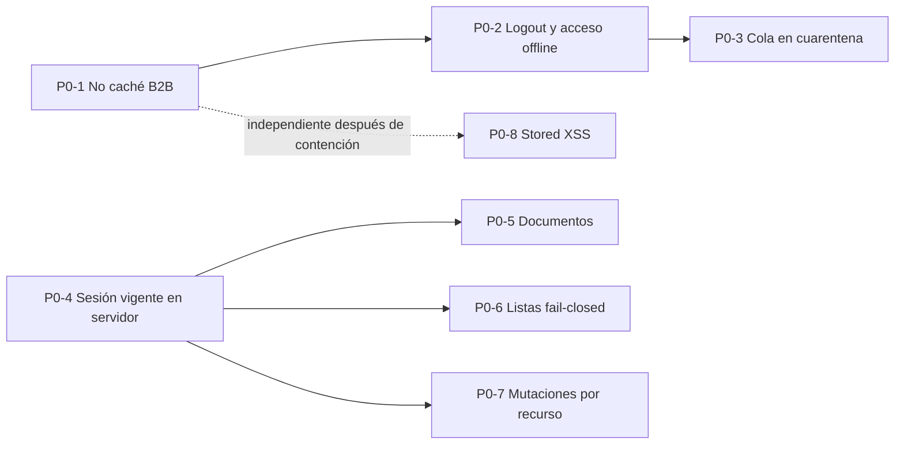
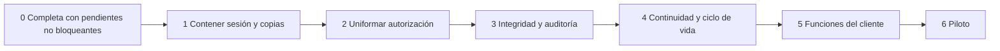

# Estado y plan técnico de CuidaDiario PRO B2B

**Corte:** 3 de octubre de 2026  
**Propósito:** consolidar el estado real, las auditorías previas, la evidencia externa, el cierre productivo de P0 y P1-A/P1-B y los requerimientos de Los Aromos en un plan mínimo, aditivo y sin pérdida de datos para P1-C/P1-D.  
**No contiene conclusiones jurídicas.** Las bases, plazos, roles jurídicos, contratos y obligaciones aplicables deben ser determinados por asesoramiento externo usando esta realidad técnica.

Etiquetas: **[VERIFICADO]** comprobado en código o evidencia externa identificada; **[INFERIDO]** conclusión técnica no observada directamente; **[NO VERIFICADO]** requiere evidencia adicional y no equivale a una afirmación negativa; **[PENDIENTE]** brecha o acción abierta; **[FUTURO]** diseño aún no implementado; **[COMPARTIDO - NO TOCAR B2C]** superficie común.

## 1. Escala y clasificación

### Prioridad técnica

- **P0:** exposición o pérdida plausible; corregir antes de ampliar capacidades.
- **P1:** control necesario para consistencia, trazabilidad o recuperación.
- **P2:** endurecimiento o evolución planificable.

### Naturaleza

- **NECESARIO PARA PROTECCIÓN/INTEGRIDAD DE DATOS:** control mínimo para evitar acceso indebido, mezcla, pérdida, alteración no atribuible o imposibilidad de recuperación.
- **BUENA PRÁCTICA DE SEGURIDAD:** defensa en profundidad; no se presenta como obligación legal.
- **REQUISITO FUNCIONAL DEL CLIENTE:** capacidad solicitada en el análisis de Los Aromos, no necesariamente existente ni jurídicamente obligatoria.
- **DEUDA TÉCNICA:** estructura o inconsistencia que aumenta costo/riesgo de operación.

Una fila puede tener más de una naturaleza, pero se identifica una principal para mantener el plan accionable.

## 2. Estado actual consolidado

### 2.1 Lo que existe y funciona según el código

| Área | Estado actual verificado |
|---|---|
| Multi-tenant | Tablas B2B separadas y filtro habitual por `institucion_id`. |
| Identidad | Registro, bcrypt, verificación de e-mail, recuperación, JWT B2B y cuatro roles. |
| Acceso | Roles, permisos institucionales, asignaciones y secciones familiares. P0-C uniforma sesión vigente, listas, documentos, agregados y mutaciones. **[VERIFICADO EN PRODUCCIÓN / CERRADO — 30/09/2026]**. |
| Residentes | Alta, ficha, edición, egreso y desactivación. |
| Medicación | Indicaciones activas e historial append-only de administraciones. |
| Tareas | Programación activa e historial append-only de cumplimientos. |
| Otros registros | Citas, síntomas, signos, contactos, notas, documentos e inventario/reposiciones. |
| Operación | Dashboard, notificaciones visuales, reportes y exportación institucional parcial. |
| Offline | **P0-1 [VERIFICADO EN PRODUCCIÓN — 29/09/2026]. P0-2/P0-3 [CERRADOS — 30/09/2026]:** lógica exhaustivamente verificada en entorno controlado; commit `9ec220c` desplegado y gate productivo proporcional aprobado. Sin JWT B2B localmente vigente no se restaura el último perfil; logout/401 limpian identidad/estación; mutaciones B2B son sólo de red y la cola heredada permanece byte a byte en cuarentena. |
| Comercial | Planes/prueba y administración manual. La integración Mercado Pago existe en código/configuración, pero está inactiva en el frontend B2B y Los Aromos no la utiliza. |
| Proveedores | Railway verificado como hosting de backend/PostgreSQL. Resend existe en código/configuración, pero su operación externa no fue comprobada. Mercado Pago queda latente/inactivo. No se demostró web push B2B. |
| Backend P0-C | P0-4/P0-5/P0-6/P0-7: 9 aserciones unitarias + 223 HTTP = 232 en PostgreSQL 18 efímero, fixtures/JWT sintéticos y cero intentos externos; commit `db4d2bd756c339e010333bd96e173673388710f4` desplegado sin migraciones y smoke productivo mínimo aprobado. **VERIFICADOS EN PRODUCCIÓN / CERRADOS — 30/09/2026**. |
| P1-A — trazabilidad/preservación | **[VERIFICADO EN PRODUCCIÓN / CERRADO — 03/10/2026]** Ledger prospectivo append-only, versionado en 13 tablas, soft-delete en seis familias, guard de egreso y auditoría sanitizada. |
| P1-B — integridad de operaciones | **[VERIFICADO EN PRODUCCIÓN / CERRADO — 03/10/2026]** Transacciones críticas, idempotencia persistida y claves UUID frontend en toma, completar tarea y carga documental. |
| Mantenimiento | Endpoint backend `maintenance-status` (`c598d55`) y guard frontend versionado `maintenance-b2b-v2.js` (`ac3e46c`) desplegados. Micro-gate OFF→ON→OFF **[VERIFICADO EN PRODUCCIÓN — 02/10/2026]**. Durante P1 también se verificó el bridge; al cierre ambos modos quedaron en `0`. |

### 2.2 Datos que pueden persistir al cerrar sesión o terminar el servicio

| Lugar | Qué puede permanecer | Control actual |
|---|---|---|
| PostgreSQL | Todo el dominio B2B, hashes/tokens y documentos base64. | Sin baja institucional automatizada ni política de retención ejecutable observada. |
| `localStorage` | Cola offline heredada, preferencias, nombres recientes de estación y, antes de cargar el cliente P0-2, una posible copia `cd_pro_last_user`; podrían existir respuestas GET `cd_api_/api/b2b...` creadas por versiones anteriores hasta cargar el cliente actualizado. | P0-1 purga sólo copias GET B2B. P0-2 retira identidad heredada. P0-3 deja `cd_offline_queue` en cuarentena byte a byte, sin leerla, ejecutarla o borrarla. **[P0-1/P0-2/P0-3 CERRADOS]** |
| Cache Storage | Estáticos y respuestas GET no-B2B; podrían existir respuestas B2B heredadas hasta activar el service worker actualizado. | **[VERIFICADO EN PRODUCCIÓN — 29/09/2026]:** purga selectiva por URL y GET B2B network-only. |
| `sessionStorage` | Trabajador seleccionado en estación compartida (`cd_active_worker`). | P0-2 lo elimina en logout, 401 o sesión inválida y preserva claves ajenas. **[P0-2 CERRADO — 30/09/2026]** |
| URL/historial | Tokens de recuperación/verificación. | No se observó limpieza inmediata de la URL. |
| Descargas/dispositivo | Exportaciones y documentos. | Fuera del control de borrado remoto de la aplicación. |
| Proveedores/logs/backups | Metadatos, solicitudes, correos y copias gestionadas; si se activa Mercado Pago, también datos comerciales de suscripción. Un dump lógico completo se conserva localmente desde el 28/09/2026. | Retención efectiva no comprobada. Los snapshots Railway no fueron restaurados; el dump local sí fue restaurado, pero su cifrado, custodia, accesos y vida útil siguen **[NO VERIFICADO]**. |

### 2.3 Exportación, conservación, eliminación y recuperación

- **Exportación actual:** administrador descarga/visualiza un conjunto JSON convertido en reporte imprimible. Incluye institución, residentes, staff, medicamentos, administraciones, citas, cumplimientos, síntomas, signos, contactos y notas.
- **Omisiones de esa exportación:** asignaciones, catálogo y reposiciones, tareas activas, documentos/binarios, preferencias/configuración completa e historial de citas independiente. No hay importador/restaurador.
- **Conservación actual:** filas activas y desactivadas permanecen en PostgreSQL; tres historiales parciales conservan eventos. No hay política técnica general de retención.
- **Eliminación en producción documentada:** desactivación para usuarios, residentes, asignaciones, medicamentos, tareas y catálogo; borrado físico para citas, síntomas, signos, contactos, notas y documentos. **Copia P1 local:** esas seis familias usan soft-delete prospectivo y documentos archivados conservan bytes/cuota.
- **Recuperación actual:** la aplicación puede descargar documentos y generar un export parcial no reimportable. **[VERIFICADO]** Existe una ruta de recuperación lógica completa probada el 28/09/2026 mediante `pg_dump` y `pg_restore` en PostgreSQL local aislado. **[NO VERIFICADO]** Los snapshots Railway, PITR, programación, política de retención y RPO/RTO no fueron probados.

### 2.4 Evidencia externa de Railway del 15/09/2026

La inspección fue visual y no invasiva: no se habilitó Query Statistics, no se abrió Console, no se ejecutó SQL y no se inspeccionaron contenidos clínicos.

| Área | Hecho verificado externamente |
|---|---|
| Proyecto | Workspace con un único proyecto relevante, `resilient-nature`, entorno `production`. |
| Servicios | `Postgres` y `cuidadiario-backend`, ambos Online. |
| Base compartida | Una misma instancia contiene tablas `*_b2b` y tablas B2C/no B2B. **[COMPARTIDO - NO TOCAR B2C]** |
| Región/réplicas | PostgreSQL y backend en `US East (Virginia, USA)`, una réplica cada uno. |
| Persistencia/red DB | Volumen `postgres-volume`; Private Networking `postgres.railway.internal`; Public Networking/TCP Proxy hacia 5432. |
| Red backend | `cuidadiario-backend.railway.internal`; dominio público Railway dirigido al puerto 8080. |
| Entrega | Repositorio `edensoftwarework/cuidadiario-backend`, rama `main`, auto-deploy por push; Railway/Railpack y Node 22.22.3 observados. |
| Variables | Se comprobó la presencia por nombre de variables PostgreSQL/backend relevantes; nunca se inspeccionaron valores. `JWT_SECRET` existe; no se observó `JWT_SECRET_B2B`. |
| Acceso Railway | Un miembro observado, rol Admin; 2FA figuraba Off. |
| Backups | `No backup schedule`; dos snapshots manuales `Pre-Security-Patch Backup`, ~243 MB cada uno, de ~23 días y ~1 mes. Restaurabilidad no probada. La UI indicó que programación/PITR requerían plan Pro en la configuración observada; PITR activo no fue demostrado. |
| Stats DB | Base ~23,8 MB; tablas ~14,2 MB; WAL ~32 MB; hit 99,99 %; 1/500 conexiones; bloat 0; riesgo XID 0. `documentos_b2b` ~13,3 MB y 2 filas. Fotografía puntual, no garantía histórica. |

### 2.5 Evidencia de recuperación lógica del 28/09/2026

**[VERIFICADO]** Se realizó una prueba real e independiente de recuperación, fuera de Railway y sin restaurar ni escribir en producción:

| Paso / atributo | Evidencia proporcionada |
|---|---|
| Origen | PostgreSQL de producción Railway mediante `DATABASE_PUBLIC_URL`; servidor PostgreSQL 17.11. |
| Herramienta | `pg_dump` 18.6 desde Windows. |
| Artefacto | `cuidadiario_produccion_2026-09-28.dump`, formato CUSTOM, gzip, base original `railway`, 314 entradas TOC. |
| Legibilidad | `pg_restore --list` leyó correctamente el archivo. |
| Destino | PostgreSQL local independiente `cuidadiario_restore_test`. |
| Resultado | `pg_restore` terminó sin errores ni advertencias. |
| Comprobación | `\dt` mostró tablas B2B y B2C restauradas **[COMPARTIDO - NO TOCAR B2C]**. |
| Conteos agregados | 33 instituciones, 82 usuarios, 90 residentes, 304 medicamentos y 12 documentos B2B; no se inspeccionaron datos personales. |
| Producción | No recibió ninguna restauración ni modificación. |
| Custodia | El dump original se conserva localmente. |

La prueba demuestra una ruta funcional `producción -> pg_dump -> archivo independiente -> pg_restore -> PostgreSQL aislado`. **[NO VERIFICADO]** No prueba PITR, restaurabilidad de snapshots Railway, automatización, retención, RPO/RTO ni cifrado/custodia/vida útil de la copia local.

### 2.6 Backup predeploy y despliegue P0-C del 30/09/2026

| Paso / atributo | Evidencia |
|---|---|
| Backup fresco | `cuidadiario_produccion_2026-10-01_pre_p0c.dump`; 10.078.959 bytes; timestamp local `30/09/2026 20:06:44 -03:00`; formato custom `PGDMP`. |
| Legibilidad | `pg_restore 18.1 --list` terminó correctamente; 325 líneas, 310 entradas TOC no vacías y estructuras B2B esperables. No se restauró ni se leyó contenido. |
| Gate Git | Repositorio/rama/origin correctos, working tree limpio, `HEAD=db4d2bd756c339e010333bd96e173673388710f4`, parent `11f4774870d8e89960bcfcfa0626781c772ce034`; tres artefactos idénticos al paquete aprobado. |
| Push/deployment | Push normal, sin force/rebase/amend; `origin/main` quedó en el SHA aprobado. Estado público Railway/GitHub `success`, deployment `af85a53b-67e5-4ed5-8a50-773cc8525b32`. |
| Smoke | Tres `/health` 200 con uptime creciente; ruta B2B protegida 401; ruta documental sintética 401 sin bytes y con `no-store`, `no-cache`, `Expires: 0`; lectura PostgreSQL con token sintético inexistente 400 y sin alcanzar actualización. |
| Producción preservada | Cero SQL manual, migraciones, cambios de esquema, requests mutadores, cuentas, residentes o documentos reales. No se repitieron las 232 pruebas exhaustivas en producción. |

Los logs internos de Railway no se inspeccionaron porque no había una sesión autenticada reutilizable. Su contenido y retención permanecen **[NO VERIFICADO]**. El estado final `success`, el uptime continuo, la lectura PostgreSQL controlada y la ausencia de 5xx no mostraron crash loop, reinicio ni incompatibilidad evidente en la ventana observada. El dump fresco del 01/10 fue restaurado y migrado íntegramente en un PostgreSQL 18 aislado, como se documenta en 5.16. Cifrado, custodia y retención del archivo, snapshots Railway, PITR y política automatizada continúan **[NO VERIFICADO]**.

### 2.7 Micro-gate productivo de mantenimiento B2B del 02/10/2026

**[VERIFICADO EN PRODUCCIÓN]** El endpoint `GET /api/b2b/maintenance-status`, desplegado en backend `c598d557f96a43a2ece07f820b8f52c0091d85a0`, respondió 200, `no-store` y alternó exclusivamente según `B2B_MAINTENANCE_MODE`. No consulta PostgreSQL ni expone identidad, datos de institución o secretos. El guard corregido/versionado `maintenance-b2b-v2.js` fue publicado en frontend `ac3e46c9506c02ec62d650fdec4292d8bae7d6a1`; la URL canónica coincidió con el asset aprobado y las 15 entradas B2B lo cargan después de `api-b2b.js`.

El gate definitivo probó OFF→ON→OFF en Edge con perfil temporal vacío: login B2B normal en OFF; pestaña ya abierta y apertura nueva bloqueadas en ON; detección de la pestaña abierta aproximadamente 5,5 s después de detectar ON en el endpoint; Reintentar estable; misma pestaña y apertura nueva normales al volver a OFF; B2C/no-B2B sin overlay; cero requests mutantes al backend; cierre código 0 y perfil eliminado. Los POST automáticos de Cloudflare RUM fueron bloqueados por el arnés antes de enviarse y se registraron separadamente, sin confundirlos con mutaciones de aplicación.

Dos gates anteriores se abortaron de forma segura: (1) el diseño temporal basado en cambiar `sw.js` no llegó a la URL canónica por el `max-age=14400` observado y fue revertido (`3dffdcb` → `9251203`); (2) el primer guard permanente leyó `globalThis.API_B2B`, aunque `API_B2B` es un `const` global léxico, quedó en `unavailable` y fue revertido (`a20694e` → `855831f`). El nombre v2 evita reutilizar el asset defectuoso. `sw.js` no es interruptor de mantenimiento.

Ese micro-gate terminó con `B2B_MAINTENANCE_MODE=0` y, en ese momento, `B2B_P1_BRIDGE_MODE` aún no se había activado. Posteriormente ambos mecanismos se usaron en la ventana P1 y el cierre productivo dejó mantenimiento `0`, bridge `0`, `/health` sano y `maintenance:false`.

### 2.8 Cierre productivo P1-A/P1-B del 03/10/2026

**[VERIFICADO EN PRODUCCIÓN]** Backend `6502be8b87aacfbb396530e09dbbbf939a6651fc`; frontend `c452c23dfd28baccd9f93cc58936523db793ae0e`. Las migraciones `p1_001_foundations`, `p1_002_versions` y `p1_003_soft_delete` quedaron registradas con sus checksums aprobados. El gate estructural final fue `PASS|3|13|13|18|35|4|1|1|0|`, `VERDICT=PASS`.

La función append-only coincidió byte a byte con la migración (`prosrc_md5=0864804c40294a982bb42a4d78089202`). Un ABORT anterior fue un falso negativo del tooling del gate, corregido después; no fue un defecto productivo.

El dump fresco `cuidadiario_produccion_2026-10-02_predeploy_p1.dump` (10.079.205 bytes, 325 líneas TOC, SHA-256 `30656BC093BFE7CD1E02014B176E883E42D462109DF7A57CD8352A4F22388CAB`) se restauró en PostgreSQL 18.1 efímero/local. El gate aislado aprobó 363/363 pruebas y el clúster fue eliminado sin tráfico externo. Esta evidencia es propia del despliegue P1-A/P1-B; no cierra P1-D.

Taxonomía canónica: **P1-A — Trazabilidad y preservación: CERRADO; P1-B — Integridad de operaciones: CERRADO; P1-C — Identidad del operador: NO INICIADO y siguiente bloque; P1-D — Continuidad y ciclo de vida: NO INICIADO. No existe P1-E.**

## 3. Hallazgos priorizados

### 3.1 Necesario para protección/integridad de datos

| Pri. | Hallazgo confirmado | Cambio técnico mínimo futuro, sin alterar datos previos |
|---|---|---|
| P0 | `JWT_SECRET` existe por nombre en producción y los JWT B2B duran 30 días. **[RESUELTO / P0-4 CERRADO — 30/09/2026]:** cada request protegido recarga usuario/institución/rol/estado/verificación y usa identidad vigente; el secreto/middleware B2C compartidos no cambiaron. | Mantener la matriz controlada y monitorear 401/503. El fallback conocido del secreto queda como endurecimiento separado que exige análisis B2C. |
| P0 | Listas, mutaciones y descargas por ID tenían controles desiguales. **[RESUELTO / P0-5/P0-6/P0-7 CERRADOS — 30/09/2026]:** helpers resuelven tenant, residente, asignación, sección y recurso; la ausencia de `paciente_id` falla cerrada para roles restringidos. | Mantener la matriz negativa de tenant, rol, asignación, sección, recurso e ID huérfano en entorno aislado. |
| P0 | Dashboard/reportes podían entregar secciones familiares no habilitadas individualmente. **[RESUELTO / P0-6 CERRADO — 30/09/2026]:** cada bloque respeta la bandera familiar vigente. | Conservar pruebas por sección; no repetirlas con datos reales en producción. |
| P0 | Versiones anteriores guardaban respuestas B2B con datos personales/de salud en `localStorage` y Cache Storage sin partición. | **[VERIFICADO EN PRODUCCIÓN — 29/09/2026] P0-1:** GET B2B network-only y purga selectiva de copias heredadas, con pruebas automatizadas, navegador controlado y validación post-despliegue. Logout permanece en P0-2. |
| P0 | La versión anterior restauraba el último perfil offline y conservaba identidad tras logout/401. | **[CERRADO — P0-2, 30/09/2026]:** lógica controlada aprobada; commit `9ec220c` desplegado y gate productivo proporcional aprobado. |
| P0 | La cola offline heredada era global, admitía `DELETE`, no identificaba propietario/tenant y podía sincronizarse automáticamente bajo otra sesión. | **[CERRADO — P0-3, 30/09/2026]:** productor, consumidor, reintentos y falsa confirmación retirados; cola previa en cuarentena byte a byte. La idempotencia servidor queda para P1. |
| P0 | Se verificaron renderizados con `innerHTML` que interpolaban datos persistidos o mensajes/URLs no confiables sin tratamiento contextual uniforme. | **[CERRADO — P0-8, 30/09/2026]:** inventario/corrección y pruebas XSS exhaustivas locales; artefacto desplegado y smoke público proporcional aprobado sin repetir payloads en producción. |
| P1 | **[CERRADO EN P1-A]** Las ediciones carecían de versión general y ledger. | Implementado prospectivamente: `version` en 13 tablas y `auditoria_eventos_b2b` append-only con actor, tenant, recurso, acción, timestamp, motivo, request ID y snapshot/diff sanitizado. No se fabricó historia previa. |
| P1 | Modo estación compartida acepta `_quien` como nombre visible bajo la sesión del administrador. | Conservar siempre actor autenticado; agregar identidad de operador seleccionada con mecanismo verificable (PIN/reautenticación) y registrar ambas identidades. |
| P1 | **[CERRADO EN P1-A]** El egreso era una convención principalmente visual. | El backend conserva lectura histórica y bloquea nuevas mutaciones sobre residentes egresados; sólo admite cierres administrativos acotados y, donde el código lo contempla, corrección excepcional por `admin_institucion` con motivo. No se afirma una prohibición absoluta fuera de esas rutas/condiciones. |
| P1 | **[VERIFICADO]** El dump lógico completo del 28/09 fue restaurado exitosamente en PostgreSQL aislado. Los dos snapshots manuales Railway, PITR, backup schedule, RPO/RTO y política de retención siguen **[NO VERIFICADO]**; el “backup completo” de UI es parcial y no reimportable. | Formalizar programación/retención y custodia de dumps, probar periódicamente; verificar por separado snapshots/PITR si se los adopta y crear export B2B completo, versionado y con manifiesto de integridad. |
| P1 | No hay mecanismo técnico para ejecutar y demostrar una política de conservación/baja institucional; las cascadas podrían amplificar una eliminación directa. | Diseñar estados institucionales, cuarentena y workflow aprobado de exportación/retención/supresión. Nunca ejecutar cascadas sobre datos reales sin inventario, respaldo y decisión externa. |
| P1 | **[CERRADO EN P1-A]** Citas, síntomas, signos, contactos, notas y documentos se borraban físicamente. | Soft-delete desplegado en las seis familias; lecturas normales excluyen eliminados y el ledger registra el evento. Documentos preservan bytes y cuota. |
| P1 | **[CERRADO EN P1-B]** Administración de medicación/stock no era atómica y no existía idempotencia servidor. | Una transacción, locks, descuento condicional e idempotencia persistida opcional quedaron desplegados; se mantiene compatibilidad sin header y no se reactiva la cola offline. |

### 3.2 Buenas prácticas de seguridad

| Pri. | Hallazgo | Mejora futura |
|---|---|---|
| P1 | TLS de PostgreSQL acepta certificado sin verificar; el estado TLS extremo a extremo no se pudo probar. **[COMPARTIDO - NO TOCAR B2C]** | Usar validación de certificado/cadena compatible con Railway y verificar HTTPS, HSTS y redirecciones en producción. |
| P1 | CORS se configura globalmente; no se observó allowlist B2B estricta. **[COMPARTIDO - NO TOCAR B2C]** | Definir orígenes/métodos/headers mínimos sin romper consumidores B2C. |
| P1 | Rate limit de autenticación vive en memoria. | Mover a almacenamiento coordinado o protección gestionada, con métricas y alertas sin registrar credenciales. |
| P1 | No se observó una capa general de headers de seguridad/CSP. | Agregar CSP, `frame-ancestors`, MIME sniffing y política de referrer tras inventariar scripts inline. |
| P1 | Tokens de recuperación/verificación se guardan en claro y viajan por query string. | Guardar digest, limitar uso/vida, invalidar al consumir y retirar query de la URL con `history.replaceState`. |
| P2 | No hay MFA ni reautenticación para exportar, cambiar roles, contraseñas o plan. | Incorporar step-up/MFA inicialmente para administradores y acciones sensibles. |
| P2 | El único miembro Railway observado tiene rol Admin y el workspace mostraba 2FA Off. No se trata como bloqueo inmediato. | Habilitar 2FA y revisar principio de mínimo privilegio/recuperación de cuenta como endurecimiento de acceso a infraestructura. |
| P2 | No se observa pipeline de análisis de dependencias, secretos, SAST o pruebas de autorización. | Añadir controles CI de sólo lectura/alerta y pruebas de seguridad B2B. |
| P2 | Logs incluyen e-mails, IDs de institución/preaprobación y errores; retención no verificada. | Estructurar/redactar logs, separar entornos, limitar acceso y fijar retención comprobable. |
| P2 | Documentos se alojan como base64 en PostgreSQL y pueden multiplicar backup/caché/costo. | Evaluar object storage privado con cifrado, URLs cortas y migración aditiva; no mover datos reales hasta probar reconciliación y rollback. |

### 3.3 Requisitos funcionales del cliente

Todo este bloque es **[FUTURO]**; no debe presentarse como estado actual ni como obligación legal.

| Pri. | Capacidad solicitada | Encaje técnico mínimo compatible |
|---|---|---|
| P1 | Evolución/historia cronológica estructurada | Nueva entidad de eventos/evoluciones vinculada a residente, actor y fecha; vista unificada que también lea registros actuales. |
| P1 | Medicación clínica más completa: vía, prescriptor, vigencia, omisiones/cambios | Columnas anulables o entidad de indicaciones versionadas; conservar `medicamentos_b2b` y sus historiales como legado consultable. |
| P1 | No eliminación/versionado de registros relevantes | Estados y revisiones hacia adelante, apoyados en auditoría append-only. |
| P1 | Incidentes y eventos adversos | Tabla B2B nueva con clasificación, descripción, acciones, responsables, estado y adjuntos. |
| P1 | Estados temporales del residente | Entidad temporal con inicio/fin/motivo, sin sobrecargar `activo` o `fecha_egreso`. |
| P1 | Contactos con prioridad y autorización/alcance | Ampliar contactos con prioridad, tipo y reglas explícitas; migración sólo aditiva. |
| P1 | Documentos categorizados, con fecha y descripción | Metadatos anulables nuevos y catálogo de categorías; preservar binarios existentes. |
| P2 | Alertas configurables | Reglas institucionales/por residente y estados de alerta; no confundir la campana actual con web push. |
| P2 | Dashboard operativo ampliado | Consultas/vistas sobre eventos, incidentes, estados y pendientes con políticas de acceso. |
| P2 | Dashboard de dirección | Agregados mínimos, sin exposición nominal innecesaria, con permiso separado. |
| P2 | Piloto y capacitación | Ambiente/datos de prueba, casos de aceptación, matriz de roles, guía y plan de reversión. |

### 3.4 Deuda técnica

| Pri. | Deuda observada | Tratamiento mínimo |
|---|---|---|
| P1 | Backend monolítico mezcla rutas, SQL, migraciones, jobs e integraciones B2B/B2C. **[COMPARTIDO - NO TOCAR B2C]** | Extraer primero módulos/guards B2B sin cambiar contratos; pruebas de caracterización antes de mover código. |
| P1 | `runMigrations()` mezcla productos, corre después de `listen` y silencia varios errores. **[COMPARTIDO - NO TOCAR B2C]** | Migrador controlado, con tabla/versiones claras, transacciones, verificación y SQL exclusivamente B2B. No reejecutar transformaciones de datos existentes. |
| P1 | Tipos/semánticas horarias mezclan `timestamp` y conversiones manuales de Argentina. | Definir contrato UTC/local por campo, probar DST/entradas offline y migrar sólo mediante columnas/vistas aditivas. |
| P1 | Exportación denominada “backup completo” no es completa ni restaurable. | Renombrar mientras sea reporte; luego definir formato canónico, manifiesto y restauración probada. |
| P2 | `historial_citas_b2b` existe pero no se escribe ni consulta. | Decidir si se activa hacia adelante o se depreca documentalmente; no borrar la tabla ni asumir que está vacía en producción. |
| P2 | Dos bloques se rotulan “migración B2B v14”. | Adoptar identificadores únicos/inmutables. |
| P2 | Nomenclatura alterna paciente/residente y “alta” puede significar creación o egreso. | Crear glosario y nombres de acción inequívocos sin renombrar destructivamente columnas/rutas. |
| P2 | Límites, precios y estado de planes difieren entre backend, configuración y landing. | Definir una fuente de verdad de catálogo comercial y alinear textos/validaciones. |

## 4. Contradicciones o hallazgos incidentales que requieren revisión

Estas divergencias requieren corrección técnica y/o revisión del texto por responsables competentes. No se emite conclusión jurídica.

### 4.1 Documentación pública e interfaz

| Ubicación / afirmación resumida | Conducta técnica observada | Acción mínima |
|---|---|---|
| `privacy.html`: localStorage se usa para el JWT. | También conserva perfil actual, preferencias, nombres recientes y, si existe de una versión anterior, `cd_offline_queue` en cuarentena. P0-1 ya impide caché GET B2B y P0-2 retira el último usuario heredado. | Inventariar la persistencia cliente restante y reflejar que P0-2/P0-3 ya están desplegados/cerrados. |
| `privacy.html`: acceso a datos restringido por rol e institución. | El tenant se filtra ampliamente, pero existen rutas con acceso a residente/sección incompleto. | Corregir guards y luego redactar el alcance exacto. |
| `privacy.html`: supresión de activos en 30 días y backups cifrados hasta 90 días. | No existe workflow de baja institucional. Railway mostró dos snapshots manuales y `No backup schedule`. Un dump lógico completo fue restaurado exitosamente el 28/09 fuera de Railway, pero no se acreditaron cifrado, programación ni retención de 90 días. | Definir procedimientos y no afirmar plazos/cifrado no operativizados. |
| `privacy.html`: todas las comunicaciones usan HTTPS/TLS. | La URL del frontend es HTTPS; PostgreSQL activa SSL pero no verifica certificado. Infraestructura efectiva no inspeccionada. | Verificar transporte extremo a extremo y ajustar configuración/texto. |
| `privacy.html`: contraseña “cifrada” con bcrypt. | bcrypt produce un hash con salt, no cifrado reversible. | Usar “hash seguro con bcrypt”. |
| `privacy.html`: categorías de datos. | Omite o no detalla citas, tareas/cumplimientos, documentos/binarios, obra social, inventario, asignaciones, preferencias, plan y copias offline. | Completar el inventario sólo con datos efectivamente tratados. |
| `terms.html`: fallas de Cloudflare. | Se verificó Cloudflare como DNS/proxy CNAME del frontend, no como Cloudflare Pages. No se verificaron logs, región, retención, target completo ni que toda indisponibilidad posible sea atribuible a ese proveedor. | Ajustar el texto al rol técnico efectivamente demostrado y evitar atribución absoluta de fallas. |
| Configuración: “backup completo” y texto “formato PDF”. | El endpoint exporta JSON parcial; el frontend construye HTML para imprimir/guardar como PDF. Omite varias tablas y binarios y no restaura. | Renombrar como reporte/exportación parcial o completar formato/restauración. |
| Landing: “historial completo ... con trazabilidad del personal”. | Hay historiales parciales; varias ediciones/borrados no se versionan y `_quien` puede ser un nombre no autenticado. | Acotar la afirmación hasta implementar trazabilidad verificable. |
| Landing: al vencer prueba “todos los datos se conservan y nunca se borran”. | El vencimiento no borra automáticamente según el código, pero múltiples endpoints realizan borrado físico y no existe garantía técnica de retención indefinida. | Precisar que el vencimiento no ejecuta borrado automático, sin promesa absoluta. |
| Landing/términos/configuración: Mercado Pago presentado como medio disponible. | El código y las variables existen, pero el propietario confirma que la integración no está habilitada actualmente en el frontend B2B ni es utilizada por Los Aromos. | Presentarla como no disponible mientras permanezca inactiva; verificar operación antes de reactivarla. |
| Landing/configuración/backend: Plan Básico. | Landing: 15 residentes/5 staff y ARS 25.000; enforcement de altas: 15/8; contratación/configuración: elegibilidad 30/20 y Mercado Pago ARS 19.000. | Resolver catálogo y límites antes de comunicar o cobrar. |

### 4.2 Código y operación

| Hallazgo incidental | Estado observado | Revisión necesaria |
|---|---|---|
| `historial_citas_b2b` | La migración crea la tabla, pero el historial actual lee `citas_b2b` con estado realizada y no existe `INSERT` al historial. | Definir intención; no borrar ni poblar retrospectivamente. |
| Middleware de plan | El comentario indica aplicación a todos los POST/PATCH/PUT clínicos, pero las rutas lo aplican selectivamente y algunas altas no lo usan. | Especificar política única y probarla; no inferirla del comentario. |
| Versiones de migración | Hay dos bloques etiquetados v14 con finalidades distintas. | Adoptar IDs únicos antes de agregar migraciones. |
| Límites comerciales | Coexisten límites Básico 15/8 en enforcement y 30/20 en compra/UI de configuración, además de 15/5 en landing. | Resolver fuente de verdad sin desactivar o eliminar residentes/staff existentes. |
| Acceso familiar agregado | La campana ya aplicaba secciones. Dashboard, reporte, catálogo/reposiciones y documentos las aplican de forma coherente. **[VERIFICADO EN PRODUCCIÓN / P0-C CERRADO — 30/09/2026]**; la matriz funcional exhaustiva se ejecutó sólo en el entorno controlado. | Mantener pruebas por sección; no repetir con cuentas o datos reales en producción. |

## 5. Plan mínimo de adecuación B2B

### 5.1 Decisión de cierre de Etapa 0

**Estado exacto: COMPLETA CON PENDIENTES NO BLOQUEANTES.**

| Criterio de salida de Etapa 0 | Evidencia | Resultado |
|---|---|---|
| Inventario consolidado | Código B2B, documentación canónica e inspección Railway del 15/09/2026. | **[VERIFICADO]** |
| Backup identificable | Dump completo `cuidadiario_produccion_2026-09-28.dump`, custom/gzip, 314 TOC, origen PostgreSQL 17.11. | **[VERIFICADO]** |
| Restauración aislada exitosa | `pg_restore` sin errores ni advertencias en `cuidadiario_restore_test`, con tablas y conteos agregados comprobados. | **[VERIFICADO]** |
| Producción preservada | No se restauró en Railway ni se modificó producción durante la prueba. | **[VERIFICADO]** |

El bloqueo real que mantenía abierta la Etapa 0 era no haber demostrado una recuperación independiente. La prueba del 28/09 lo resolvió para una copia lógica completa y permite comenzar correcciones P0 que no requieren SQL. Se elige “con pendientes no bloqueantes”, y no “completa” sin reservas, porque snapshots Railway, PITR, automatización, RPO/RTO, retención y custodia/cifrado del dump continúan **[NO VERIFICADO]**. Esos puntos deben resolverse en continuidad P1 y antes de depender de cualquiera de esos mecanismos, pero no impiden iniciar el bloque P0-1.

**[PENDIENTE]** Antes de cada futuro despliegue a producción debe confirmarse un backup reciente recuperable, el rollback específico y la autorización humana. La prueba del 28/09 no es autorización permanente ni demuestra que una copia antigua cubra cambios posteriores.

### 5.2 Reglas de ejecución futura

- No tocar tablas, rutas ni funcionalidades B2C.
- Marcar y probar toda superficie **[COMPARTIDO - NO TOCAR B2C]** antes de cambiarla.
- No eliminar, reescribir, normalizar retrospectivamente ni modificar en masa datos reales.
- Preferir nuevas columnas anulables, nuevas tablas B2B, índices concurrentes/seguros y vistas compatibles.
- Ejecutar primero backup y restauración de prueba; después migración idempotente en ensayo; por último despliegue reversible.
- Documentar y ensayar rollback antes de cada despliegue/migración.
- Mantener lectura de estructuras legadas durante la transición.
- Empezar trazabilidad/versionado desde la fecha de activación; no fabricar historia anterior.
- No ejecutar purge automático hasta que la retención esté definida y validada externamente.
- Separar criterios técnicos de las decisiones legales pendientes.

### 5.3 Etapas consolidadas

| Etapa | Alcance mínimo | Criterio de salida | Estado al 03/10/2026 |
|---|---|---|---|
| 0. Verificación externa | Inspección Railway del 15/09 más dump/restauración lógica independiente del 28/09. Permanecen pendientes los mecanismos administrados, política y controles de continuidad. | Inventario consolidado, backup identificable y restauración aislada exitosa. | **COMPLETA CON PENDIENTES NO BLOQUEANTES** |
| 1. Contención cliente/sesión | Secreto obligatorio, revalidación B2B, no caché sensible, logout completo, cola segregada, tokens fuera de URL. | Pruebas muestran que otro usuario/tenant no recibe copias y una sesión revocada no opera. | **P0 CERRADO EN PRODUCCIÓN:** P0-1/P0-2/P0-3/P0-4/P0-8 cerrados. El fallback secreto y tokens en URL permanecen como backlog separado, sin reabrir los bloques P0 aceptados. |
| 2. Autorización uniforme | Guard de recurso/residente/sección en todas las rutas y agregados. | Matriz automatizada AI/MD/CS/FA × tenant × asignación × sección sin escapes. | **VERIFICADO EN PRODUCCIÓN / P0 CERRADO:** P0-5/P0-6/P0-7; matriz exhaustiva controlada y gate productivo proporcional. |
| 3. Integridad y trazabilidad | P1-A preservación/trazabilidad; P1-B integridad; P1-C identidad verificable del operador. | Mutaciones nuevas atribuibles y repetibles con seguridad; operador verificable en estación compartida. | **P1-A/P1-B CERRADOS EN PRODUCCIÓN. P1-C NO INICIADO / siguiente bloque.** |
| 4. Continuidad y ciclo de vida | P1-D: export completo versionado, restore periódico, retención/baja y logs controlados. | Exportación reconciliada y simulacro documentado sin tocar producción. | **P1-D NO INICIADO** |
| 5. Funciones de Los Aromos | Evolución, indicaciones versionadas, incidentes, estados temporales, metadatos y dashboards. | Criterios de aceptación del cliente y permisos aprobados sobre datos de prueba. | **NO INICIADA** |
| 6. Piloto controlado | Capacitación, soporte, métricas, rollback y seguimiento. | Piloto aprobado antes de ampliar alcance. | **NO INICIADA** |

La documentación canónica no equivale por sí sola a avance de implementación. La Etapa 0 está cerrada sólo en el sentido anterior. P0 está cerrado en producción. P1-A/P1-B están desplegados, verificados en producción y cerrados; la Etapa 3 permanece abierta exclusivamente por P1-C. P1-D y las funciones nuevas de Los Aromos no se iniciaron.

P0-2 + P0-3 + P0-8 fueron publicados como un único paquete frontend controlado en el commit `9ec220c4722e528cda77c9ece3d21cb62bcd7068`, manteniendo evidencia, aceptación y rollback separados por bloque.

Estados permitidos para futuras actualizaciones: **NO INICIADA**, **EN VERIFICACIÓN**, **COMPLETA CON PENDIENTES NO BLOQUEANTES**, **LISTA PARA IMPLEMENTAR**, **EN IMPLEMENTACIÓN LOCAL**, **IMPLEMENTADA**, **VERIFICADO EN ENTORNO CONTROLADO**, **VERIFICADO EN PRODUCCIÓN** y **VERIFICADA**. Una recomendación de auditoría no cambia por sí sola el estado; sólo evidencia post-despliegue específica permite usar “verificado en producción”.

### 5.4 Orden ejecutable de bloques P0

1. **P0-1 — Contener caché de respuestas B2B en navegador. VERIFICADO EN PRODUCCIÓN — 29/09/2026.**
2. **P0-2 — Retirar acceso offline no autenticado y completar logout/401. CERRADO — 30/09/2026.**
3. **P0-3 — Detener y poner en cuarentena la cola offline global. CERRADO — 30/09/2026.**
4. **P0-4 — Revalidar en servidor la sesión B2B contra estado actual. VERIFICADO EN PRODUCCIÓN / CERRADO — 30/09/2026.**
5. **P0-5 — Cerrar autorización y caché de descarga/eliminación de documentos. VERIFICADO EN PRODUCCIÓN / CERRADO — 30/09/2026.**
6. **P0-6 — Hacer fail-closed las listas cuando falta `paciente_id`. VERIFICADO EN PRODUCCIÓN / CERRADO — 30/09/2026.**
7. **P0-7 — Aplicar autorización de residente/recurso a mutaciones por ID. VERIFICADO EN PRODUCCIÓN / CERRADO — 30/09/2026.**
8. **P0-8 — Eliminar sinks de stored XSS y uniformar renderizado seguro B2B. CERRADO — 30/09/2026.**

Los bloques conservan trazabilidad individual. P0-1 a P0-3 contienen copias/acciones del navegador; P0-4 establece identidad vigente en servidor y fue usado como base de P0-5 a P0-7. P0-8 no depende de SQL. P0-4/P0-5/P0-6/P0-7 se agruparon operacionalmente como P0-C, sin crear un bloque nuevo ni perder criterios/rollback separados.

### 5.5 P0-1 — Contener caché de respuestas B2B en navegador

**Estado al 29/09/2026:** **P0-1 VERIFICADO EN PRODUCCIÓN**. El commit desplegado `ffb8ef595ed57a920dc9f0b1ee6e7927e13b8636` (`P0-1: prevent B2B response caching`; deployment GitHub Pages #86 informado como Active) modifica únicamente `js/api-b2b.js` y `sw.js`. Los contenidos públicos de ambos archivos coincidieron por SHA-256 normalizado con ese commit y los archivos P0-1 aprobados en esa fecha. La evidencia histórica fue 33 aserciones de mocks, 38 en Chrome controlado y 23 post-despliegue. La regresión final del paquete posterior aprobó 35 aserciones deterministas y 69 en Chrome controlado; el gate del commit `9ec220c` volvió a confirmar P0-1 sin cambiar su estado.

- **Problema original — [VERIFICADO]:** la versión previa de `API_B2B.get()` conservaba todas las respuestas GET en claves `cd_api_*`; el service worker aplicaba `networkFirstWithCache` también a GET B2B. Respuestas con datos personales/salud podían quedar fuera de la sesión y sin partición por usuario/tenant.
- **Evidencia actual:** `frontend/js/api-b2b.js`, `purgeLegacyGetCache` y `get`; `frontend/sw.js`, `isB2BApiUrl`, `purgeB2BApiResponsesFromCaches`, rama B2B previa a las genéricas y `networkOnly`.
- **Riesgo:** otro usuario del mismo navegador, una sesión expirada o el modo offline pueden recibir respuestas de una sesión anterior.
- **Comportamiento implementado localmente:** los GET `/api/b2b/` son sólo de red, no se escriben ni leen desde `localStorage`/Cache Storage y las copias B2B heredadas se eliminan selectivamente. El shell/estáticos PWA y la caché no-B2B conservan sus estrategias.
- **Archivos de implementación/prueba:** `frontend/js/api-b2b.js`; `frontend/sw.js` **[COMPARTIDO - NO TOCAR B2C]**; `frontend/tests/p0-1-cache.test.js`; arnés real controlado `frontend/tests/p0-1-browser.test.js`.
- **Migración SQL:** no.
- **Impacto B2C/no-B2B:** la condición es exacta para `/api/b2b` o `/api/b2b/…`. Las ramas existentes de otras rutas `/api/`, hosts Railway/Render, estáticos y HTML no cambiaron. Los mocks confirmaron preservación/fallback de `/api/admin`, host Railway no-B2B y cachés ajenos; Chrome controlado confirmó `/api/b2b-other`, API no-B2B y shell PWA online/offline; producción confirmó que `/api/b2b-other` y una respuesta no-B2B sintética sobreviven a la activación. No se probó funcionalidad B2C con datos ni cuentas reales.
- **Pruebas ejecutadas:** 33 aserciones con mocks para GET B2B online/offline, `localStorage`, Cache Storage, `/api/admin`, host Railway no-B2B, cachés ajenos y shell; 38 aserciones en Chrome controlado; y 23 aserciones post-despliegue en Chrome 153.0.8010.48 con Node 24.11.1, perfil temporal sobre `https://cuidadiario-pro.edensoftwork.com`, estado sintético, instalación/activación/control del SW y purga selectiva real. En la prueba final no se usaron credenciales/datos reales, no se llamó al backend, no se emitieron requests `/api/b2b` y no hubo métodos mutadores de aplicación. La telemetría RUM inyectada por Cloudflare fue interceptada en el navegador antes de recibir respuesta.
- **Criterio objetivo de aceptación:** aprobado. En entorno controlado se acreditó que un GET B2B no crea claves/respuestas y que offline devuelve 503 sin recuperar el cuerpo anterior. En producción se acreditó que los archivos activos son exactamente los aprobados, el SW instala/controla, la activación elimina `/api/b2b` y `/api/b2b/…`, `purgeLegacyGetCache()` elimina sólo la clave B2B ficticia y `/api/b2b-other`, cola, último usuario sintético, preferencias y respuestas no-B2B permanecen.
- **Rollback:** revertir exclusivamente los cambios de `frontend/js/api-b2b.js` y `frontend/sw.js` y retirar la prueba/documentación asociada. No hubo cambio de nombre/versión de caché. Las copias sensibles ya purgadas no se recrean; ningún dato de PostgreSQL se modifica.

### 5.6 P0-2 — Retirar acceso offline no autenticado y completar logout/401

**Estado al 30/09/2026:** **P0-2 CERRADO.** Lógica exhaustivamente verificada en entorno controlado; commit `9ec220c` desplegado y gate productivo proporcional aprobado.

- **Problema original — [VERIFICADO]:** `cd_pro_last_user` sobrevivía al logout/401; `login.html` lo usaba para entrar sin token ni contraseña; `utils-b2b.js` podía restaurar `cd_pro_user`; `removeToken()` quitaba sólo token y usuario actual.
- **Evidencia actual:** `frontend/js/api-b2b.js`, validación temporal/claim local, `removeToken`, 401 y retiro de migración; `frontend/login.html`, sin bypass/fallback offline; `frontend/js/utils-b2b.js`, guardia fail-closed; `frontend/verify-email.html`, sin escritura de último usuario; `configuracion.js`/`reportes.js`, init detenido cuando falla la guardia.
- **Riesgo:** acceso visual a información persistida y continuidad aparente sin autenticación válida; identidad residual tras logout.
- **Comportamiento implementado localmente:** sin JWT estructuralmente B2B y temporalmente vigente no se atraviesa la guardia ni se restaura identidad offline. Logout y 401 eliminan `cd_pro_token`, `cd_pro_user`, `cd_pro_last_user` y `sessionStorage.cd_active_worker`, e invocan la purga selectiva P0-1. La firma/estado remoto no pueden validarse en cliente y quedan a cargo del backend/P0-4.
- **Cola/P0-3:** P0-2 no borra, migra, reescribe ni atribuye `cd_offline_queue`. P0-3, desplegado en el mismo paquete, retiró por completo `_offlineQueue`, `_syncOfflineQueue` y sus disparadores aun con sesión válida; la cola heredada permanece intacta.
- **Archivos de implementación/prueba:** `frontend/js/api-b2b.js`, `frontend/login.html`, `frontend/js/utils-b2b.js`, `frontend/verify-email.html`, `frontend/js/configuracion.js`, `frontend/js/reportes.js`, cambio de versión del script —sin renombrar cachés ni estrategias— en `frontend/sw.js` para recargar in-place los assets P0-2, `frontend/tests/p0-2-session.test.js` y ajustes de regresión en `frontend/tests/p0-1-cache.test.js`/`p0-1-browser.test.js`.
- **Migración SQL:** no.
- **Impacto B2C/no-B2B:** los scripts funcionales modificados sólo son consumidos por páginas PRO B2B. `sw.js` **[COMPARTIDO - NO TOCAR B2C]** conserva `v6`, `CACHE_NAME_API` y todas las estrategias; su reinstalación refresca assets B2B precacheados en el mismo caché y preserva entradas estáticas ajenas. Pruebas preservaron claves ficticias B2C/no-B2B, preferencias, `sessionStorage` ajeno, `/api/b2b-other`, API no-B2B y shell PWA. No se usaron cuentas ni funcionalidad B2C real.
- **Pruebas ejecutadas:** 88 aserciones deterministas en `p0-2-session.test.js`; 35 aserciones P0-1 en `p0-1-cache.test.js`; 69 aserciones combinadas en Chrome 153.0.8010.48 real, perfil temporal y origen local. Cubren logout online/offline, 401 sintético, token ausente/malformado/vencido/no vigente/no-B2B, reload, copia heredada, guardia protegida, estación, cola byte a byte, preferencias/claves ajenas, unicidad de `login.html`/`admin-panel.html` y recarga in-place real de assets preservando una entrada estática no-B2B. No se invocó backend ni se generó/sincronizó una operación de cola.
- **Criterio objetivo de aceptación:** aprobado en entorno controlado. Sin token válido se exige login; no se restaura `cd_pro_user`; logout/401 eliminan identidad B2B y selección activa de estación; la cola conserva exactamente sus bytes; P0-1 y no-B2B mantienen su conducta.
- **Gate productivo:** GitHub Pages workflow `36767900645` finalizó `success`; archivos públicos y actualización del cliente/SW aprobados con estado sintético, cero backend y cero datos reales. No se repitió la matriz local completa.
- **Rollback:** revertir exclusivamente los seis archivos funcionales P0-2, el cambio de script del service worker y sus pruebas/documentación. No hay rollback de DB ni datos. No restaurar `cd_pro_last_user` ni sincronizar/borrar la cola como mecanismo de rollback. Un rollback publicado debe volver a cambiar bytes de `sw.js` para disparar otra reinstalación/recarga in-place de assets; no borrar el caché compartido.

### 5.7 P0-3 — Detener y poner en cuarentena la cola offline global

**Estado al 30/09/2026: P0-3 CERRADO.** Lógica exhaustivamente verificada en entorno controlado; commit `9ec220c` desplegado y gate productivo proporcional aprobado.

- **Problema original — [VERIFICADO]:** `cd_offline_queue` guardaba POST/PATCH/DELETE sin usuario ni institución; `_syncOfflineQueue()` usaba el token vigente y se disparaba al volver online/cargar página. `_qid` no llegaba al servidor. La UI podía cerrar formularios y presentar la acción como guardada.
- **Inventario antes/después:** se retiraron el productor `_offlineQueue.add`, su lector/remover/contador, `_syncOfflineQueue`, timers de `DOMContentLoaded`/`online`, evento `offlinesynccomplete` y su consumidor en `paciente.js`, así como la interpretación de `err.queued`. `handleOfflineWrite` permanece temporalmente como adaptador compatible que siempre devuelve `false` y no muta UI/estado. No quedó otro productor, consumidor, timer ni trigger automático en frontend B2B.
- **Comportamiento implementado:** POST/PATCH/DELETE siempre intentan red y propagan fallo explícito. El cliente no lee, parsea, migra, reescribe, ejecuta, transmite ni elimina una `cd_offline_queue` previa. Reconexión, reload, logout y cambio de usuario conservan exactamente sus bytes. El banner/landing informan que los cambios requieren internet y no se guardan para después.
- **Archivos funcionales:** `frontend/js/api-b2b.js`, `frontend/js/utils-b2b.js`, `frontend/js/paciente.js` y `frontend/landing.html`; `frontend/sw.js` sólo dispara actualización coordinada del paquete y no cambia estrategias.
- **Pruebas:** `p0-3-offline-queue.test.js`, 37 aserciones; regresión `p0-2-session.test.js`, 88; Chrome real local `p0-a-browser.test.js`, dentro de sus 15 aserciones: POST/PATCH/DELETE offline fallaron sin `queued`, cola byte a byte intacta, clave no-B2B intacta y cero mutaciones automáticas tras `online`+reload.
- **Migración/datos:** no hay SQL ni modificación retrospectiva. No se usaron datos reales ni se tocó la cola de un navegador de producción.
- **Impacto B2C/no-B2B:** los productores/consumidores retirados pertenecen al cliente PRO. El service worker compartido conserva ramas y cachés no-B2B; las pruebas preservan una clave ficticia no-B2B. No se probó una cuenta B2C real.
- **Criterio objetivo de aceptación:** aprobado en entorno controlado. La cuarentena es deliberadamente silenciosa y conservadora; conteo/aviso/reconciliación supervisada no se implementan en este bloque para evitar leer o reinterpretar contenido heredado.
- **Rollback:** revertir sólo los archivos frontend P0-3 y pruebas/documentación asociadas. No ejecutar ni borrar masivamente la cola como rollback. Cualquier reconciliación exige revisar actor, tenant, recurso y estado actual.

### 5.8 P0-4 — Revalidar en servidor la sesión B2B contra estado actual

**Estado al 30/09/2026: VERIFICADO EN PRODUCCIÓN / CERRADO.**

- **Problema confirmado:** el middleware confiaba durante hasta 30 días en identidad, tenant, rol y verificación del JWT sin recargar estado actual.
- **Solución local:** `authB2BMiddleware` exige Bearer estricto y `b2b: true`; valida firma; parsea IDs positivos sin coerción parcial; consulta `usuarios_b2b` + `instituciones_b2b`; exige usuario/institución activos, rol permitido, e-mail verificado y coincidencia con el tenant del token. Sólo después carga en `req.b2bUser` identidad, rol y permisos actuales. Error de autenticación/estado responde 401; error de revalidación DB responde 503 y falla cerrado.
- **Evidencia:** usuario vigente; inexistente; inactivo; institución inactiva; e-mail no verificado; rol inválido/cambiado; institución cambiada; token B2C/no B2B; cambio entre requests. Todos usan JWT y filas sintéticos.
- **Impacto B2C:** `JWT_SECRET`, login y middleware B2C no se modificaron. La regresión HTTP sintética B2C aprobó; no se probaron cuentas reales.
- **Archivos:** `backend/index.js`, `backend/db.js` sólo por guard de test y `backend/tests/p0-c-authorization.test.js`.
- **Migración/datos:** ninguna migración, cambio de esquema o dato real.
- **Rollback:** revertir el middleware/helpers B2B de revalidación. No hay rollback SQL ni de datos. Antes de desplegar, revisar métricas esperadas de 401/403/503 y conservar el diff separado.

### 5.9 P0-5 — Cerrar autorización y caché de documentos

**Estado al 30/09/2026: VERIFICADO EN PRODUCCIÓN / CERRADO.**

- **Problema confirmado:** descarga aceptaba sólo JWT+institución y eliminación sólo institución+subidor/admin; no aplicaban residente/asignación ni sección familiar. Las respuestas tampoco imponían no-store desde servidor.
- **Solución local:** middleware limitado a `/api/b2b/documentos` aplica `Cache-Control: private, no-store, max-age=0`, `Pragma: no-cache` y `Expires: 0`, incluso en errores. Descarga/eliminación resuelven documento dentro del tenant, autorizan su residente y la sección familiar; DELETE conserva además administrador o subidor. Recurso no autorizado/ajeno/inexistente devuelve 404 sin bytes.
- **Evidencia:** listar, descargar y eliminar; documento permitido, no asignado, cross-tenant, sección deshabilitada, uploader permitido/denegado, administrador y bytes ficticios intactos. P0-1 sigue cubriendo Cache Storage.
- **Frontend/B2C:** no se modificó frontend ni ruta B2C. Las 242 aserciones frontend P0-1/P0-2/P0-3/P0-8 volvieron a pasar.
- **Migración/datos:** no. Todos los documentos fueron fixtures ficticios en DB efímera.
- **Rollback:** retirar el middleware de cabeceras y revertir las dos rutas/helper de autorización documental. No borrar cachés ni datos; no hay rollback SQL.

### 5.10 P0-6 — Hacer fail-closed las listas sin `paciente_id`

**Estado al 30/09/2026: VERIFICADO EN PRODUCCIÓN / CERRADO.**

- **Inventario resuelto:** medicamentos e historial; citas e historial; tareas e historial; síntomas; signos; contactos; notas; catálogo, stock bajo y reposiciones; notificaciones; dashboard y reportes.
- **Solución local:** `authorizeB2BPatientList` exige un ID positivo y acceso vigente cuando el rol no puede listar globalmente. FA y personal restringido sin `paciente_id` reciben 400 en las listas que requieren contexto; un residente no asignado devuelve 403. AI y personal con permiso global conservan la lista institucional. Stock/reposiciones sin filtro conservan inventario institucional y sólo residentes asignados para personal restringido; FA requiere residente y sección medicamentos. Notificaciones se limitan a asignados.
- **Agregados familiares:** dashboard y reportes omiten o ponen en cero medicamentos, tareas, citas, síntomas, signos, contactos y notas según la bandera vigente; catálogo/reposiciones respetan medicamentos.
- **Evidencia:** combinaciones con/sin filtro, ID malformado, asignado/no asignado, otro tenant, sección habilitada/deshabilitada y administrador global; se validó también que bodies no contengan marcadores prohibidos de A2/B.
- **Migración/frontend/B2C:** no hubo migración ni cambio frontend/B2C.
- **Rollback:** revertir helper y filtros/query de lista/agregados B2B por familia. No hay rollback SQL o de datos; conservar las pruebas negativas como detector de regresión.

### 5.11 P0-7 — Aplicar autorización de residente/recurso a mutaciones por ID

**Estado al 30/09/2026: VERIFICADO EN PRODUCCIÓN / CERRADO.**

- **Inventario resuelto:** PATCH/DELETE de residentes; toma/PATCH/DELETE de medicamentos; PATCH/DELETE de citas; completar/PATCH/DELETE de tareas; PATCH/DELETE de síntomas; DELETE de signos; PATCH/DELETE de contactos y notas; POST/PATCH de catálogo con residente; DELETE de catálogo institucional; DELETE de asignación; PATCH/DELETE de staff; DELETE documental se conserva trazado además en P0-5.
- **Solución local:** allowlist cerrada de tablas y `loadAndAuthorizeB2BPatientResource` resuelven registro+tenant+residente antes de escribir; `checkB2BCatalogLink` valida catálogo institucional o del mismo residente. IDs inexistentes, cross-tenant, no asignados, rol incorrecto o recurso con padre no resoluble fallan antes de la mutación. Se usa 404 cuando corresponde evitar enumeración.
- **Evidencia:** casos positivos y negativos por familia, conteos/filas posteriores, otro tenant, mismo tenant no asignado, ID inexistente, padre huérfano, rol cambiado e inactividad entre requests. DELETE físicos existentes no se convirtieron a soft-delete; eso sigue en P1.
- **Migración/frontend/B2C:** no hubo migración ni cambio frontend/B2C.
- **Rollback:** revertir el helper allowlisted y las llamadas por familia, manteniendo separable el diff de residentes, medicación/catálogo, citas/tareas y síntomas/signos/contactos/notas/documentos. No hay rollback SQL ni de datos.

### 5.12 P0-8 — Eliminar stored XSS y uniformar renderizado seguro B2B

**Estado al 30/09/2026: P0-8 CERRADO.** Lógica XSS exhaustivamente verificada en entorno controlado; commit `9ec220c` desplegado y artefactos/arranque validados mediante gate proporcional, sin ejecutar payloads sobre datos reales.

- **Problema original — [VERIFICADO]:** `innerHTML`, atributos/handlers y redirecciones interpolaban datos persistidos, mensajes o URLs sin tratamiento contextual uniforme. Los vectores alcanzaban ficha, dashboard, vistas de cuidador/familiar, pacientes, staff, catálogo, reportes, autenticación, notificaciones, administración y checkout latente.
- **Inventario A/B/C:** **A** HTML/íconos/clases/handlers constantes y PWA shell; **B** contenido dinámico ya tratado mediante `textContent`, `escapeHtml`, mapeos cerrados, números/fechas validados, IDs normalizados, Blob URL o escape propio del export; **C** texto/atributos/URLs/handlers no confiables que se corrigieron. Tras la corrección no queda un sink B2B clase C conocido; conservar `innerHTML` no implica entrada cruda cuando cada interpolación pertenece a A/B.
- **Cambios:** `showToast`, alertas y notificaciones construyen DOM/texto; URLs de notificación se limitan al mismo origen; Mercado Pago a HTTPS+host permitido; teléfonos/e-mails sólo enlazan con gramática válida; IDs/números se normalizan; handlers no reciben nombres/texto externo; fechas inválidas no reflejan el valor crudo; todos los controladores B2B inventariados escapan texto persistido según contexto. El enlace `javascript:` constante del fallback offline se reemplazó por HTML declarativo.
- **Cobertura funcional:** `admin-panel.html`, login/registro/reset/verificación, `utils-b2b.js`, dashboard, cuidador, familiar, paciente, pacientes, staff, catálogo, reportes y configuración. `onboarding.js` quedó clasificado B: mensajes internos constantes o escapados, sin corrección funcional necesaria.
- **Pruebas:** `p0-8-xss.test.js` aprobó 82 aserciones de inventario, compilación y payloads. `p0-a-browser.test.js` aprobó 15 en Chrome 153.0.8010.48; inyectó cierres de etiqueta, comillas, `<script>`, SVG/event handlers y URLs `javascript:` en renderizadores reales: cero ejecución y cero nodos/handlers activos, con texto clínico, Unicode y HTML benigno visibles como texto.
- **Migración/datos:** no hay SQL ni saneamiento retrospectivo. Los valores existentes permanecen intactos y se neutralizan sólo al renderizar.
- **Impacto B2C/no-B2B:** los controladores modificados son PRO. `sw.js` es compartido pero conserva rutas/estrategias/cachés y sólo sustituye markup estático del fallback; P0-1 y shell/no-B2B pasaron regresión. No se usaron cuentas ni datos B2C reales.
- **Criterio objetivo de aceptación:** aprobado en entorno controlado. La revisión estática no halló `eval`, `new Function`, `outerHTML`, `insertAdjacentHTML`, `srcdoc` ni URLs `javascript:` en runtime de producto; el único `document.write` es el documento aislado de exportación con valores escapados.
- **Rollback:** revertir por componente y pruebas/documentación. No tocar PostgreSQL. Un rollback que reabra un sink conocido sólo debe evaluarse localmente; para revertir el paquete publicado sería necesario cambiar otra vez los bytes de `sw.js`, sin borrar cachés compartidas.

#### Lista runtime del paquete frontend conjunto propuesto

| Archivo a copiar posteriormente | Bloque(s) local(es) |
|---|---|
| `frontend/admin-panel.html` | P0-8 |
| `frontend/landing.html` | P0-3 |
| `frontend/login.html` | P0-2, P0-8 |
| `frontend/register.html` | P0-8 |
| `frontend/reset-password.html` | P0-8 |
| `frontend/verify-email.html` | P0-2, P0-8 |
| `frontend/sw.js` | coordinación P0-2/P0-3/P0-8; preserva P0-1 |
| `frontend/js/api-b2b.js` | P0-2, P0-3; conserva P0-1 |
| `frontend/js/catalogo.js` | P0-8 |
| `frontend/js/configuracion.js` | P0-2, P0-8 |
| `frontend/js/cuidador.js` | P0-8 |
| `frontend/js/dashboard.js` | P0-8 |
| `frontend/js/familiar.js` | P0-8 |
| `frontend/js/paciente.js` | P0-3, P0-8 |
| `frontend/js/pacientes.js` | P0-8 |
| `frontend/js/reportes.js` | P0-2, P0-8 |
| `frontend/js/staff.js` | P0-8 |
| `frontend/js/utils-b2b.js` | P0-2, P0-3, P0-8 |

Esta lista es una preparación documental y no autoriza commit, push ni despliegue. Las pruebas y documentos no son runtime. Un rollback conjunto debe partir de una única revisión/commit identificable y revertir los 18 archivos como unidad, conservando subcommits/diff por bloque y volviendo a cambiar los bytes de `sw.js` para que clientes instalados reciban la reversión; nunca se debe borrar indiscriminadamente Cache Storage ni tocar la cola heredada.

**Estado del paquete al 30/09/2026:** **DESPLEGADO Y CERRADO.** El commit `9ec220c4722e528cda77c9ece3d21cb62bcd7068` fue publicado en `origin/main`; GitHub Pages workflow `36767900645` terminó `success`. Seis artefactos públicos coincidieron con el commit —HTML normalizado únicamente por transformaciones identificadas de Cloudflare— y el smoke proporcional aprobó 30 checks en Chrome 153.0.8010.48: SW instalado/activado/controlador, `v6`, assets distribuidos, P0-1 preservado, identidad heredada retirada, cola sintética intacta tras `online`, estado no-B2B preservado, cero backend y cero mutaciones. Las 326 aserciones locales no se repitieron en producción.

### 5.13 Dependencias y primer bloque obligatorio



**P0-1 a P0-8 están CERRADOS. P0 COMPLETO — 30/09/2026.** El frontend consolidado y el backend P0-C están desplegados. P0-C sigue siendo sólo la etiqueta operativa de P0-4/P0-5/P0-6/P0-7; cada bloque conserva evidencia y rollback separados. La matriz backend de 232 aserciones se ejecutó previamente en entorno aislado y no se repitió en producción.

La producción no es un banco de pruebas. La lógica se valida exhaustivamente en entorno controlado. Para futuros despliegues frontend, la verificación productiva será proporcional y focalizada: revisión/artefactos publicados correctos, finalización de GitHub Pages, dominio, actualización/activación/control del service worker, distribución/caché y smoke mínimo no destructivo. No se repetirá la matriz XSS, todas las mutaciones offline ni pruebas con datos/cuentas reales si ya quedaron demostradas localmente. Se preferirán contenido público, estado sintético del navegador e inspección de archivos/hash y requests que no alcancen el backend real.

P0-C completó implementación y prueba controlada con backend/PostgreSQL aislados, datos ficticios, matriz negativa y regresión B2C. Tras revisión humana, backup fresco estructuralmente legible y rollback identificado, se publicó exactamente `db4d2bd756c339e010333bd96e173673388710f4`; el deployment `af85a53b-67e5-4ed5-8a50-773cc8525b32` y el smoke mínimo quedaron satisfactorios. No hubo migraciones. Cambios posteriores de backend/base mantienen la misma regla operativa; toda migración exige ensayo aislado y forward-fix/rollback explícito.

### 5.14 Estado y backlog P1, separado de funciones de Los Aromos

1. **P1-A — Trazabilidad y preservación: VERIFICADO EN PRODUCCIÓN / CERRADO.** Auditoría prospectiva append-only, versionado, soft-delete y guard de egreso.
2. **P1-B — Integridad de operaciones: VERIFICADO EN PRODUCCIÓN / CERRADO.** Transacciones, locks e idempotencia en operaciones críticas cubiertas.
3. **P1-C — Identidad del operador: NO INICIADO / siguiente bloque.** Identidad verificable en estación compartida, conservando actor autenticado y operador como dimensiones separadas.
4. **P1-D — Continuidad y ciclo de vida: NO INICIADO.** UI/export del ledger, exportación B2B completa/versionada, backups programados, custodia, restauraciones periódicas, RPO/RTO, retención/baja institucional y tratamiento de logs.

No existe P1-E. Digest/vida de tokens y otros endurecimientos mantienen su prioridad propia; no deben renombrarse como un bloque P1 adicional.

Las capacidades clínicas/operativas nuevas solicitadas por Los Aromos permanecen en 3.3 y no forman parte de P0 ni deben incluirse incidentalmente en esas entregas.

### 5.15 P1-A + P1-B — implementación, gates y cierre productivo

**Estado actual:** **[VERIFICADO EN PRODUCCIÓN / CERRADO — 03/10/2026]**. Los párrafos siguientes conservan la evidencia local/predeploy que sustentó la promoción.

- Tres migraciones exclusivamente B2B, aditivas e idempotentes: fundaciones/ledger/idempotencia, versiones y soft-delete de seis familias. `schema_migrations_b2b` conserva checksum y un error bloquea el arranque.
- Ledger prospectivo con CREATE sanitizado, primer baseline heredado, diffs posteriores y referencias mínimas para eventos —IDs/FK, actor, cantidad/stock y timestamp, sin notas ni nombres visibles—. Trigger impide UPDATE/DELETE ordinario. No fabrica historia previa ni afirma inmutabilidad absoluta.
- Mutación y ledger comparten transacción. Toma+stock, restock+historial, registro institución+admin, PATCH multi-campo, documento+cuota y tarea completada fueron llevados a una unidad atómica.
- `version` empieza en 1 para filas heredadas. `expected_version`/`If-Match` son opcionales; si se envían y divergen, 409 `VERSION_CONFLICT`. Clientes viejos conservan compatibilidad.
- `Idempotency-Key` es opcional y se aplica a toma, tarea completada y documento. Misma key/payload devuelve el resultado comprometido; payload distinto devuelve 409; retención conceptual 90 días. El frontend genera UUID por intento crítico y no reactiva la cola offline.
- Citas, síntomas, signos, contactos, notas y documentos se archivan lógicamente. Documentos archivados conservan bytes/metadatos, continúan ocupando cuota y no aparecen ni descargan por las rutas normales. No se agregó purga ni restore UI.
- Egresados conservan lectura histórica. Se bloquean nuevas mutaciones; cierres administrativos permitidos siguen siendo acotados; corrección excepcional exige `admin_institucion` y motivo. `fecha_egreso=null` no reactiva.
- Canales laterales seguros de perfil, verificación, notificaciones y superadmin se auditan. Los flujos de Mercado Pago/sincronización externa no se ampliaron: requieren outbox/saga y revisión del acoplamiento **[COMPARTIDO - NO TOCAR B2C]**.

**Evidencia:** PostgreSQL 18 efímero, loopback, base `cuidadiario_p1_test_*`, esquema pre-P1 y fixtures sintéticos A/B/B2C. Las migraciones se ejecutaron dos veces y un checksum divergente bloqueó el runner. Suite P1 backend: 106 PASS; frontend P1: 11 PASS; P0-C: 232 PASS; P0 frontend determinístico: 242 PASS; Chrome P0-1: 69 PASS. Total: **660 aserciones PASS**, cero intentos externos informados por los arneses de backend/P1. Se probaron carreras de versión, stock, key y cuota; fallos inyectados en registro, tres etapas de toma, dos de restock, tarea y documento; rollback sin estado parcial; trigger append-only; actor; sanitización; soft-delete; egreso; tenant, bridge administrativo y B2C sintético.

Durante el gate predeploy del 01/10/2026 se repitieron sin cambios de runtime las suites P1 backend (**106 PASS**, cero intentos externos) y frontend (**11 PASS**, red simulada). Un arnés efímero adicional comprobó dos runners concurrentes serializados y un fallo deliberado dentro de `p1_002`: esa migración revirtió íntegramente, `p1_001` permaneció registrado y el runner pudo completar luego `p1_002`/`p1_003` al corregir el esquema sintético. PostgreSQL 17 no estaba instalado localmente y no se instaló; la repetición usó PostgreSQL 18.

**Cierre del bloqueante de distribución frontend — 01/10/2026:** `frontend/sw.js` cambió sólo en el comentario identificador del paquete para producir bytes nuevos, sin cambiar `CACHE_NAME`, `STATIC_ASSETS`, rutas, ramas ni estrategias. Chrome 153 con perfil temporal instaló el SW P0 exacto por hash (`27449291…18ad`), precacheó un `api-b2b.js` P0 equivalente sin idempotencia, detectó una única actualización, activó el SW P1 (`66688605…b3b8`) y sirvió el cliente P1 con hash `c458e23e…6b7b79`. El arnés aprobó 43 aserciones: sustitución efectiva del asset, tres keys UUID, ausencia de cache B2B, 503 offline, purga selectiva y preservación de shell, `/api/b2b-other`, API/caché/localStorage no-B2B, identidad, preferencias y `cd_offline_queue`. El test P1 ampliado aprobó 16 aserciones —incluye fallo explícito y cero reenvíos al recuperar conectividad—; P0 determinístico aprobó 242, P0-1 Chrome 69 y P0-A Chrome 15. Esta fue evidencia controlada previa; la publicación posterior quedó cerrada en el commit frontend `c452c23dfd28baccd9f93cc58936523db793ae0e`.

**Reconciliación de autoridad — 02/10/2026:** la comparación exhaustiva mostró que `frontend/sw.js` controlado había sido sustituido por la versión P0 productiva y ya no contenía el único byte lógico de distribución `/P1-B`. El test y la documentación previa demostraron inequívocamente la intención, por lo que se restauró sólo ese comentario sobre la última base P0. El diff contra producción es una línea; SHA-256 raw `0AB125822EA1C6D74FC5EB703659E105F7A2750C967CC4453C9FF2DA474E4D32`, LF normalizado `8E05D1CA773F66108F1AA0368378B22188D3D9BBC1F08A7001D99C59BBC5BD8C`. Sin alterar las 43 aserciones, el runner recibió únicamente endurecimiento de launch/teardown/timeout/diagnóstico para el sandbox Windows. Edge 154.0.4258.48 aprobó 43/43 en loopback: baseline P0, `updatefound=1`, activación/control P1, sustitución del cliente, tres UUID, purga/network-only B2B, preservación no-B2B y reapertura offline. Cero servicios externos y perfil temporal eliminado.

**Bridge/forward-fix:** con código P1 y esquema ya aplicado, activar temporalmente `B2B_P1_BRIDGE_MODE=1` en el entorno del backend y reiniciar/desplegar ese mismo código compatible. El middleware permite GET no mutadores y login, bloquea las demás mutaciones HTTP B2B y también `POST /api/admin/set-plan` con 503, y conserva filtros de archivados/autorización P0. No bloquea el runner de migraciones de arranque ni procesos fuera del router; en particular, la sincronización periódica B2B de Mercado Pago puede actualizar planes si existe `MP_ACCESS_TOKEN`. No elimina columnas/tablas, no restaura backups y no autoriza volver al backend pre-P1. Esta vía se verificó durante la ventana productiva y quedó desactivada (`0`) al cerrar.

**Promoción completada:** el backend P1 se publicó en `6502be8b87aacfbb396530e09dbbbf939a6651fc` y el frontend P1 en `c452c23dfd28baccd9f93cc58936523db793ae0e`. El preflight, las migraciones, el gate estructural final, el bridge/mantenimiento y la publicación del service worker cumplieron sus gates; P1-A/P1-B no conservan un pendiente de despliegue.

**Divergencias/riesgos aceptados en esta pasada:** `expected_version` e `Idempotency-Key` siguen opcionales por compatibilidad; no hay job de purga de claves vencidas; el trigger append-only no resiste a un administrador DB; no existe UI/export/restauración del ledger; la identidad de operador individual en estación compartida sigue en P1-C. Las mutaciones y sincronizaciones de Mercado Pago B2B quedaron fuera del ledger/transacción local porque la integración está inactiva y exige saga/outbox sin tocar el acoplamiento compartido. El runner histórico de esquema en `index.js` aún contiene errores silenciados preexistentes y DDL compartido; el gate 5.16 confirmó que en el dump actual ese arranque fue idempotente, pero no rediseñó ese runner.

### 5.16 Gate predeploy histórico con dump del 01/10/2026

**Veredicto emitido en ese momento:** **GO CON CONDICIONES / VERIFICADOS EN ENTORNO CONTROLADO**. Esta sección conserva la evidencia previa a la promoción; el estado actual está cerrado en producción en 2.8 y 5.15. Codex no accedió a Railway ni a PostgreSQL productivo: el usuario generó manualmente `cuidadiario_produccion_2026-10-01_pre_p1.dump` y todas las pruebas usaron restauraciones efímeras ligadas exclusivamente a `127.0.0.1`.

**Backup y restauración.** El archivo original permaneció inalterado. Coincidieron tamaño `10.078.860` bytes, fecha informada, SHA-256 `B9D3702147298FDB58238CE0B120EA6FAC754FBD07C387E25F84FC84BE256630` y `pg_restore --list` de 325 líneas/310 entradas. `pg_restore 18.1` restauró en PostgreSQL 18.1 en ~0,66 s, sin warnings ni errores. La restauración contenía 32 tablas —17 B2B y 15 no-B2B— y la baseline sumó 961 filas B2B y 1.502 no-B2B. No se imprimieron filas personales o clínicas.

**Esquema pre-P1 y preservación.** No preexistían journal, ledger, idempotencia, función/trigger/índices P1 ni columnas `version`/archivado: cero colisiones. Tras migrar, los conteos y fingerprints de las 32 tablas heredadas coincidieron; el fingerprint estructural no-B2B también coincidió. No hubo DROP/TRUNCATE, filas ocultas, auditoría fabricada ni operaciones idempotentes retroactivas. Se validaron 13 columnas `version BIGINT NOT NULL DEFAULT 1 CHECK (version > 0)`, 18 columnas nullable de archivado en seis familias, cuatro índices, 24 constraints de las tablas nuevas, función y trigger append-only.

| Migración | Duración observada | Lock/costo esperado | Resultado |
|---|---:|---|---|
| `p1_001_foundations` | ~32 ms | advisory lock transaccional; crea tablas/índices nuevos, sin lock material sobre tablas de dominio | PASS |
| `p1_002_versions` | ~9 ms | `ACCESS EXCLUSIVE` sobre 13 tablas hasta COMMIT; default constante evita rewrite en PG17+, pero el CHECK puede requerir validación/scan | PASS |
| `p1_003_soft_delete` | ~1 ms | `ACCESS EXCLUSIVE` sobre seis tablas; columnas nullable metadata-only, sin scan esperado | PASS |
| Runner completo | ~100 ms | incluye bootstrap, journal y round-trips | PASS |
| Segunda ejecución | ~2 ms | checksum/journal, sin reaplicar DDL | PASS |

El SQL usado no contiene construcciones exclusivas de PostgreSQL 18 y es compatible con PostgreSQL 17. Los índices P1 se crean sobre tablas nuevas vacías; `CREATE INDEX CONCURRENTLY` no aporta seguridad y no puede ejecutarse dentro de la transacción actual. La base observada es pequeña; con una réplica, el riesgo dominante no es la duración medida sino una espera por transacciones concurrentes justo al adquirir `ACCESS EXCLUSIVE`.

**Fallos y concurrencia.** Copias adicionales del dump demostraron rollback transaccional individual de `p1_001`, `p1_002` y `p1_003`, journal coherente, reanudación, checksum divergente bloqueante y dos runners concurrentes serializados (~57 ms, tres entradas únicas). Un objeto `version TEXT` preexistente mostró deliberadamente que `ADD COLUMN IF NOT EXISTS` no valida compatibilidad y el runner podría registrar `p1_002`: por eso el preflight de definiciones exactas es condición obligatoria y debe abortar ante cualquier drift; el dump real no presentó esa colisión. Un fallo de migración impidió que `startServer` abriera el puerto.

**Runtime y regresión.** El backend real arrancó sobre la copia migrada en ~54 ms, respondió `/health`, mantuvo cero intentos externos y superó transacciones, stock, idempotencia, fallos inyectados, concurrencia de versión/cuota, ledger sanitizado, soft-delete, documentos y egreso usando sólo una institución sintética agregada a la copia temporal. El gate específico aprobó 363 aserciones; P1 backend 106; P0-C 232; P1 frontend 16; upgrade PWA 43; P0-1 Chrome 69 y P0-A Chrome 15, todos PASS.

**Compatibilidad durante deploy.** `frontend P0 + backend pre-P1 + esquema pre-P1`, `frontend P1 + backend pre-P1 + esquema pre-P1`, `frontend P0 + backend P1 + esquema P1` y el conjunto P1 completo son compatibles —la key/versión son opcionales—. `backend P1 + esquema pre-P1` no acepta tráfico porque migra antes de escuchar. `backend pre-P1 + esquema P1` es tolerable sólo antes de la primera operación P1; después es inseguro porque no filtra archivados y conserva DELETE físico.

**Disponibilidad Los Aromos: C — VENTANA DE MANTENIMIENTO COORDINADA.** Las migraciones duran menos de 0,1 s en la restauración, pero Railway tiene una sola réplica y el drenaje/solapamiento de instancias no está verificado. El backend pre-P1 no puede activarse en bridge y una escritura iniciada durante el corte podría confirmar sin entregar respuesta, dejando un reintento manual ambiguo. A/B no alcanzan seguridad equivalente con la evidencia disponible. Se recomienda coordinar una pausa de escritura de 15 minutos después de las 17:00; la parte crítica termina apenas el backend P1 esté healthy y el journal/esquema pasen el smoke. Durante la pausa no se debe operar; si se intentara, podría verse error de conexión/503 y la operación debe considerarse no confirmada hasta verificación, sin reintento automático. El frontend puede desplegarse después, con backend P1 ya sano, sin prolongar la pausa.

**Bridge.** Permite login y GET reales; bloquea mutaciones HTTP B2B, `verify-subscription`, `auth/verify-email` y `POST /api/admin/set-plan`; P0-C y filtros de archivados permanecen. No cubre startup/migraciones, SQL administrativo, timers/jobs ni la sincronización directa B2B de Mercado Pago cuando existe `MP_ACCESS_TOKEN`; tampoco intercepta B2C. Por esos huecos es contingencia post-migración, no sustituto de la ventana coordinada.

**Runbook resumido — estado histórico al 01/10:** usuario confirma pausa y backup/hash; Codex realiza preflight final y traslada sólo backend aprobado; usuario autoriza commit/push; Railway migra/arranca; Codex/usuario abortan si deploy, health, journal/checksums o estructura no coinciden; luego se hace smoke read-only; recién entonces se traslada/publica `js/api-b2b.js` + `sw.js`; se verifican GitHub Pages, hashes y update del SW; se reabre operación y se observa. El procedimiento fue ejecutado posteriormente con el dump fresco y los gates descritos en 2.8; se conserva aquí como evidencia de diseño.

| Paso planificado al 01/10 | Actor | Acción/modificación | Éxito y criterio de abortar | Forward-fix |
|---|---|---|---|---|
| 1 | Usuario | Coordinar C: pausa de 15 min, preferentemente después de las 17:00. | Confirmación explícita de que no se iniciarán operaciones; abortar si no puede garantizarse. | Reprogramar; no degradar a A/B sin evidencia nueva de drain/protección. |
| 2 | Usuario + Codex | Confirmar existencia/tamaño/hash/TOC del dump; generar uno nuevo si dejó de ser fresco. | Debe coincidir y seguir legible; cualquier diferencia no explicada aborta. | Nuevo dump manual y nueva verificación aislada si cambió el esquema. |
| 3 | Codex | Preflight read-only: ausencia/definición exacta de journal, P1 tables/function/trigger/índices y columnas. | Cero drift respecto del gate; una colisión aborta antes del push. | Analizar definición y preparar migración aditiva nueva; no confiar en `IF NOT EXISTS`. |
| 4 | Codex | Inspeccionar HEAD/status reales; preservar los seis docs frontend ya modificados. | Backend limpio en baseline y ningún runtime ajeno; abortar ante cambios solapados. | Reconciliar manualmente, nunca sobrescribir cambios del usuario. |
| 5 | Codex | Transferir backend `index.js`, `db.js`, `b2b-p1.js` y pruebas aprobadas. | Hash/diff limitado al paquete; suites 363/106/232 PASS. | Corregir sólo en copia controlada y repetir gate afectado. |
| 6 | Usuario/Codex, con autorización | Crear commit backend y push a `main`. | Commit contiene sólo inventario aprobado; abortar si cambia otro archivo. | Nuevo commit correctivo; nunca reset/force. |
| 7 | Railway automático | Construir, ejecutar runner y abrir puerto sólo tras migraciones. | Deployment `success`; si falla/no queda healthy, no desplegar frontend. | Si no aplicó esquema, corregir y redeploy; si aplicó parcial/completo, forward-fix P1. |
| 8 | Codex/Usuario | Health repetido y uptime estable; revisar ausencia de crash loop/5xx. | Tres respuestas sanas y deployment estable. | Mantener pausa; bridge P1 si el proceso abre pero las mutaciones no son seguras. |
| 9 | Usuario con acceso Railway | SQL exclusivamente estructural/agregado: journal/checksums, columnas, índices, trigger; cero contenido clínico. | Tres versiones/checksums exactos y todas las definiciones esperadas. | Abort frontend; forward-fix aditivo P1. No DROP/restauración rutinaria. |
| 10 | Codex/Usuario | Smoke backend: auth fail-closed, documentos no-store, GET inocuo, sin mutaciones reales. | Sin 5xx y controles P0/P1 observables. | Bridge P1 + corrección; recordar que bridge no cubre jobs/MP sync. |
| 11 | Usuario | Reabrir operación normal; backend P1 ya sano con frontend P0 compatible. | Fin de la pausa crítica, esperado <5 min y margen 15 min. | Si excede 15 min, comunicar extensión y mantener pausa. |
| 12 | Codex | Transferir frontend sólo `js/api-b2b.js`, `sw.js` y pruebas; no sobrescribir docs. | `api-b2b.js` `c458e23e…6b7b79`; `sw.js` `0ab12582…e4d32` raw (`8e05d1ca…c5bd8c` LF); upgrade actual 43/43 PASS en Edge 154. | Corregir sólo en copia controlada; backend P1 puede seguir con frontend P0. |
| 13 | Usuario/Codex, con autorización | Commit/push frontend; GitHub Pages automático. | Workflow `success` y dominio sirve artefactos esperados. | Revertir mediante nuevo commit; `sw.js` debe volver a cambiar bytes. |
| 14 | Codex/Usuario | Smoke público: hashes, instalación/update/control SW, `api-b2b.js` efectivo, B2B network-only/offline fail-closed. | Hashes exactos, sin cache/replay B2B, no-B2B preservado. | Nuevo forward-fix frontend; no borrar caches indiscriminadamente. |
| 15 | Codex/Usuario | Health final y observación proporcional. | Sin crash loop, 5xx o degradación; cerrar operación. | Backend: forward-fix/bridge P1. Frontend: commit correctivo. Backup sólo emergencia. |

**Repositorios reales al cierre P1:** frontend `main`/HEAD `c452c23dfd28baccd9f93cc58936523db793ae0e`; backend `main`/HEAD `6502be8b87aacfbb396530e09dbbbf939a6651fc`. Los seis documentos canónicos del frontend permanecen como cambios locales no staged hasta su revisión humana; no forman parte de los commits de producto. No transferir `node_modules`, dumps, perfiles/DB temporales ni archivos B2C.

### 5.17 Gate operativo utilizado para desplegar P1-A/P1-B

El mecanismo operativo quedó **APROBADO Y UTILIZADO EN PRODUCCIÓN**. Se conserva como evidencia histórica/runbook, no como tarea pendiente. El dump vigente para la operación fue `cuidadiario_produccion_2026-10-02_predeploy_p1.dump` (10.079.205 bytes, 325 líneas TOC, SHA-256 `30656BC093BFE7CD1E02014B176E883E42D462109DF7A57CD8352A4F22388CAB`) y su gate aislado dio 363/363 PASS. Procedimiento ejecutado:

1. **Fuera de la ventana:** generar el dump fresco de producción; registrar ruta, tamaño, SHA-256 y cantidad de líneas de `pg_restore --list`. No reutilizar por omisión el dump de un gate anterior.
2. Ejecutar `backend/tests/p1-production-backup-gate.test.js` sobre ese archivo, restaurándolo sólo en PostgreSQL efímero/loopback. El arnés exige `P1_BACKUP_DUMP_PATH`, `P1_BACKUP_EXPECTED_SIZE_BYTES`, `P1_BACKUP_EXPECTED_SHA256` y `P1_BACKUP_EXPECTED_LIST_LINES`; sin los cuatro datos falla antes de abrir archivo alguno. Debe repetir el PASS integral, incluida ausencia de drift P1, preservación B2B/no-B2B, idempotencia, fallos, concurrencia y arranque bloqueante.
3. Obtener autorización humana expresa y confirmar la pausa coordinada de Los Aromos. Verificar read-only que backend esté sano, mantenimiento conocido en `0`, bridge no activado, guard v2 y HEAD/status de ambos repositorios. Cualquier diferencia no explicada es **ABORT**.
4. Ejecutar el preflight estructural read-only contra producción. Deben coincidir las precondiciones ensayadas —sin colisiones P1 y con definiciones heredadas compatibles—; no confiar únicamente en `IF NOT EXISTS`. Drift de columna, objeto, journal o checksum es **ABORT antes del push**.
5. Activar `B2B_MAINTENANCE_MODE=1`, esperar backend Online y verificar `maintenance:true`, `no-store`, pestaña nueva y pestaña ya abierta. Si el overlay no aparece o la pausa humana no se sostiene, **ABORT**.
6. Preconfigurar `B2B_P1_BRIDGE_MODE=1` y esperar Online. El backend pre-P1 no implementa el middleware y por eso todavía ignora la variable: hasta que arranque el proceso P1, la protección real sigue siendo la pausa coordinada más el overlay. No presentar este estado como bridge activo.
7. Trasladar al repositorio backend sólo `index.js`, `db.js`, `b2b-p1.js` y las pruebas P1 aprobadas; comprobar hashes/diff, commit y push sólo con autorización. Railway debe ejecutar primero las migraciones y abrir el puerto después. Fallo de build, migración o health es **ABORT de frontend**.
8. Cuando el proceso P1 esté Online, la variable ya vuelve efectivo el bridge. Exigir tres health sanos, ausencia de crash loop/5xx y comprobación estructural/agregada de las tres filas del journal, sus checksums, columnas, índices, función y trigger. No inspeccionar contenido clínico.
9. Ejecutar smoke backend no destructivo: fail-closed, headers sensibles, GET inocuo y 503 del bridge para una mutación sintética que no llegue al handler. Si algo difiere, mantener mantenimiento/bridge y aplicar sólo forward-fix P1; una vez aplicado el esquema o usada semántica P1, no volver al backend pre-P1, no hacer `DROP` y no restaurar el dump como rollback rutinario.
10. Desactivar `B2B_P1_BRIDGE_MODE`, esperar Online y repetir health. Luego cambiar `B2B_MAINTENANCE_MODE=0`, esperar Online y verificar `maintenance:false`, pestañas normales y B2C/no-B2B sin impacto. Si falla, reactivar el bridge P1 compatible y mantener/comunicar mantenimiento.
11. Con backend P1 ya sano y operación reabierta, trasladar al frontend sólo `js/api-b2b.js`, `sw.js` y las pruebas aprobadas, preservando los seis documentos dirty preexistentes. Comprobar hashes/diff, commit/push autorizado y workflow de GitHub Pages.
12. Verificar hashes públicos, `updatefound`, instalación/activación/control del SW, sustitución efectiva de `api-b2b.js`, idempotency key, B2B network-only/offline fail-closed, purga selectiva y no-B2B preservado. Ante fallo frontend, corregir con un nuevo commit; el backend P1 permanece compatible con frontend P0.
13. Observar health/5xx y cerrar la operación sólo con todos los gates verdes. El backup queda para emergencia y análisis, no para un rollback destructivo rutinario.

**Resultado:** backend `6502be8b87aacfbb396530e09dbbbf939a6651fc`, frontend `c452c23dfd28baccd9f93cc58936523db793ae0e`, gate estructural `PASS|3|13|13|18|35|4|1|1|0|`, bridge `0`, mantenimiento `0`, `/health` sano y `maintenance:false`. P1-A/P1-B quedaron cerrados.

`B2B_MAINTENANCE_MODE` es comunicación/bloqueo visual y nunca una barrera de seguridad. `B2B_P1_BRIDGE_MODE` es la barrera técnica de mutaciones del paquete P1 sólo cuando ese runtime está ejecutándose. Ninguna cubre SQL administrativo, jobs/timers ni la sincronización de Mercado Pago. `sw.js` no debe editarse ni publicarse para alternar variables.

Comando local preparado para el paso 2, reemplazando exclusivamente los cuatro valores por la evidencia del dump fresco:

```powershell
$env:P1_BACKUP_DUMP_PATH = 'C:\ruta\absoluta\dump-fresco.dump'
$env:P1_BACKUP_EXPECTED_SIZE_BYTES = '<bytes>'
$env:P1_BACKUP_EXPECTED_SHA256 = '<sha256-64-hex>'
$env:P1_BACKUP_EXPECTED_LIST_LINES = '<lineas>'
node .\backend\tests\p1-production-backup-gate.test.js
Remove-Item Env:P1_BACKUP_DUMP_PATH,Env:P1_BACKUP_EXPECTED_SIZE_BYTES,Env:P1_BACKUP_EXPECTED_SHA256,Env:P1_BACKUP_EXPECTED_LIST_LINES -ErrorAction SilentlyContinue
```

Checksums esperados del SQL reconciliado: `p1_001_foundations` `30243e4ba7212cb4f694ea51e7c0858b1a03c654a64fc3d76d7b03bbca56a134`; `p1_002_versions` `40f07b8737011ee4e80f2b53749f6af66dbd56e2c70a6a4c1db82ffdf9cb1f24`; `p1_003_soft_delete` `ce82843fab3655588a4cb8e13f43c8fcdb6b3c72760e356051f13999a74b2b99`. El orden es obligatorio y el journal bloquea una misma versión con checksum divergente.

## 6. Evidencia externa y puntos todavía no verificados

### 6.1 Alcance de la verificación realizada

Quedaron verificados visualmente en Railway el proyecto/entorno, servicios Online, región, una réplica por servicio, volumen, superficies de red, dominio/puerto del backend, repositorio/rama/auto-deploy, builder/runtime, nombres de variables, existencia de `JWT_SECRET`, miembro/rol/2FA, ausencia de backup schedule, dos snapshots manuales y las métricas puntuales detalladas en 2.4.

**[VERIFICADO]** El 28/09/2026 quedó probada la ruta lógica completa descrita en 2.5. Para P1 se repitió con el dump fresco del 02/10: restore PostgreSQL 18.1 y gate 363/363 antes del despliegue. Ambas pruebas son independientes de los snapshots Railway.

La presencia de una variable por nombre no valida su valor, alcance, rotación ni funcionamiento. La ausencia de una variable visible tampoco se convierte en afirmación sobre otros sistemas o mecanismos no inspeccionados.

### 6.2 PostgreSQL y continuidad pendientes

- esquema histórico fuera de P1, FK/extensiones/timezone y estado de `_migrations`; la estructura P1, sus cuatro índices, función, trigger y `schema_migrations_b2b` sí quedaron verificados;
- conteos y tamaños B2B por tabla/institución, salvo los cinco totales agregados del 28/09; huérfanos, duplicados e integridad semántica;
- cifrado efectivo en reposo/en tránsito y controles aplicados al TCP Proxy público;
- restaurabilidad de los dos snapshots Railway, política/retención efectiva, backup automático, PITR activo y última restauración por esos mecanismos;
- RPO/RTO, frecuencia y monitoreo de continuidad;
- cifrado, acceso, custodia, retención y eliminación segura de los dumps locales conservados;
- forks, ambientes de staging y otras copias fuera de Railway distintas del dump verificado;
- procedimiento efectivo de baja, exportación, retención y destrucción.

Todos los puntos anteriores permanecen **[NO VERIFICADO]** salvo cuando se identifica expresamente evidencia. No invalidan los restores lógicos exitosos ni quedan demostrados por ellos.

### 6.3 Servicios y ejecución: verificado y pendiente

**[VERIFICADO]** El frontend se publica desde `edensoftwarework/cuidadiario-pro`, GitHub Pages, `main`, `/(root)`, con dominio `cuidadiario-pro.edensoftwork.com`. La publicación P1 del commit `c452c23dfd28baccd9f93cc58936523db793ae0e` quedó observada: worker P1 activado/controlando, marcadores P1 y guard de mantenimiento cargados, overlay ausente con mantenimiento OFF. Cloudflare figura como DNS/proxy CNAME y no como Cloudflare Pages; HTTPS público respondió. Se observó “DNS Check in Progress” y “Enforce HTTPS” no disponible, sin evidencia suficiente para calificarlos como falla.

**[VERIFICADO]** P0-C quedó cerrado en `db4d2bd`; P1-A/P1-B quedó desplegado en `6502be8b87aacfbb396530e09dbbbf939a6651fc`. Para P1 se verificaron migraciones antes de `listen`, gate estructural read-only y `/health`; no se accedió a contenido clínico ni se afirma haber inspeccionado logs internos.

Permanecen **[NO VERIFICADO]**:

- valores, suficiencia, fecha y propietario de rotación de variables/secretos;
- configuración administrada del healthcheck, historial de reinicios y disponibilidad sostenida; para P1 sí se verificó que las migraciones corren antes de `listen` y que `/health` respondió;
- target CNAME completo, cadena/configuración de certificados y redirects, región, reglas efectivas de proxy/caché y retención del frontend;
- política y contenido de logs, métricas, trazas, alertas y plazo de conservación;
- accesos efectivos a shell, base, deploys y secretos más allá del miembro visible; cuentas técnicas o compartidas;
- segregación entre producción, prueba y desarrollo.

### 6.4 Proveedores `[NO VERIFICADO]`

- operación actual, contrato/cuenta/región/retención y accesos de Resend; mensajes y eventos conservados;
- validez de credenciales, webhooks activos, logs y permisos de Mercado Pago; se sabe únicamente que la integración B2B está inactiva/no utilizada por Los Aromos;
- que no existan integraciones, exportadores, analytics o observabilidad no presentes en el repositorio;
- qué registra/conserva Cloudflare y bajo qué cuenta, región, acceso y retención;
- si algún mecanismo web push separado procesa B2B fuera del código inspeccionado.

## 7. Validación externa no técnica pendiente

Con la evidencia técnica anterior, especialistas externos deberán definir, entre otros puntos:

- roles y responsabilidades contractuales;
- bases y finalidades de tratamiento;
- información/consentimientos aplicables;
- plazos de conservación y supresión;
- transferencias y acuerdos con proveedores;
- alcance exigible de acceso, rectificación, exportación y eliminación;
- requisitos sectoriales eventualmente aplicables.

La sola presencia de información de salud no convierte automáticamente a CuidaDiario PRO en historia clínica electrónica oficial ni permite inferir obligaciones sectoriales específicas.

## 8. Dependencias entre etapas



La Etapa 0 habilita iniciar P0, no un despliegue irrestricto. No se recomienda empezar las ampliaciones clínicas antes de cerrar exposición de sesión/caché, autorización, trazabilidad y controles de continuidad P1. Eso evita multiplicar datos sensibles sobre controles todavía incompletos.

## 9. Criterio de actualización de este documento

Al completar una etapa futura se debe:

1. enlazar evidencia de pruebas y migración;
2. actualizar `ARQUITECTURA_B2B.md`, `MODELO_DATOS_B2B.md` y `MAPA_API_B2B.md` en la misma entrega;
3. cambiar estado sólo después de verificar producción;
4. registrar cualquier desvío o decisión de no implementación;
5. preservar la distinción actual/propuesto y el límite B2C.
