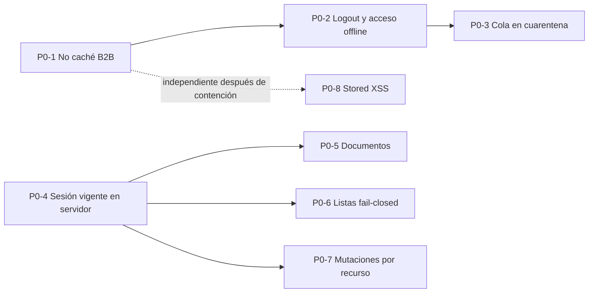
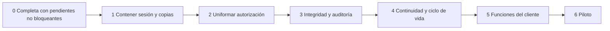

# Estado y plan técnico de CuidaDiario PRO B2B

**Corte:** 30 de septiembre de 2026  
**Propósito:** consolidar el estado real, las auditorías previas, la evidencia externa de Railway del 15/09/2026, la recuperación lógica verificada el 28/09/2026 y los requerimientos de Los Aromos en un plan mínimo, aditivo y sin pérdida de datos.  
**No contiene conclusiones jurídicas.** Las bases, plazos, roles jurídicos, contratos y obligaciones aplicables deben ser determinados por asesoramiento externo usando esta realidad técnica.

Etiquetas: **[VERIFICADO]** comprobado en código o evidencia externa identificada; **[INFERIDO]** conclusión técnica no observada directamente; **[NO VERIFICADO]** requiere evidencia adicional y no equivale a una afirmación negativa; **[PENDIENTE]** brecha o acción abierta; **[FUTURO]** diseño aún no implementado; **[COMPARTIDO - NO TOCAR B2C]** superficie común.

## 1. Escala y clasificación

### Prioridad técnica

- **P0:** exposición o pérdida plausible; corregir antes de ampliar capacidades.
- **P1:** control necesario para consistencia, trazabilidad o recuperación.
- **P2:** endurecimiento o evolución planificable.

### Naturaleza

- **NECESARIO PARA PROTECCIÓN/INTEGRIDAD DE DATOS:** control mínimo para evitar acceso indebido, mezcla, pérdida, alteración no atribuible o imposibilidad de recuperación.
- **BUENA PRÁCTICA DE SEGURIDAD:** defensa en profundidad; no se presenta como obligación legal.
- **REQUISITO FUNCIONAL DEL CLIENTE:** capacidad solicitada en el análisis de Los Aromos, no necesariamente existente ni jurídicamente obligatoria.
- **DEUDA TÉCNICA:** estructura o inconsistencia que aumenta costo/riesgo de operación.

Una fila puede tener más de una naturaleza, pero se identifica una principal para mantener el plan accionable.

## 2. Estado actual consolidado

### 2.1 Lo que existe y funciona según el código

| Área | Estado actual verificado |
|---|---|
| Multi-tenant | Tablas B2B separadas y filtro habitual por `institucion_id`. |
| Identidad | Registro, bcrypt, verificación de e-mail, recuperación, JWT B2B y cuatro roles. |
| Acceso | Roles, permisos institucionales, asignaciones y secciones familiares; aplicación desigual por endpoint. |
| Residentes | Alta, ficha, edición, egreso y desactivación. |
| Medicación | Indicaciones activas e historial append-only de administraciones. |
| Tareas | Programación activa e historial append-only de cumplimientos. |
| Otros registros | Citas, síntomas, signos, contactos, notas, documentos e inventario/reposiciones. |
| Operación | Dashboard, notificaciones visuales, reportes y exportación institucional parcial. |
| Offline | **P0-1 [VERIFICADO EN PRODUCCIÓN — 29/09/2026]:** GET B2B sin caché y purga de copias heredadas. **P0-2/P0-3 [VERIFICADOS EN ENTORNO CONTROLADO — 30/09/2026]:** sin JWT B2B localmente vigente no se restaura el último perfil; logout/401 limpian identidad/estación; mutaciones B2B son sólo de red. Una cola heredada permanece byte a byte en cuarentena y sin consumidor. **NO DESPLEGADO / NO VERIFICADO EN PRODUCCIÓN.** |
| Comercial | Planes/prueba y administración manual. La integración Mercado Pago existe en código/configuración, pero está inactiva en el frontend B2B y Los Aromos no la utiliza. |
| Proveedores | Railway verificado como hosting de backend/PostgreSQL. Resend existe en código/configuración, pero su operación externa no fue comprobada. Mercado Pago queda latente/inactivo. No se demostró web push B2B. |

### 2.2 Datos que pueden persistir al cerrar sesión o terminar el servicio

| Lugar | Qué puede permanecer | Control actual |
|---|---|---|
| PostgreSQL | Todo el dominio B2B, hashes/tokens y documentos base64. | Sin baja institucional automatizada ni política de retención ejecutable observada. |
| `localStorage` | Cola offline heredada, preferencias, nombres recientes de estación y, antes de cargar el cliente P0-2, una posible copia `cd_pro_last_user`; podrían existir respuestas GET `cd_api_/api/b2b...` creadas por versiones anteriores hasta cargar el cliente actualizado. | P0-1 purga sólo copias GET B2B **[VERIFICADO EN PRODUCCIÓN]**. P0-2 retira identidad heredada. P0-3 deja `cd_offline_queue` en cuarentena byte a byte, sin leerla, ejecutarla o borrarla **[VERIFICADO EN ENTORNO CONTROLADO; NO EN PRODUCCIÓN]**. |
| Cache Storage | Estáticos y respuestas GET no-B2B; podrían existir respuestas B2B heredadas hasta activar el service worker actualizado. | **[VERIFICADO EN PRODUCCIÓN — 29/09/2026]:** purga selectiva por URL y GET B2B network-only. |
| `sessionStorage` | Trabajador seleccionado en estación compartida (`cd_active_worker`). | P0-2 lo elimina en logout, 401 o sesión inválida y preserva claves ajenas **[VERIFICADO EN ENTORNO CONTROLADO; NO EN PRODUCCIÓN]**. |
| URL/historial | Tokens de recuperación/verificación. | No se observó limpieza inmediata de la URL. |
| Descargas/dispositivo | Exportaciones y documentos. | Fuera del control de borrado remoto de la aplicación. |
| Proveedores/logs/backups | Metadatos, solicitudes, correos y copias gestionadas; si se activa Mercado Pago, también datos comerciales de suscripción. Un dump lógico completo se conserva localmente desde el 28/09/2026. | Retención efectiva no comprobada. Los snapshots Railway no fueron restaurados; el dump local sí fue restaurado, pero su cifrado, custodia, accesos y vida útil siguen **[NO VERIFICADO]**. |

### 2.3 Exportación, conservación, eliminación y recuperación

- **Exportación actual:** administrador descarga/visualiza un conjunto JSON convertido en reporte imprimible. Incluye institución, residentes, staff, medicamentos, administraciones, citas, cumplimientos, síntomas, signos, contactos y notas.
- **Omisiones de esa exportación:** asignaciones, catálogo y reposiciones, tareas activas, documentos/binarios, preferencias/configuración completa e historial de citas independiente. No hay importador/restaurador.
- **Conservación actual:** filas activas y desactivadas permanecen en PostgreSQL; tres historiales parciales conservan eventos. No hay política técnica general de retención.
- **Eliminación actual:** desactivación para usuarios, residentes, asignaciones, medicamentos, tareas y catálogo; borrado físico para citas, síntomas, signos, contactos, notas y documentos.
- **Recuperación actual:** la aplicación puede descargar documentos y generar un export parcial no reimportable. **[VERIFICADO]** Existe una ruta de recuperación lógica completa probada el 28/09/2026 mediante `pg_dump` y `pg_restore` en PostgreSQL local aislado. **[NO VERIFICADO]** Los snapshots Railway, PITR, programación, política de retención y RPO/RTO no fueron probados.

### 2.4 Evidencia externa de Railway del 15/09/2026

La inspección fue visual y no invasiva: no se habilitó Query Statistics, no se abrió Console, no se ejecutó SQL y no se inspeccionaron contenidos clínicos.

| Área | Hecho verificado externamente |
|---|---|
| Proyecto | Workspace con un único proyecto relevante, `resilient-nature`, entorno `production`. |
| Servicios | `Postgres` y `cuidadiario-backend`, ambos Online. |
| Base compartida | Una misma instancia contiene tablas `*_b2b` y tablas B2C/no B2B. **[COMPARTIDO - NO TOCAR B2C]** |
| Región/réplicas | PostgreSQL y backend en `US East (Virginia, USA)`, una réplica cada uno. |
| Persistencia/red DB | Volumen `postgres-volume`; Private Networking `postgres.railway.internal`; Public Networking/TCP Proxy hacia 5432. |
| Red backend | `cuidadiario-backend.railway.internal`; dominio público Railway dirigido al puerto 8080. |
| Entrega | Repositorio `edensoftwarework/cuidadiario-backend`, rama `main`, auto-deploy por push; Railway/Railpack y Node 22.22.3 observados. |
| Variables | Se comprobó la presencia por nombre de variables PostgreSQL/backend relevantes; nunca se inspeccionaron valores. `JWT_SECRET` existe; no se observó `JWT_SECRET_B2B`. |
| Acceso Railway | Un miembro observado, rol Admin; 2FA figuraba Off. |
| Backups | `No backup schedule`; dos snapshots manuales `Pre-Security-Patch Backup`, ~243 MB cada uno, de ~23 días y ~1 mes. Restaurabilidad no probada. La UI indicó que programación/PITR requerían plan Pro en la configuración observada; PITR activo no fue demostrado. |
| Stats DB | Base ~23,8 MB; tablas ~14,2 MB; WAL ~32 MB; hit 99,99 %; 1/500 conexiones; bloat 0; riesgo XID 0. `documentos_b2b` ~13,3 MB y 2 filas. Fotografía puntual, no garantía histórica. |

### 2.5 Evidencia de recuperación lógica del 28/09/2026

**[VERIFICADO]** Se realizó una prueba real e independiente de recuperación, fuera de Railway y sin restaurar ni escribir en producción:

| Paso / atributo | Evidencia proporcionada |
|---|---|
| Origen | PostgreSQL de producción Railway mediante `DATABASE_PUBLIC_URL`; servidor PostgreSQL 17.11. |
| Herramienta | `pg_dump` 18.6 desde Windows. |
| Artefacto | `cuidadiario_produccion_2026-09-28.dump`, formato CUSTOM, gzip, base original `railway`, 314 entradas TOC. |
| Legibilidad | `pg_restore --list` leyó correctamente el archivo. |
| Destino | PostgreSQL local independiente `cuidadiario_restore_test`. |
| Resultado | `pg_restore` terminó sin errores ni advertencias. |
| Comprobación | `\dt` mostró tablas B2B y B2C restauradas **[COMPARTIDO - NO TOCAR B2C]**. |
| Conteos agregados | 33 instituciones, 82 usuarios, 90 residentes, 304 medicamentos y 12 documentos B2B; no se inspeccionaron datos personales. |
| Producción | No recibió ninguna restauración ni modificación. |
| Custodia | El dump original se conserva localmente. |

La prueba demuestra una ruta funcional `producción -> pg_dump -> archivo independiente -> pg_restore -> PostgreSQL aislado`. **[NO VERIFICADO]** No prueba PITR, restaurabilidad de snapshots Railway, automatización, retención, RPO/RTO ni cifrado/custodia/vida útil de la copia local.

## 3. Hallazgos priorizados

### 3.1 Necesario para protección/integridad de datos

| Pri. | Hallazgo confirmado | Cambio técnico mínimo futuro, sin alterar datos previos |
|---|---|---|
| P0 | `JWT_SECRET` existe por nombre en producción, pero los JWT B2B duran 30 días y `authB2BMiddleware` no recarga usuario, institución, rol ni estado. Un token emitido puede mantener claims anteriores tras desactivar al usuario/institución o cambiar su rol. La clave y helpers son compartidos. **[COMPARTIDO - NO TOCAR B2C]** | Revalidar estado e identidad B2B actuales en cada petición protegida, sin cambiar todavía firma o contrato JWT compartido. El fallback conocido del secreto queda como endurecimiento separado que exige análisis B2C. |
| P0 | Varias listas comprueban acceso al residente sólo si viene `paciente_id`; varias mutaciones/descargas por ID sólo aplican institución y rol. | Crear un guard B2B único que resuelva el recurso, obtenga su `paciente_id` y aplique `P`/`F` en cada operación. Agregar pruebas negativas multi-tenant, rol y asignación. |
| P0 | Dashboard/reportes pueden entregar secciones familiares no habilitadas individualmente. | Filtrar cada bloque con la misma política de sección usada por las rutas de módulo. |
| P0 | Versiones anteriores guardaban respuestas B2B con datos personales/de salud en `localStorage` y Cache Storage sin partición. | **[VERIFICADO EN PRODUCCIÓN — 29/09/2026] P0-1:** GET B2B network-only y purga selectiva de copias heredadas, con pruebas automatizadas, navegador controlado y validación post-despliegue. Logout permanece en P0-2. |
| P0 | La versión anterior restauraba el último perfil offline y conservaba identidad tras logout/401. | **[VERIFICADO EN ENTORNO CONTROLADO — P0-2, 30/09/2026]:** se retiró la restauración, se limpia identidad/estación y se preserva byte a byte la cola. Pendiente despliegue/verificación en producción. |
| P0 | La cola offline heredada era global, admitía `DELETE`, no identificaba propietario/tenant y podía sincronizarse automáticamente bajo otra sesión. | **[VERIFICADO EN ENTORNO CONTROLADO — P0-3, 30/09/2026]:** productor, consumidor, reintentos y falsa confirmación retirados; cola previa en cuarentena byte a byte. No desplegado. La idempotencia servidor queda para P1. |
| P0 | Se verificaron renderizados con `innerHTML` que interpolaban datos persistidos o mensajes/URLs no confiables sin tratamiento contextual uniforme. | **[VERIFICADO EN ENTORNO CONTROLADO — P0-8, 30/09/2026]:** inventario y corrección por contexto, 82 aserciones deterministas y 15 en Chrome real sin ejecución. No desplegado ni verificado en producción. |
| P1 | Ediciones sobrescriben información clínica/operativa sin versión general; historial sólo cubre administraciones, tareas completadas y aumentos de stock. | Agregar ledger/auditoría B2B append-only con actor autenticado, institución, residente, tipo, ID, acción, timestamp, motivo y snapshot/diff protegido. Empezar hacia adelante. |
| P1 | Modo estación compartida acepta `_quien` como nombre visible bajo la sesión del administrador. | Conservar siempre actor autenticado; agregar identidad de operador seleccionada con mecanismo verificable (PIN/reautenticación) y registrar ambas identidades. |
| P1 | El egreso se aplica como convención visual; el backend no bloquea universalmente nuevas mutaciones del residente egresado. | Incorporar guard de estado de residencia con excepciones explícitas y trazables. No modificar registros históricos. |
| P1 | **[VERIFICADO]** El dump lógico completo del 28/09 fue restaurado exitosamente en PostgreSQL aislado. Los dos snapshots manuales Railway, PITR, backup schedule, RPO/RTO y política de retención siguen **[NO VERIFICADO]**; el “backup completo” de UI es parcial y no reimportable. | Formalizar programación/retención y custodia de dumps, probar periódicamente; verificar por separado snapshots/PITR si se los adopta y crear export B2B completo, versionado y con manifiesto de integridad. |
| P1 | No hay mecanismo técnico para ejecutar y demostrar una política de conservación/baja institucional; las cascadas podrían amplificar una eliminación directa. | Diseñar estados institucionales, cuarentena y workflow aprobado de exportación/retención/supresión. Nunca ejecutar cascadas sobre datos reales sin inventario, respaldo y decisión externa. |
| P1 | Citas, síntomas, signos, contactos, notas y documentos se borran físicamente, sin papelera ni evento de borrado. | Para nuevas operaciones, reemplazar por estado lógico/revocación y registrar evento. No reconstruir, borrar ni modificar retrospectivamente filas reales. |
| P1 | Administración de medicación e impacto de stock se ejecutan en sentencias separadas y no existe idempotencia servidor. | Incorporar transacción e idempotency key B2B persistida con resultado/actor/tenant, sin reescribir administraciones previas. |

### 3.2 Buenas prácticas de seguridad

| Pri. | Hallazgo | Mejora futura |
|---|---|---|
| P1 | TLS de PostgreSQL acepta certificado sin verificar; el estado TLS extremo a extremo no se pudo probar. **[COMPARTIDO - NO TOCAR B2C]** | Usar validación de certificado/cadena compatible con Railway y verificar HTTPS, HSTS y redirecciones en producción. |
| P1 | CORS se configura globalmente; no se observó allowlist B2B estricta. **[COMPARTIDO - NO TOCAR B2C]** | Definir orígenes/métodos/headers mínimos sin romper consumidores B2C. |
| P1 | Rate limit de autenticación vive en memoria. | Mover a almacenamiento coordinado o protección gestionada, con métricas y alertas sin registrar credenciales. |
| P1 | No se observó una capa general de headers de seguridad/CSP. | Agregar CSP, `frame-ancestors`, MIME sniffing y política de referrer tras inventariar scripts inline. |
| P1 | Tokens de recuperación/verificación se guardan en claro y viajan por query string. | Guardar digest, limitar uso/vida, invalidar al consumir y retirar query de la URL con `history.replaceState`. |
| P2 | No hay MFA ni reautenticación para exportar, cambiar roles, contraseñas o plan. | Incorporar step-up/MFA inicialmente para administradores y acciones sensibles. |
| P2 | El único miembro Railway observado tiene rol Admin y el workspace mostraba 2FA Off. No se trata como bloqueo inmediato. | Habilitar 2FA y revisar principio de mínimo privilegio/recuperación de cuenta como endurecimiento de acceso a infraestructura. |
| P2 | No se observa pipeline de análisis de dependencias, secretos, SAST o pruebas de autorización. | Añadir controles CI de sólo lectura/alerta y pruebas de seguridad B2B. |
| P2 | Logs incluyen e-mails, IDs de institución/preaprobación y errores; retención no verificada. | Estructurar/redactar logs, separar entornos, limitar acceso y fijar retención comprobable. |
| P2 | Documentos se alojan como base64 en PostgreSQL y pueden multiplicar backup/caché/costo. | Evaluar object storage privado con cifrado, URLs cortas y migración aditiva; no mover datos reales hasta probar reconciliación y rollback. |

### 3.3 Requisitos funcionales del cliente

Todo este bloque es **[FUTURO]**; no debe presentarse como estado actual ni como obligación legal.

| Pri. | Capacidad solicitada | Encaje técnico mínimo compatible |
|---|---|---|
| P1 | Evolución/historia cronológica estructurada | Nueva entidad de eventos/evoluciones vinculada a residente, actor y fecha; vista unificada que también lea registros actuales. |
| P1 | Medicación clínica más completa: vía, prescriptor, vigencia, omisiones/cambios | Columnas anulables o entidad de indicaciones versionadas; conservar `medicamentos_b2b` y sus historiales como legado consultable. |
| P1 | No eliminación/versionado de registros relevantes | Estados y revisiones hacia adelante, apoyados en auditoría append-only. |
| P1 | Incidentes y eventos adversos | Tabla B2B nueva con clasificación, descripción, acciones, responsables, estado y adjuntos. |
| P1 | Estados temporales del residente | Entidad temporal con inicio/fin/motivo, sin sobrecargar `activo` o `fecha_egreso`. |
| P1 | Contactos con prioridad y autorización/alcance | Ampliar contactos con prioridad, tipo y reglas explícitas; migración sólo aditiva. |
| P1 | Documentos categorizados, con fecha y descripción | Metadatos anulables nuevos y catálogo de categorías; preservar binarios existentes. |
| P2 | Alertas configurables | Reglas institucionales/por residente y estados de alerta; no confundir la campana actual con web push. |
| P2 | Dashboard operativo ampliado | Consultas/vistas sobre eventos, incidentes, estados y pendientes con políticas de acceso. |
| P2 | Dashboard de dirección | Agregados mínimos, sin exposición nominal innecesaria, con permiso separado. |
| P2 | Piloto y capacitación | Ambiente/datos de prueba, casos de aceptación, matriz de roles, guía y plan de reversión. |

### 3.4 Deuda técnica

| Pri. | Deuda observada | Tratamiento mínimo |
|---|---|---|
| P1 | Backend monolítico mezcla rutas, SQL, migraciones, jobs e integraciones B2B/B2C. **[COMPARTIDO - NO TOCAR B2C]** | Extraer primero módulos/guards B2B sin cambiar contratos; pruebas de caracterización antes de mover código. |
| P1 | `runMigrations()` mezcla productos, corre después de `listen` y silencia varios errores. **[COMPARTIDO - NO TOCAR B2C]** | Migrador controlado, con tabla/versiones claras, transacciones, verificación y SQL exclusivamente B2B. No reejecutar transformaciones de datos existentes. |
| P1 | Tipos/semánticas horarias mezclan `timestamp` y conversiones manuales de Argentina. | Definir contrato UTC/local por campo, probar DST/entradas offline y migrar sólo mediante columnas/vistas aditivas. |
| P1 | Exportación denominada “backup completo” no es completa ni restaurable. | Renombrar mientras sea reporte; luego definir formato canónico, manifiesto y restauración probada. |
| P2 | `historial_citas_b2b` existe pero no se escribe ni consulta. | Decidir si se activa hacia adelante o se depreca documentalmente; no borrar la tabla ni asumir que está vacía en producción. |
| P2 | Dos bloques se rotulan “migración B2B v14”. | Adoptar identificadores únicos/inmutables. |
| P2 | Nomenclatura alterna paciente/residente y “alta” puede significar creación o egreso. | Crear glosario y nombres de acción inequívocos sin renombrar destructivamente columnas/rutas. |
| P2 | Límites, precios y estado de planes difieren entre backend, configuración y landing. | Definir una fuente de verdad de catálogo comercial y alinear textos/validaciones. |

## 4. Contradicciones o hallazgos incidentales que requieren revisión

Estas divergencias requieren corrección técnica y/o revisión del texto por responsables competentes. No se emite conclusión jurídica.

### 4.1 Documentación pública e interfaz

| Ubicación / afirmación resumida | Conducta técnica observada | Acción mínima |
|---|---|---|
| `privacy.html`: localStorage se usa para el JWT. | También conserva perfil actual, preferencias, nombres recientes y, si existe de una versión anterior, `cd_offline_queue` en cuarentena. P0-1 ya impide caché GET B2B y P0-2 retira el último usuario heredado en el cliente local. | Inventariar la persistencia cliente que realmente queda y distinguir el paquete local aún no desplegado. |
| `privacy.html`: acceso a datos restringido por rol e institución. | El tenant se filtra ampliamente, pero existen rutas con acceso a residente/sección incompleto. | Corregir guards y luego redactar el alcance exacto. |
| `privacy.html`: supresión de activos en 30 días y backups cifrados hasta 90 días. | No existe workflow de baja institucional. Railway mostró dos snapshots manuales y `No backup schedule`. Un dump lógico completo fue restaurado exitosamente el 28/09 fuera de Railway, pero no se acreditaron cifrado, programación ni retención de 90 días. | Definir procedimientos y no afirmar plazos/cifrado no operativizados. |
| `privacy.html`: todas las comunicaciones usan HTTPS/TLS. | La URL del frontend es HTTPS; PostgreSQL activa SSL pero no verifica certificado. Infraestructura efectiva no inspeccionada. | Verificar transporte extremo a extremo y ajustar configuración/texto. |
| `privacy.html`: contraseña “cifrada” con bcrypt. | bcrypt produce un hash con salt, no cifrado reversible. | Usar “hash seguro con bcrypt”. |
| `privacy.html`: categorías de datos. | Omite o no detalla citas, tareas/cumplimientos, documentos/binarios, obra social, inventario, asignaciones, preferencias, plan y copias offline. | Completar el inventario sólo con datos efectivamente tratados. |
| `terms.html`: fallas de Cloudflare. | Se verificó Cloudflare como DNS/proxy CNAME del frontend, no como Cloudflare Pages. No se verificaron logs, región, retención, target completo ni que toda indisponibilidad posible sea atribuible a ese proveedor. | Ajustar el texto al rol técnico efectivamente demostrado y evitar atribución absoluta de fallas. |
| Configuración: “backup completo” y texto “formato PDF”. | El endpoint exporta JSON parcial; el frontend construye HTML para imprimir/guardar como PDF. Omite varias tablas y binarios y no restaura. | Renombrar como reporte/exportación parcial o completar formato/restauración. |
| Landing: “historial completo ... con trazabilidad del personal”. | Hay historiales parciales; varias ediciones/borrados no se versionan y `_quien` puede ser un nombre no autenticado. | Acotar la afirmación hasta implementar trazabilidad verificable. |
| Landing: al vencer prueba “todos los datos se conservan y nunca se borran”. | El vencimiento no borra automáticamente según el código, pero múltiples endpoints realizan borrado físico y no existe garantía técnica de retención indefinida. | Precisar que el vencimiento no ejecuta borrado automático, sin promesa absoluta. |
| Landing/términos/configuración: Mercado Pago presentado como medio disponible. | El código y las variables existen, pero el propietario confirma que la integración no está habilitada actualmente en el frontend B2B ni es utilizada por Los Aromos. | Presentarla como no disponible mientras permanezca inactiva; verificar operación antes de reactivarla. |
| Landing/configuración/backend: Plan Básico. | Landing: 15 residentes/5 staff y ARS 25.000; enforcement de altas: 15/8; contratación/configuración: elegibilidad 30/20 y Mercado Pago ARS 19.000. | Resolver catálogo y límites antes de comunicar o cobrar. |

### 4.2 Código y operación

| Hallazgo incidental | Estado observado | Revisión necesaria |
|---|---|---|
| `historial_citas_b2b` | La migración crea la tabla, pero el historial actual lee `citas_b2b` con estado realizada y no existe `INSERT` al historial. | Definir intención; no borrar ni poblar retrospectivamente. |
| Middleware de plan | El comentario indica aplicación a todos los POST/PATCH/PUT clínicos, pero las rutas lo aplican selectivamente y algunas altas no lo usan. | Especificar política única y probarla; no inferirla del comentario. |
| Versiones de migración | Hay dos bloques etiquetados v14 con finalidades distintas. | Adoptar IDs únicos antes de agregar migraciones. |
| Límites comerciales | Coexisten límites Básico 15/8 en enforcement y 30/20 en compra/UI de configuración, además de 15/5 en landing. | Resolver fuente de verdad sin desactivar o eliminar residentes/staff existentes. |
| Acceso familiar agregado | La campana aplica secciones familiares al armar ítems; dashboard y reporte no lo hacen de manera equivalente. | Alinear política en backend y agregar pruebas por sección. |

## 5. Plan mínimo de adecuación B2B

### 5.1 Decisión de cierre de Etapa 0

**Estado exacto: COMPLETA CON PENDIENTES NO BLOQUEANTES.**

| Criterio de salida de Etapa 0 | Evidencia | Resultado |
|---|---|---|
| Inventario consolidado | Código B2B, documentación canónica e inspección Railway del 15/09/2026. | **[VERIFICADO]** |
| Backup identificable | Dump completo `cuidadiario_produccion_2026-09-28.dump`, custom/gzip, 314 TOC, origen PostgreSQL 17.11. | **[VERIFICADO]** |
| Restauración aislada exitosa | `pg_restore` sin errores ni advertencias en `cuidadiario_restore_test`, con tablas y conteos agregados comprobados. | **[VERIFICADO]** |
| Producción preservada | No se restauró en Railway ni se modificó producción durante la prueba. | **[VERIFICADO]** |

El bloqueo real que mantenía abierta la Etapa 0 era no haber demostrado una recuperación independiente. La prueba del 28/09 lo resolvió para una copia lógica completa y permite comenzar correcciones P0 que no requieren SQL. Se elige “con pendientes no bloqueantes”, y no “completa” sin reservas, porque snapshots Railway, PITR, automatización, RPO/RTO, retención y custodia/cifrado del dump continúan **[NO VERIFICADO]**. Esos puntos deben resolverse en continuidad P1 y antes de depender de cualquiera de esos mecanismos, pero no impiden iniciar el bloque P0-1.

**[PENDIENTE]** Antes de cada futuro despliegue a producción debe confirmarse un backup reciente recuperable, el rollback específico y la autorización humana. La prueba del 28/09 no es autorización permanente ni demuestra que una copia antigua cubra cambios posteriores.

### 5.2 Reglas de ejecución futura

- No tocar tablas, rutas ni funcionalidades B2C.
- Marcar y probar toda superficie **[COMPARTIDO - NO TOCAR B2C]** antes de cambiarla.
- No eliminar, reescribir, normalizar retrospectivamente ni modificar en masa datos reales.
- Preferir nuevas columnas anulables, nuevas tablas B2B, índices concurrentes/seguros y vistas compatibles.
- Ejecutar primero backup y restauración de prueba; después migración idempotente en ensayo; por último despliegue reversible.
- Documentar y ensayar rollback antes de cada despliegue/migración.
- Mantener lectura de estructuras legadas durante la transición.
- Empezar trazabilidad/versionado desde la fecha de activación; no fabricar historia anterior.
- No ejecutar purge automático hasta que la retención esté definida y validada externamente.
- Separar criterios técnicos de las decisiones legales pendientes.

### 5.3 Etapas consolidadas

| Etapa | Alcance mínimo | Criterio de salida | Estado al 30/09/2026 |
|---|---|---|---|
| 0. Verificación externa | Inspección Railway del 15/09 más dump/restauración lógica independiente del 28/09. Permanecen pendientes los mecanismos administrados, política y controles de continuidad. | Inventario consolidado, backup identificable y restauración aislada exitosa. | **COMPLETA CON PENDIENTES NO BLOQUEANTES** |
| 1. Contención cliente/sesión | Secreto obligatorio, revalidación B2B, no caché sensible, logout completo, cola segregada, tokens fuera de URL. | Pruebas muestran que otro usuario/tenant no recibe copias y una sesión revocada no opera. | **EN IMPLEMENTACIÓN LOCAL**: P0-1 **VERIFICADO EN PRODUCCIÓN**; P0-2, P0-3 y P0-8 **VERIFICADOS EN ENTORNO CONTROLADO, NO DESPLEGADOS**; P0-4 a P0-7 no iniciados. |
| 2. Autorización uniforme | Guard de recurso/residente/sección en todas las rutas y agregados. | Matriz automatizada AI/MD/CS/FA × tenant × asignación × sección sin escapes. | **NO INICIADA** |
| 3. Integridad y trazabilidad | Idempotencia, auditoría append-only, actor verificable, estados lógicos y control de egreso. | Mutaciones nuevas son atribuibles, repetibles con seguridad y no destruyen evidencia. | **NO INICIADA** |
| 4. Continuidad y ciclo de vida | Export completo versionado, restore probado, procedimiento de retención/baja y logs controlados. | Exportación reconciliada con conteos y simulacro documentado sin tocar producción. | **NO INICIADA** |
| 5. Funciones de Los Aromos | Evolución, indicaciones versionadas, incidentes, estados temporales, metadatos y dashboards. | Criterios de aceptación del cliente y permisos aprobados sobre datos de prueba. | **NO INICIADA** |
| 6. Piloto controlado | Capacitación, soporte, métricas, rollback y seguimiento. | Piloto aprobado antes de ampliar alcance. | **NO INICIADA** |

La documentación canónica no equivale por sí sola a avance de implementación. La Etapa 0 está cerrada sólo en el sentido anterior. La Etapa 1 está en implementación local con los estados de bloque indicados; las etapas 2 a 6 permanecen no iniciadas.

Sujeto a revisión humana final, la intención de entrega es publicar P0-2 + P0-3 + P0-8 como **un único paquete frontend controlado**, manteniendo evidencia, aceptación y rollback separados por bloque. Esta intención no constituye autorización ni evidencia de despliegue.

Estados permitidos para futuras actualizaciones: **NO INICIADA**, **EN VERIFICACIÓN**, **COMPLETA CON PENDIENTES NO BLOQUEANTES**, **LISTA PARA IMPLEMENTAR**, **EN IMPLEMENTACIÓN LOCAL**, **IMPLEMENTADA**, **VERIFICADO EN ENTORNO CONTROLADO**, **VERIFICADO EN PRODUCCIÓN** y **VERIFICADA**. Una recomendación de auditoría no cambia por sí sola el estado; sólo evidencia post-despliegue específica permite usar “verificado en producción”.

### 5.4 Orden ejecutable de bloques P0

1. **P0-1 — Contener caché de respuestas B2B en navegador. VERIFICADO EN PRODUCCIÓN — 29/09/2026.**
2. **P0-2 — Retirar acceso offline no autenticado y completar logout/401. VERIFICADO EN ENTORNO CONTROLADO — 30/09/2026; NO DESPLEGADO.**
3. **P0-3 — Detener y poner en cuarentena la cola offline global. VERIFICADO EN ENTORNO CONTROLADO — 30/09/2026; NO DESPLEGADO.**
4. **P0-4 — Revalidar en servidor la sesión B2B contra estado actual.**
5. **P0-5 — Cerrar autorización y caché de descarga/eliminación de documentos.**
6. **P0-6 — Hacer fail-closed las listas cuando falta `paciente_id`.**
7. **P0-7 — Aplicar autorización de residente/recurso a mutaciones por ID.**
8. **P0-8 — Eliminar sinks de stored XSS y uniformar renderizado seguro B2B. VERIFICADO EN ENTORNO CONTROLADO — 30/09/2026; NO DESPLEGADO.**

Los bloques son deliberadamente pequeños. P0-1 a P0-3 contienen copias/acciones del navegador; P0-4 establece identidad vigente en servidor y es prerrequisito de P0-5 a P0-7. P0-8 no depende de SQL y fue validado junto con P0-3 como paquete frontend local controlado, sin iniciar P0-4 a P0-7.

### 5.5 P0-1 — Contener caché de respuestas B2B en navegador

**Estado al 29/09/2026:** **P0-1 VERIFICADO EN PRODUCCIÓN**. El commit desplegado `ffb8ef595ed57a920dc9f0b1ee6e7927e13b8636` (`P0-1: prevent B2B response caching`; deployment GitHub Pages #86 informado como Active) modifica únicamente `js/api-b2b.js` y `sw.js`. Los contenidos públicos de ambos archivos coincidieron por SHA-256 normalizado con ese commit y los archivos P0-1 aprobados en esa fecha. La evidencia histórica fue 33 aserciones de mocks, 38 en Chrome controlado y 23 post-despliegue. La regresión final del paquete local posterior aprobó 35 aserciones deterministas y 69 en Chrome controlado; no cambia ni vuelve a declarar el estado productivo.

- **Problema original — [VERIFICADO]:** la versión previa de `API_B2B.get()` conservaba todas las respuestas GET en claves `cd_api_*`; el service worker aplicaba `networkFirstWithCache` también a GET B2B. Respuestas con datos personales/salud podían quedar fuera de la sesión y sin partición por usuario/tenant.
- **Evidencia actual:** `frontend/js/api-b2b.js`, `purgeLegacyGetCache` y `get`; `frontend/sw.js`, `isB2BApiUrl`, `purgeB2BApiResponsesFromCaches`, rama B2B previa a las genéricas y `networkOnly`.
- **Riesgo:** otro usuario del mismo navegador, una sesión expirada o el modo offline pueden recibir respuestas de una sesión anterior.
- **Comportamiento implementado localmente:** los GET `/api/b2b/` son sólo de red, no se escriben ni leen desde `localStorage`/Cache Storage y las copias B2B heredadas se eliminan selectivamente. El shell/estáticos PWA y la caché no-B2B conservan sus estrategias.
- **Archivos de implementación/prueba:** `frontend/js/api-b2b.js`; `frontend/sw.js` **[COMPARTIDO - NO TOCAR B2C]**; `frontend/tests/p0-1-cache.test.js`; arnés real controlado `frontend/tests/p0-1-browser.test.js`.
- **Migración SQL:** no.
- **Impacto B2C/no-B2B:** la condición es exacta para `/api/b2b` o `/api/b2b/…`. Las ramas existentes de otras rutas `/api/`, hosts Railway/Render, estáticos y HTML no cambiaron. Los mocks confirmaron preservación/fallback de `/api/admin`, host Railway no-B2B y cachés ajenos; Chrome controlado confirmó `/api/b2b-other`, API no-B2B y shell PWA online/offline; producción confirmó que `/api/b2b-other` y una respuesta no-B2B sintética sobreviven a la activación. No se probó funcionalidad B2C con datos ni cuentas reales.
- **Pruebas ejecutadas:** 33 aserciones con mocks para GET B2B online/offline, `localStorage`, Cache Storage, `/api/admin`, host Railway no-B2B, cachés ajenos y shell; 38 aserciones en Chrome controlado; y 23 aserciones post-despliegue en Chrome 153.0.8010.48 con Node 24.11.1, perfil temporal sobre `https://cuidadiario-pro.edensoftwork.com`, estado sintético, instalación/activación/control del SW y purga selectiva real. En la prueba final no se usaron credenciales/datos reales, no se llamó al backend, no se emitieron requests `/api/b2b` y no hubo métodos mutadores de aplicación. La telemetría RUM inyectada por Cloudflare fue interceptada en el navegador antes de recibir respuesta.
- **Criterio objetivo de aceptación:** aprobado. En entorno controlado se acreditó que un GET B2B no crea claves/respuestas y que offline devuelve 503 sin recuperar el cuerpo anterior. En producción se acreditó que los archivos activos son exactamente los aprobados, el SW instala/controla, la activación elimina `/api/b2b` y `/api/b2b/…`, `purgeLegacyGetCache()` elimina sólo la clave B2B ficticia y `/api/b2b-other`, cola, último usuario sintético, preferencias y respuestas no-B2B permanecen.
- **Rollback:** revertir exclusivamente los cambios de `frontend/js/api-b2b.js` y `frontend/sw.js` y retirar la prueba/documentación asociada. No hubo cambio de nombre/versión de caché. Las copias sensibles ya purgadas no se recrean; ningún dato de PostgreSQL se modifica.

### 5.6 P0-2 — Retirar acceso offline no autenticado y completar logout/401

**Estado al 30/09/2026:** **P0-2 VERIFICADO EN ENTORNO CONTROLADO. NO DESPLEGADO / NO VERIFICADO EN PRODUCCIÓN.**

- **Problema original — [VERIFICADO]:** `cd_pro_last_user` sobrevivía al logout/401; `login.html` lo usaba para entrar sin token ni contraseña; `utils-b2b.js` podía restaurar `cd_pro_user`; `removeToken()` quitaba sólo token y usuario actual.
- **Evidencia actual:** `frontend/js/api-b2b.js`, validación temporal/claim local, `removeToken`, 401 y retiro de migración; `frontend/login.html`, sin bypass/fallback offline; `frontend/js/utils-b2b.js`, guardia fail-closed; `frontend/verify-email.html`, sin escritura de último usuario; `configuracion.js`/`reportes.js`, init detenido cuando falla la guardia.
- **Riesgo:** acceso visual a información persistida y continuidad aparente sin autenticación válida; identidad residual tras logout.
- **Comportamiento implementado localmente:** sin JWT estructuralmente B2B y temporalmente vigente no se atraviesa la guardia ni se restaura identidad offline. Logout y 401 eliminan `cd_pro_token`, `cd_pro_user`, `cd_pro_last_user` y `sessionStorage.cd_active_worker`, e invocan la purga selectiva P0-1. La firma/estado remoto no pueden validarse en cliente y quedan a cargo del backend/P0-4.
- **Cola/P0-3:** P0-2 no borra, migra, reescribe ni atribuye `cd_offline_queue`. P0-3, validado después dentro del mismo paquete local, retiró por completo `_offlineQueue`, `_syncOfflineQueue` y sus disparadores aun con sesión válida; la cola heredada permanece intacta.
- **Archivos de implementación/prueba:** `frontend/js/api-b2b.js`, `frontend/login.html`, `frontend/js/utils-b2b.js`, `frontend/verify-email.html`, `frontend/js/configuracion.js`, `frontend/js/reportes.js`, cambio de versión del script —sin renombrar cachés ni estrategias— en `frontend/sw.js` para recargar in-place los assets P0-2, `frontend/tests/p0-2-session.test.js` y ajustes de regresión en `frontend/tests/p0-1-cache.test.js`/`p0-1-browser.test.js`.
- **Migración SQL:** no.
- **Impacto B2C/no-B2B:** los scripts funcionales modificados sólo son consumidos por páginas PRO B2B. `sw.js` **[COMPARTIDO - NO TOCAR B2C]** conserva `v6`, `CACHE_NAME_API` y todas las estrategias; su reinstalación refresca assets B2B precacheados en el mismo caché y preserva entradas estáticas ajenas. Pruebas preservaron claves ficticias B2C/no-B2B, preferencias, `sessionStorage` ajeno, `/api/b2b-other`, API no-B2B y shell PWA. No se usaron cuentas ni funcionalidad B2C real.
- **Pruebas ejecutadas:** 88 aserciones deterministas en `p0-2-session.test.js`; 35 aserciones P0-1 en `p0-1-cache.test.js`; 69 aserciones combinadas en Chrome 153.0.8010.48 real, perfil temporal y origen local. Cubren logout online/offline, 401 sintético, token ausente/malformado/vencido/no vigente/no-B2B, reload, copia heredada, guardia protegida, estación, cola byte a byte, preferencias/claves ajenas, unicidad de `login.html`/`admin-panel.html` y recarga in-place real de assets preservando una entrada estática no-B2B. No se invocó backend ni se generó/sincronizó una operación de cola.
- **Criterio objetivo de aceptación:** aprobado en entorno controlado. Sin token válido se exige login; no se restaura `cd_pro_user`; logout/401 eliminan identidad B2B y selección activa de estación; la cola conserva exactamente sus bytes; P0-1 y no-B2B mantienen su conducta.
- **Pendiente antes de producción:** revisión humana, commit/deploy autorizado y prueba post-despliegue aislada que confirme archivos activos, actualización del cliente/SW, logout/401, almacenamiento y regresión P0-1/no-B2B sin usar datos reales.
- **Rollback:** revertir exclusivamente los seis archivos funcionales P0-2, el cambio de script del service worker y sus pruebas/documentación. No hay rollback de DB ni datos. No restaurar `cd_pro_last_user` ni sincronizar/borrar la cola como mecanismo de rollback. Un rollback publicado debe volver a cambiar bytes de `sw.js` para disparar otra reinstalación/recarga in-place de assets; no borrar el caché compartido.

### 5.7 P0-3 — Detener y poner en cuarentena la cola offline global

**Estado al 30/09/2026: P0-3 VERIFICADO EN ENTORNO CONTROLADO. NO DESPLEGADO / NO VERIFICADO EN PRODUCCIÓN.**

- **Problema original — [VERIFICADO]:** `cd_offline_queue` guardaba POST/PATCH/DELETE sin usuario ni institución; `_syncOfflineQueue()` usaba el token vigente y se disparaba al volver online/cargar página. `_qid` no llegaba al servidor. La UI podía cerrar formularios y presentar la acción como guardada.
- **Inventario antes/después:** se retiraron el productor `_offlineQueue.add`, su lector/remover/contador, `_syncOfflineQueue`, timers de `DOMContentLoaded`/`online`, evento `offlinesynccomplete` y su consumidor en `paciente.js`, así como la interpretación de `err.queued`. `handleOfflineWrite` permanece temporalmente como adaptador compatible que siempre devuelve `false` y no muta UI/estado. No quedó otro productor, consumidor, timer ni trigger automático en frontend B2B.
- **Comportamiento implementado:** POST/PATCH/DELETE siempre intentan red y propagan fallo explícito. El cliente no lee, parsea, migra, reescribe, ejecuta, transmite ni elimina una `cd_offline_queue` previa. Reconexión, reload, logout y cambio de usuario conservan exactamente sus bytes. El banner/landing informan que los cambios requieren internet y no se guardan para después.
- **Archivos funcionales:** `frontend/js/api-b2b.js`, `frontend/js/utils-b2b.js`, `frontend/js/paciente.js` y `frontend/landing.html`; `frontend/sw.js` sólo dispara actualización coordinada del paquete y no cambia estrategias.
- **Pruebas:** `p0-3-offline-queue.test.js`, 37 aserciones; regresión `p0-2-session.test.js`, 88; Chrome real local `p0-a-browser.test.js`, dentro de sus 15 aserciones: POST/PATCH/DELETE offline fallaron sin `queued`, cola byte a byte intacta, clave no-B2B intacta y cero mutaciones automáticas tras `online`+reload.
- **Migración/datos:** no hay SQL ni modificación retrospectiva. No se usaron datos reales ni se tocó la cola de un navegador de producción.
- **Impacto B2C/no-B2B:** los productores/consumidores retirados pertenecen al cliente PRO. El service worker compartido conserva ramas y cachés no-B2B; las pruebas preservan una clave ficticia no-B2B. No se probó una cuenta B2C real.
- **Criterio objetivo de aceptación:** aprobado en entorno controlado. La cuarentena es deliberadamente silenciosa y conservadora; conteo/aviso/reconciliación supervisada no se implementan en este bloque para evitar leer o reinterpretar contenido heredado.
- **Rollback:** revertir sólo los archivos frontend P0-3 y pruebas/documentación asociadas. No ejecutar ni borrar masivamente la cola como rollback. Cualquier reconciliación exige revisar actor, tenant, recurso y estado actual.

### 5.8 P0-4 — Revalidar en servidor la sesión B2B contra estado actual

- **Problema concreto — [VERIFICADO]:** el login valida usuario/institución activos, pero `authB2BMiddleware` posterior confía durante hasta 30 días en `id`, `institucion_id`, `rol` y verificación del JWT sin recargar estado actual.
- **Evidencia:** `backend/index.js`, ruta `POST /api/b2b/auth/login`, firma JWT y `authB2BMiddleware`.
- **Riesgo:** un usuario desactivado o con rol/institución cambiados puede conservar autorizaciones anteriores hasta vencer el token.
- **Comportamiento esperado — [FUTURO]:** cada petición B2B autenticada verifica usuario e institución vigentes en PostgreSQL, falla cerrado si no están activos/verificados y usa rol/pertenencia actuales para los guards siguientes. No se altera el middleware B2C ni el contrato del token compartido.
- **Archivos probables:** `backend/index.js` **[COMPARTIDO - NO TOCAR B2C]**, limitado a middleware/helpers B2B.
- **Migración SQL:** no.
- **Impacto B2C:** potencial por el archivo monolítico y secreto/helpers compartidos; comportamiento de rutas/middleware B2C debe caracterizarse y quedar idéntico.
- **Pruebas necesarias:** activo; usuario desactivado; institución inactiva; rol cambiado; e-mail no verificado; usuario/tenant inexistente; JWT B2C sobre ruta B2B; regresión B2C.
- **Criterio objetivo de aceptación:** el siguiente request tras desactivar/cambiar rol refleja el estado actual sin esperar expiración; los guards reciben identidad B2B recargada; rutas B2C no cambian.
- **Rollback:** revertir el helper/middleware B2B; no hay SQL ni cambios de datos. Registrar métricas de 401/403 antes del despliegue para detectar incompatibilidades.

### 5.9 P0-5 — Cerrar autorización y caché de documentos

- **Problema concreto — [VERIFICADO]:** listar/subir documentos aplica acceso al residente, pero `GET /api/b2b/documentos/:id/download` sólo exige JWT+institución y `DELETE` sólo institución más subidor/admin. No aplican `P` ni sección familiar. La copia en Cache Storage quedó mitigada por P0-1 verificado en producción; el control de autorización y las cabeceras de respuesta siguen pendientes de P0-5.
- **Evidencia:** `backend/index.js`, rutas de documentos; `frontend/js/api-b2b.js`, descarga por `fetch`; `frontend/sw.js`, caché GET.
- **Riesgo:** acceso o borrado de un archivo de un residente no asignado dentro del mismo tenant; una descarga autorizada o indebidamente autorizada aún puede permanecer fuera de Cache Storage, por ejemplo en el sistema de archivos del dispositivo.
- **Comportamiento esperado — [FUTURO]:** resolver metadatos del documento, aplicar acceso vigente al residente y sección documental antes de devolver/borrar; responder descarga con `Cache-Control: no-store`; conservar regla de subidor/admin para borrar además del acceso al residente. P0-1 ya debe impedir caché cliente.
- **Archivos probables:** `backend/index.js`, `frontend/js/api-b2b.js`; `frontend/sw.js` sólo si P0-1 no cubriera completamente el request.
- **Migración SQL:** no.
- **Impacto B2C:** potencial sólo por archivos compartidos; rutas no B2B no se modifican.
- **Pruebas necesarias:** matriz tenant/rol/asignación/sección/subidor; documento inexistente; cabeceras; Cache Storage; descarga válida binaria; DELETE autorizado/denegado sin ejecutar pruebas sobre datos reales.
- **Criterio objetivo de aceptación:** acceso no asignado o sección deshabilitada devuelve 403/404 consistente sin contenido; descarga autorizada funciona y no se almacena; DELETE requiere simultáneamente acceso al residente y condición subidor/admin.
- **Rollback:** revertir rutas/helper y cliente; no hay migración. No usar borrado real de documentos de producción para verificar.

### 5.10 P0-6 — Hacer fail-closed las listas sin `paciente_id`

- **Problema concreto — [VERIFICADO]:** varias listas de medicamentos/historial, citas/historial, tareas/historial, síntomas, signos, contactos, notas y reposiciones aplican `P` sólo cuando llega `paciente_id`; omitirlo amplía la consulta al tenant.
- **Evidencia:** `backend/index.js`, familias de rutas anteriores; inventario detallado en `MAPA_API_B2B.md`.
- **Riesgo:** familiar o personal limitado puede obtener registros de residentes no asignados mediante llamada directa o un cliente defectuoso.
- **Comportamiento esperado — [FUTURO]:** ausencia de filtro nunca amplía alcance. Roles con autorización institucional explícita pueden listar el tenant; familiares y personal restringido reciben sólo residentes asignados o un 400/403 definido. Las secciones familiares se aplican por bloque.
- **Archivos probables:** `backend/index.js`; eventualmente `frontend/js/api-b2b.js` sólo para hacer filtros explícitos.
- **Migración SQL:** no.
- **Impacto B2C:** potencial por backend monolítico; SQL/tablas/rutas B2C quedan intactos.
- **Pruebas necesarias:** por cada familia, AI/MD/CS/FA × con/sin filtro × asignado/no asignado × otro tenant × sección habilitada/deshabilitada.
- **Criterio objetivo de aceptación:** ninguna combinación restringida recibe filas fuera de su conjunto autorizado cuando falta `paciente_id`; clientes actuales autorizados siguen funcionando con filtros explícitos.
- **Rollback:** revertir guards/query B2B; no hay cambio de esquema/datos. Conservar pruebas negativas para impedir regresión.

### 5.11 P0-7 — Aplicar autorización de residente/recurso a mutaciones por ID

- **Problema concreto — [VERIFICADO]:** múltiples PATCH/DELETE/acciones resuelven el recurso por `id`+institución y rol, pero no aplican acceso al residente real; incluye residentes, medicación/toma, citas, tareas, síntomas, signos, contactos, notas y partes del catálogo.
- **Evidencia:** `backend/index.js`, rutas inventariadas en secciones 6 a 11 de `MAPA_API_B2B.md`.
- **Riesgo:** alteración/desactivación/borrado de registros de un residente no asignado dentro del tenant.
- **Comportamiento esperado — [FUTURO]:** helper B2B común resuelve el recurso, extrae `paciente_id` y aplica tenant, rol, permiso, asignación y sección antes de mutar. Para recursos institucionales sin residente se exige permiso institucional explícito.
- **Archivos probables:** `backend/index.js`; controladores frontend sólo si deben tratar 403 de forma explícita.
- **Migración SQL:** no.
- **Impacto B2C:** potencial por archivo compartido; helper nuevo debe ser exclusivamente B2B.
- **Pruebas necesarias:** matriz negativa por familia/recurso; IDs inexistentes; otro tenant; sin asignación; cambio de rol entre requests; recurso institucional versus de residente.
- **Criterio objetivo de aceptación:** toda mutación por ID falla antes de escribir cuando el actor no puede acceder al residente/recurso; casos autorizados preservan contrato y resultado actuales.
- **Rollback:** revertir por familia en PRs/subcommits independientes. No revertir datos porque las pruebas deben usar fixtures aislados y producción no se toca.

### 5.12 P0-8 — Eliminar stored XSS y uniformar renderizado seguro B2B

**Estado al 30/09/2026: P0-8 VERIFICADO EN ENTORNO CONTROLADO. NO DESPLEGADO / NO VERIFICADO EN PRODUCCIÓN.**

- **Problema original — [VERIFICADO]:** `innerHTML`, atributos/handlers y redirecciones interpolaban datos persistidos, mensajes o URLs sin tratamiento contextual uniforme. Los vectores alcanzaban ficha, dashboard, vistas de cuidador/familiar, pacientes, staff, catálogo, reportes, autenticación, notificaciones, administración y checkout latente.
- **Inventario A/B/C:** **A** HTML/íconos/clases/handlers constantes y PWA shell; **B** contenido dinámico ya tratado mediante `textContent`, `escapeHtml`, mapeos cerrados, números/fechas validados, IDs normalizados, Blob URL o escape propio del export; **C** texto/atributos/URLs/handlers no confiables que se corrigieron. Tras la corrección no queda un sink B2B clase C conocido; conservar `innerHTML` no implica entrada cruda cuando cada interpolación pertenece a A/B.
- **Cambios:** `showToast`, alertas y notificaciones construyen DOM/texto; URLs de notificación se limitan al mismo origen; Mercado Pago a HTTPS+host permitido; teléfonos/e-mails sólo enlazan con gramática válida; IDs/números se normalizan; handlers no reciben nombres/texto externo; fechas inválidas no reflejan el valor crudo; todos los controladores B2B inventariados escapan texto persistido según contexto. El enlace `javascript:` constante del fallback offline se reemplazó por HTML declarativo.
- **Cobertura funcional:** `admin-panel.html`, login/registro/reset/verificación, `utils-b2b.js`, dashboard, cuidador, familiar, paciente, pacientes, staff, catálogo, reportes y configuración. `onboarding.js` quedó clasificado B: mensajes internos constantes o escapados, sin corrección funcional necesaria.
- **Pruebas:** `p0-8-xss.test.js` aprobó 82 aserciones de inventario, compilación y payloads. `p0-a-browser.test.js` aprobó 15 en Chrome 153.0.8010.48; inyectó cierres de etiqueta, comillas, `<script>`, SVG/event handlers y URLs `javascript:` en renderizadores reales: cero ejecución y cero nodos/handlers activos, con texto clínico, Unicode y HTML benigno visibles como texto.
- **Migración/datos:** no hay SQL ni saneamiento retrospectivo. Los valores existentes permanecen intactos y se neutralizan sólo al renderizar.
- **Impacto B2C/no-B2B:** los controladores modificados son PRO. `sw.js` es compartido pero conserva rutas/estrategias/cachés y sólo sustituye markup estático del fallback; P0-1 y shell/no-B2B pasaron regresión. No se usaron cuentas ni datos B2C reales.
- **Criterio objetivo de aceptación:** aprobado en entorno controlado. La revisión estática no halló `eval`, `new Function`, `outerHTML`, `insertAdjacentHTML`, `srcdoc` ni URLs `javascript:` en runtime de producto; el único `document.write` es el documento aislado de exportación con valores escapados.
- **Rollback:** revertir por componente y pruebas/documentación. No tocar PostgreSQL. Un rollback que reabra un sink conocido sólo debe evaluarse localmente; para revertir el paquete publicado sería necesario cambiar otra vez los bytes de `sw.js`, sin borrar cachés compartidas.

#### Lista runtime del paquete frontend conjunto propuesto

| Archivo a copiar posteriormente | Bloque(s) local(es) |
|---|---|
| `frontend/admin-panel.html` | P0-8 |
| `frontend/landing.html` | P0-3 |
| `frontend/login.html` | P0-2, P0-8 |
| `frontend/register.html` | P0-8 |
| `frontend/reset-password.html` | P0-8 |
| `frontend/verify-email.html` | P0-2, P0-8 |
| `frontend/sw.js` | coordinación P0-2/P0-3/P0-8; preserva P0-1 |
| `frontend/js/api-b2b.js` | P0-2, P0-3; conserva P0-1 |
| `frontend/js/catalogo.js` | P0-8 |
| `frontend/js/configuracion.js` | P0-2, P0-8 |
| `frontend/js/cuidador.js` | P0-8 |
| `frontend/js/dashboard.js` | P0-8 |
| `frontend/js/familiar.js` | P0-8 |
| `frontend/js/paciente.js` | P0-3, P0-8 |
| `frontend/js/pacientes.js` | P0-8 |
| `frontend/js/reportes.js` | P0-2, P0-8 |
| `frontend/js/staff.js` | P0-8 |
| `frontend/js/utils-b2b.js` | P0-2, P0-3, P0-8 |

Esta lista es una preparación documental y no autoriza commit, push ni despliegue. Las pruebas y documentos no son runtime. Un rollback conjunto debe partir de una única revisión/commit identificable y revertir los 18 archivos como unidad, conservando subcommits/diff por bloque y volviendo a cambiar los bytes de `sw.js` para que clientes instalados reciban la reversión; nunca se debe borrar indiscriminadamente Cache Storage ni tocar la cola heredada.

**Estado del paquete al 30/09/2026:** **LISTO TÉCNICAMENTE PARA TRASLADO MANUAL AL REPOSITORIO REAL Y REVISIÓN HUMANA PREVIA AL DESPLIEGUE.** La pasada final aprobó 326 aserciones: P0-1 determinista 35, P0-2 88, P0-3 37, P0-8 82, navegador P0-1/P0-2/SW 69 y navegador combinado P0-3/P0-8 15. `login.html` y `admin-panel.html` quedaron una sola vez cada uno en `STATIC_ASSETS`; `CACHE_NAME` continúa en `cuidadiario-pro-v6`. Esto no autoriza copia, Git ni publicación.

### 5.13 Dependencias y primer bloque obligatorio

**P0-1 está VERIFICADO EN PRODUCCIÓN. P0-2, P0-3 y P0-8 están VERIFICADOS EN ENTORNO CONTROLADO y no fueron desplegados. El paquete conjunto está listo técnicamente para traslado manual y revisión humana previa. P0-4 a P0-7 no se iniciaron.** La entrega se detiene en esta puerta; cualquier copia, commit, despliegue, verificación productiva o bloque siguiente requiere instrucción posterior explícita.

La producción no es un banco de pruebas. La lógica se valida exhaustivamente en entorno controlado. Para un futuro despliegue de este paquete frontend, la verificación productiva será proporcional y focalizada: revisión/artefactos publicados correctos, finalización de GitHub Pages, dominio, actualización/activación/control del service worker, distribución/caché y smoke mínimo no destructivo. No se repetirá la matriz XSS, todas las mutaciones offline ni pruebas con datos/cuentas reales si ya quedaron demostradas localmente. Se preferirán contenido público, estado sintético del navegador e inspección de archivos/hash y requests que no alcancen el backend real.

Para P0-4/P0-5/P0-6/P0-7 y cambios posteriores de backend/base, la regla operativa es: implementación controlada; backend y PostgreSQL aislados con datos ficticios; matriz negativa de tenant/rol/asignación/recurso; regresión B2C sin modificar B2C; rollback; aprobación humana; despliegue exclusivo del código aprobado; y smoke productivo mínimo de despliegue/configuración/integración. Toda migración exige backup reciente recuperable, ensayo en DB aislada, rollback o forward-fix, aprobación y verificación agregada/no destructiva. No se crea ahora infraestructura adicional sin necesidad concreta.

### 5.14 Backlog P1 posterior, separado de funciones de Los Aromos

1. auditoría B2B prospectiva append-only;
2. versionado/corrección y sustitución controlada de DELETE físico hacia adelante;
3. transacciones e idempotencia para administración de medicación y stock;
4. identidad verificable del actor en estación compartida;
5. exportación B2B completa, versionada y reimportable;
6. continuidad: backups programados, custodia, restauraciones periódicas y RPO/RTO;
7. ciclo de vida/retención/baja institucional;
8. digest/vida de tokens, tratamiento documental y minimización/retención de logs.

Las capacidades clínicas/operativas nuevas solicitadas por Los Aromos permanecen en 3.3 y no forman parte de P0 ni deben incluirse incidentalmente en esas entregas.

## 6. Evidencia externa y puntos todavía no verificados

### 6.1 Alcance de la verificación realizada

Quedaron verificados visualmente en Railway el proyecto/entorno, servicios Online, región, una réplica por servicio, volumen, superficies de red, dominio/puerto del backend, repositorio/rama/auto-deploy, builder/runtime, nombres de variables, existencia de `JWT_SECRET`, miembro/rol/2FA, ausencia de backup schedule, dos snapshots manuales y las métricas puntuales detalladas en 2.4.

**[VERIFICADO]** El 28/09/2026 también quedó probada la ruta lógica completa descrita en 2.5: dump de producción, archivo legible, restore local aislado sin errores/advertencias, tablas presentes y cinco conteos agregados. Esta prueba es independiente de los snapshots Railway.

La presencia de una variable por nombre no valida su valor, alcance, rotación ni funcionamiento. La ausencia de una variable visible tampoco se convierte en afirmación sobre otros sistemas o mecanismos no inspeccionados.

### 6.2 PostgreSQL y continuidad pendientes

- esquema efectivo, índices, FK, triggers, extensiones, timezone y estado de `_migrations`;
- conteos y tamaños B2B por tabla/institución, salvo los cinco totales agregados del 28/09; huérfanos, duplicados e integridad semántica;
- cifrado efectivo en reposo/en tránsito y controles aplicados al TCP Proxy público;
- restaurabilidad de los dos snapshots Railway, política/retención efectiva, backup automático, PITR activo y última restauración por esos mecanismos;
- RPO/RTO, frecuencia y monitoreo de continuidad;
- cifrado, acceso, custodia, retención y eliminación segura del dump local conservado;
- forks, ambientes de staging y otras copias fuera de Railway distintas del dump verificado;
- procedimiento efectivo de baja, exportación, retención y destrucción.

Todos los puntos anteriores permanecen **[NO VERIFICADO]** salvo cuando se identifica expresamente la evidencia del 28/09. No invalidan el restore lógico exitoso ni quedan demostrados por él.

### 6.3 Servicios y ejecución: verificado y pendiente

**[VERIFICADO]** El frontend se publica desde `edensoftwarework/cuidadiario-pro`, GitHub Pages, `main`, `/(root)`, con dominio `cuidadiario-pro.edensoftwork.com`. P0-1 demostró correspondencia de los archivos públicos con el commit aprobado. Cloudflare figura como DNS/proxy CNAME y no como Cloudflare Pages; HTTPS público respondió. Se observó “DNS Check in Progress” y “Enforce HTTPS” no disponible, sin evidencia suficiente para calificarlos como falla.

Permanecen **[NO VERIFICADO]**:

- valores, suficiencia, fecha y propietario de rotación de variables/secretos;
- health checks, orden real de inicio/migración, historial de reinicios y disponibilidad;
- target CNAME completo, cadena/configuración de certificados y redirects, región, reglas efectivas de proxy/caché y retención del frontend;
- política y contenido de logs, métricas, trazas, alertas y plazo de conservación;
- accesos efectivos a shell, base, deploys y secretos más allá del miembro visible; cuentas técnicas o compartidas;
- segregación entre producción, prueba y desarrollo.

### 6.4 Proveedores `[NO VERIFICADO]`

- operación actual, contrato/cuenta/región/retención y accesos de Resend; mensajes y eventos conservados;
- validez de credenciales, webhooks activos, logs y permisos de Mercado Pago; se sabe únicamente que la integración B2B está inactiva/no utilizada por Los Aromos;
- que no existan integraciones, exportadores, analytics o observabilidad no presentes en el repositorio;
- qué registra/conserva Cloudflare y bajo qué cuenta, región, acceso y retención;
- si algún mecanismo web push separado procesa B2B fuera del código inspeccionado.

## 7. Validación externa no técnica pendiente

Con la evidencia técnica anterior, especialistas externos deberán definir, entre otros puntos:

- roles y responsabilidades contractuales;
- bases y finalidades de tratamiento;
- información/consentimientos aplicables;
- plazos de conservación y supresión;
- transferencias y acuerdos con proveedores;
- alcance exigible de acceso, rectificación, exportación y eliminación;
- requisitos sectoriales eventualmente aplicables.

La sola presencia de información de salud no convierte automáticamente a CuidaDiario PRO en historia clínica electrónica oficial ni permite inferir obligaciones sectoriales específicas.

## 8. Dependencias entre etapas

La Etapa 0 habilita iniciar P0, no un despliegue irrestricto. No se recomienda empezar las ampliaciones clínicas antes de cerrar exposición de sesión/caché, autorización, trazabilidad y controles de continuidad P1. Eso evita multiplicar datos sensibles sobre controles todavía incompletos.

## 9. Criterio de actualización de este documento

Al completar una etapa futura se debe:

1. enlazar evidencia de pruebas y migración;
2. actualizar `ARQUITECTURA_B2B.md`, `MODELO_DATOS_B2B.md` y `MAPA_API_B2B.md` en la misma entrega;
3. cambiar estado sólo después de verificar producción;
4. registrar cualquier desvío o decisión de no implementación;
5. preservar la distinción actual/propuesto y el límite B2C.
