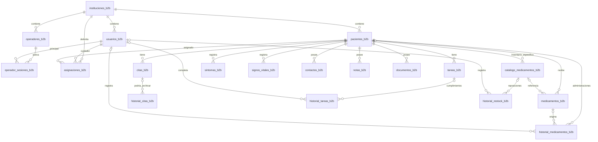

# Modelo de datos de CuidaDiario PRO B2B

**Fuente:** DDL, migraciones y consultas de `backend/index.js`/`backend/b2b-p1.js`/`backend/b2b-p1c.js`, inspección externa parcial de Railway, recuperación lógica y gates P1.
**Alcance:** modelo B2B reconstruido. Los gates productivos verificaron P1-A/P1-B y P1-C; la definición histórica restante, el contenido y la consistencia semántica integral continúan **[NO VERIFICADO]** salvo evidencia expresa.

**[VERIFICADO] Este documento modela exclusivamente B2B. NO MODIFICAR TABLAS B2C.** Existen tablas de otro producto en la misma base/runner, pero quedan fuera de este modelo. `_migrations` sólo se menciona por ser una dependencia compartida.

## 1. Convenciones

- `PK`: clave primaria.
- `FK`: clave foránea.
- Todas las tablas descritas en las secciones 3 a 8 son B2B y usan sufijo `_b2b`.
- `institucion_id` es la frontera lógica de tenant y aparece en las tablas de dominio.
- “Desactivación” significa conservar la fila y cambiar `activo`/`activa` a `false`.
- “Borrado físico” significa ejecutar `DELETE` sobre la fila.
- Las FK con `ON DELETE CASCADE` podrían borrar dependencias si la fila padre se elimina directamente. El API no expone borrado de institución.
- La sensibilidad es una clasificación técnica de exposición, no una conclusión jurídica.

## 2. Relaciones principales

Además de las relaciones mostradas, cada tabla hija pertenece a `instituciones_b2b`. Varias referencias a usuario, medicamento, catálogo, cita o tarea son anulables y usan `ON DELETE SET NULL` para conservar el evento histórico si se elimina el objeto referenciado.

## 3. Tenant e identidad

### 3.1 `instituciones_b2b`

Raíz de cada tenant B2B.

| Grupo | Campos reconstruidos |
|---|---|
| Identidad | `id` PK, `nombre`, `tipo`, `direccion`, `telefono`, `email` |
| Estado/plan | `plan`, `activa`, `trial_started_at`, `discount_expires_at`, `plan_manual_expires_at`, `mp_preapproval_id` |
| Operación | `stock_modelo`, `permisos_equipo` JSONB, `onboarding_done`, `shared_mode` |
| Auditoría mínima | `created_at` |

Sensibilidad: datos de contacto institucional, configuración de acceso, estado comercial e identificadores de suscripción. No existe una ruta B2B para borrar la institución. Mercado Pago actualiza parte de los campos comerciales.

### 3.2 `usuarios_b2b`

Usuarios institucionales, incluido el administrador.

| Grupo | Campos reconstruidos |
|---|---|
| Claves | `id` PK, `institucion_id` FK `CASCADE` |
| Identidad/contacto | `nombre`, `email` único |
| Autenticación | `password_hash`, `reset_token`, `reset_token_expiry`, `email_verified`, `email_verification_token`, `email_verification_expiry` |
| Autorización/operación | `rol`, `turno`, `activo`, `notif_prefs` JSONB, `notif_last_seen_at` |
| Auditoría mínima | `created_at` |

El API de “eliminar staff” desactiva (`activo=false`); no borra físicamente. Los tokens de recuperación/verificación se almacenan en claro en columnas de la base según el código. Al borrar una institución por fuera del API, la FK podría eliminar usuarios en cascada.

### 3.3 `operadores_b2b` — P1-C productivo

Directorio de personas que operan una estación compartida; no reemplaza `usuarios_b2b` ni crea una cuenta de login.

| Grupo | Campos P1-C |
|---|---|
| Claves/tenant | `id BIGSERIAL` PK; `institucion_id` FK `RESTRICT`; nombre único por tenant normalizado con `lower(btrim(nombre))` |
| Identidad/autorización | `nombre` 2–120; `rol` limitado a `admin_institucion`, `medico`, `cuidador_staff`; `activo` |
| Credencial | `pin_hash` bcrypt; `credential_version BIGINT > 0` para invalidar sesiones al cambiar PIN/rol/estado |
| Trazabilidad | `created_by_usuario_id` FK anulable al principal; `created_at`, `updated_at`, `version BIGINT > 0` |

No almacena PIN en claro. No existe operador `familiar`, e-mail, contraseña, JWT ni asignación propia. Cambiar PIN/rol/estado incrementa `credential_version` y revoca sesiones abiertas; cambiar sólo el nombre no lo hace.

### 3.4 `operador_sesiones_b2b` — P1-C productivo

| Grupo | Campos P1-C |
|---|---|
| Identidad | `id UUID` PK; `institucion_id`, `operador_b2b_id`, `principal_usuario_id` con FK `RESTRICT` |
| Secreto derivado | `token_hash CHAR(64) UNIQUE`; el token opaco de 32 bytes sólo se entrega al cliente al activar |
| Vigencia | `credential_version`, `created_at`, `last_seen_at`, `expires_at`, `revoked_at`; check `expires_at > created_at` |

Esta tabla existe sólo para operadores secundarios. El principal autenticado que trabaja como sí mismo no crea fila aquí ni en `operadores_b2b`. La sesión secundaria exige operador activo, misma versión de credencial, no revocada, máximo 8 horas y `last_seen_at` dentro de 60 minutos. No hay job de purga/retención implementado; la revocación conserva la fila. **[VERIFICADO EN PRODUCCIÓN / CERRADO — 04/10/2026].** Cero operadores/sesiones es un estado válido y fue el estado verificado al desplegar.

## 4. Residentes y asignaciones

### 4.1 `pacientes_b2b`

Aunque la tabla usa el término “pacientes”, la documentación funcional emplea “residentes”.

| Grupo | Campos reconstruidos |
|---|---|
| Claves | `id` PK, `institucion_id` FK `CASCADE` |
| Identificación | `nombre`, `apellido`, `fecha_nacimiento`, `dni`, `foto_url`, `habitacion` |
| Cobertura/contactos heredados | `obra_social`, `num_afiliado`, `contacto_familiar_nombre`, `contacto_familiar_tel` |
| Salud/cuidado | `diagnostico`, `alergias`, `medico_cabecera`, `antecedentes`, `notas_ingreso` |
| Ciclo de residencia | `fecha_ingreso`, `fecha_egreso`, `motivo_egreso`, `activo` |
| Auditoría mínima | `created_at` |

Sensibilidad: identificación directa y datos relativos a salud/cuidado. `DELETE /pacientes/:id` desactiva; la operación de egreso completa fecha/motivo pero no necesariamente cambia `activo`. Desde P1-A el backend conserva la lectura histórica y bloquea nuevas mutaciones sobre residentes egresados; sólo admite los cierres administrativos acotados y, donde el código lo contempla, una corrección excepcional por `admin_institucion` con motivo. No se afirma una prohibición absoluta fuera de esas rutas/condiciones.

### 4.2 `asignaciones_b2b`

| Campos | Relaciones y ciclo de vida |
|---|---|
| `id` PK; `institucion_id`, `cuidador_id`, `paciente_id` FK; `activa`, `created_at` | Institución, usuario y residente con `CASCADE`; combinación cuidador/residente única. El API desactiva en lugar de borrar. |

La asignación es parte del control de acceso a residentes para familiares y, según permisos, para equipo. Su historial de altas/bajas no tiene una tabla de auditoría separada.

## 5. Medicación e inventario

### 5.1 `medicamentos_b2b`

| Grupo | Campos reconstruidos |
|---|---|
| Claves | `id` PK; `institucion_id`, `paciente_id` y `catalogo_id` anulable son FK |
| Prescripción/plan | `nombre`, `dosis`, `frecuencia`, `hora_inicio`, `hora_fin`, `horarios_custom`, `instrucciones` |
| Estado | `stock`, `activo`, `created_at` |

Institución y residente usan `CASCADE`; catálogo usa `SET NULL`. El API “elimina” por desactivación. La edición sobreescribe el registro y no crea una versión de la indicación.

### 5.2 `historial_medicamentos_b2b`

Registra administraciones realizadas.

| Grupo | Campos reconstruidos |
|---|---|
| Claves | `id` PK; `institucion_id`, `paciente_id`, `medicamento_id` anulable y `administrado_por` anulable son FK |
| Snapshot/evento | `medicamento_nombre`, `dosis`, `administrador_nombre`, `notas`, `fecha`, `cantidad` |

Residente e institución usan `CASCADE`; medicamento y usuario usan `SET NULL`. Es append-only desde la ruta de toma, pero no hay protección de base que impida modificaciones directas. La atribución nominal puede provenir de `_quien` en modo compartido.

### 5.3 `catalogo_medicamentos_b2b`

Pese al nombre histórico, admite categorías de medicamentos, alimentos, cocina, limpieza, higiene, enfermería, papelería, mantenimiento y otros.

| Grupo | Campos reconstruidos |
|---|---|
| Claves | `id` PK; `institucion_id` y `paciente_id` anulable son FK |
| Descripción | `nombre`, `principio_activo`, `presentacion`, `unidad`, `categoria` |
| Stock | `stock_actual`, `stock_minimo`, `activo` |
| Fechas | `created_at`, `updated_at` |

El residente usa `SET NULL`; institución usa `CASCADE`. Sin `paciente_id` es inventario institucional; con ese campo es específico del residente. La eliminación API desactiva.

### 5.4 `historial_restock_b2b`

| Grupo | Campos reconstruidos |
|---|---|
| Claves | `id` PK; `institucion_id`, `catalogo_id`, `paciente_id` y `registrado_por` son FK, las tres últimas anulables |
| Snapshot/evento | `nombre_item`, `stock_anterior`, `cantidad_repuesta`, `stock_nuevo`, `notas`, `registrado_nombre`, `created_at` |

Institución usa `CASCADE`; catálogo, residente y usuario usan `SET NULL`. Se crea sólo cuando un `PATCH` aumenta `stock_actual`; reducciones y otras ediciones no generan evento histórico.

## 6. Agenda y tareas

### 6.1 `citas_b2b`

Campos: `id` PK; `institucion_id`, `paciente_id` y `created_by` son FK (la última anulable); `titulo`, `descripcion`, `fecha`, `medico`, `especialidad`, `lugar`, `estado`, `created_at`, `updated_at`.

Institución/residente usan `CASCADE`; creador usa `SET NULL`. El API productivo permite edición versionada y soft-delete prospectivo. “Historial de citas” consulta las filas no archivadas de esta misma tabla con `estado='realizada'`.

### 6.2 `historial_citas_b2b`

Campos reconstruidos: `id` PK; FK a institución, residente, cita y usuario (cita/usuario anulables); snapshots de título, descripción, fecha, médico, especialidad, lugar y estado, más fecha/usuario de archivado.

La tabla se crea mediante migración, pero no se encontró un `INSERT` B2B que la alimente ni la ruta de historial la consulta. Es una estructura actual aparentemente inactiva; no debe suponerse que contiene trazabilidad real.

### 6.3 `tareas_b2b`

Campos: `id` PK; `institucion_id`, `paciente_id` y `created_by` son FK (la última anulable); `titulo`, `descripcion`, `categoria`, `frecuencia`, `hora`, `activa`, `created_at`.

Institución/residente usan `CASCADE`; creador usa `SET NULL`. El API desactiva al eliminar. Las ediciones sobreescriben; los cumplimientos se separan en historial.

### 6.4 `historial_tareas_b2b`

Campos: `id` PK; FK a institución, residente, tarea y usuario (tarea/usuario anulables); `tarea_titulo`, `completador_nombre`, `notas`, `fecha`.

Institución/residente usan `CASCADE`; tarea/usuario usan `SET NULL`. Es append-only desde la ruta de completar. La atribución nominal puede venir de `_quien`.

## 7. Observaciones de salud, contactos y notas

| Tabla | Campos de contenido | Referencias | Eliminación API | Historial de edición/borrado |
|---|---|---|---|---|
| `sintomas_b2b` | `id` PK; `descripcion`, `intensidad`, `fecha`, nombre del registrador | FK institución/residente `CASCADE`; FK usuario `SET NULL` | Soft-delete P1 productivo | Ledger prospectivo |
| `signos_vitales_b2b` | `id` PK; `tipo`, `valor`, `unidad`, `notas`, `fecha`, nombre del registrador | FK institución/residente `CASCADE`; FK usuario `SET NULL` | Soft-delete P1 productivo | Ledger; no hay PATCH API |
| `contactos_b2b` | `id` PK; `nombre`, `relacion`, `telefono`, `email`, `es_principal`, `created_at` | FK institución/residente `CASCADE` | Soft-delete P1 productivo | Ledger prospectivo |
| `notas_b2b` | `id` PK; `titulo`, `contenido`, `urgente`, autor nominal, `created_at` | FK institución/residente `CASCADE`; FK usuario `SET NULL` | Soft-delete P1 productivo | Ledger prospectivo |

Son datos personales y/o de salud/cuidado. El backend conserva compatibilidad con `_offline_ts` para síntomas/signos y `_quien` como texto no autoritativo, pero P0-3 ya no crea ni reproduce mutaciones desde una cola offline. P1 productivo versiona ediciones y atribuye el actor desde la sesión backend revalidada.

## 8. Documentos

### `documentos_b2b`

| Grupo | Campos reconstruidos |
|---|---|
| Claves | `id` PK; `institucion_id` y `paciente_id` son FK obligatorias; `subido_por` es FK anulable |
| Archivo | `nombre_archivo`, `tipo_mime`, `tamanio_bytes`, `datos` TEXT base64 |
| Atribución | `subido_nombre`, `created_at` |

Institución/residente usan `CASCADE`; usuario usa `SET NULL`. El contenido se almacena dentro de PostgreSQL, no en un repositorio de objetos observado. En P1 productivo el API conserva fila, metadatos y bytes, marca `deleted_at/deleted_by/deletion_reason`, excluye listado/descarga normal y continúa computando los datos archivados en la cuota. No hay purga definitiva ni UI de restauración.

**P0-C no modificó este modelo ni creó migraciones.** P1-A/P1-B agregaron el ciclo lógico anterior y están **[VERIFICADOS EN PRODUCCIÓN / CLOSED]**. La autorización P0 y las cabeceras no-store se conservan.

## 9. Tabla compartida de control

`_migrations` es una tabla genérica usada como marcador de migraciones, incluidas transformaciones horarias B2B. **[COMPARTIDO - NO TOCAR B2C]**. No forma parte del dominio funcional B2B y no debe alterarse sin comprobar qué otros procesos la consumen.

## 10. Matriz de conservación actual

| Recurso | Alta | Edición | Eliminación expuesta | Evidencia histórica conservada |
|---|---|---|---|---|
| Institución | Registro B2B | Versionada | No hay endpoint | Ledger prospectivo, incluido canal superadmin. |
| Usuarios | Sí | Versionada | Desactivación | Ledger prospectivo de cambios/seguridad. |
| Residentes | Sí | Versionada / egreso | Desactivación | Fecha/motivo, guard de egreso y ledger prospectivo. |
| Asignaciones | Sí/reactivación | Estado versionado | Desactivación | Ledger prospectivo local. |
| Medicamentos | Sí | Versionada | Desactivación | Historial de administraciones y ledger prospectivo de indicación/stock. |
| Administraciones | Sí | No expuesta | No expuesta | La fila es el evento. |
| Catálogo | Sí | Versionada localmente | Desactivación | Reposición y cambio quedan en una transacción con ledger. |
| Citas | Sí | Versionada | **Soft-delete** | Estado realizada en fila actual; archivadas se excluyen. |
| Tareas | Sí | Versionada | Desactivación | Cumplimientos idempotentes y auditados. |
| Síntomas | Sí | Versionada | **Soft-delete** | Ledger prospectivo. |
| Signos vitales | Sí | Sin PATCH | **Soft-delete** | Ledger prospectivo. |
| Contactos | Sí | Versionada | **Soft-delete** | Ledger prospectivo. |
| Notas | Sí | Versionada | **Soft-delete** | Ledger prospectivo. |
| Documentos | Sí | Sin PATCH | **Soft-delete** | Fila/bytes conservados, ocultos y aún incluidos en cuota. |

## 11. Cascadas y riesgo de borrado retrospectivo

La mayor parte del dominio depende de institución y residente mediante `ON DELETE CASCADE`. Aunque las rutas normales desactivan al residente y no exponen borrado de institución, una eliminación directa, migración o herramienta administrativa podría eliminar en cadena datos reales. Por la regla de preservación:

- no convertir retrospectivamente ni borrar filas existentes;
- no ejecutar `DELETE`, `TRUNCATE` ni recrear tablas para adecuar el modelo;
- no cambiar FK/cascadas sin inventario y respaldo verificado;
- incorporar futuras protecciones de forma aditiva y aplicarlas hacia adelante;
- si se requiere ocultar información, preferir estados lógicos y conservar integridad/referencias.

## 12. Vacíos del modelo frente a requerimientos propuestos

El documento del cliente propone, entre otros, historia/evolución cronológica más estructurada, indicaciones de medicación con vía/prescriptor/omisiones/versiones, incidentes, estados temporales, contactos con prioridad y alcance, categorías/fecha/descripcion documental, alertas configurables, tablero directivo y auditoría de cambios.

Esas capacidades son **PROPUESTAS**. No deben inferirse de las tablas actuales ni implementarse reemplazando datos. La estrategia mínima es agregar entidades/columnas anulables, eventos y vistas compatibles, con migraciones idempotentes exclusivamente B2B. El orden se define en `ESTADO_Y_PLAN_B2B.md`.

## 13. Mapa de tablas a endpoints principales

| Tabla | Endpoints que principalmente la leen o modifican | Datos sensibles/relevantes |
|---|---|---|
| `instituciones_b2b` | `/api/b2b/auth/register`, `/api/b2b/institucion`, rutas B2B de suscripción/verificación/cancelación y `/api/admin/institucion/:id`, `/api/admin/set-plan`. | Contacto, configuración de acceso y estado comercial. |
| `usuarios_b2b` | rutas `/api/b2b/auth/*`, `/api/b2b/me/notif-prefs`, `/api/b2b/staff`, `/api/b2b/asignaciones`, `/api/b2b/notificaciones/vistas` y consultas de atribución. | Identidad/contacto, hash, tokens, rol y preferencias. |
| `pacientes_b2b` | `/api/b2b/pacientes`, casi todas las familias clínicas/operativas, dashboard, notificaciones, reportes y export. | Identificación directa, cobertura y salud/cuidado. |
| `asignaciones_b2b` | `/api/b2b/asignaciones`, listado/acceso a pacientes, guards, dashboard y notificaciones. | Relación usuario-residente que gobierna confidencialidad. |
| `medicamentos_b2b` | `/api/b2b/medicamentos`, `/api/b2b/medicamentos/:id/toma`, dashboard, reportes y export. | Medicación/indicaciones y stock individual. |
| `historial_medicamentos_b2b` | `/api/b2b/medicamentos/historial`, toma, dashboard, reportes y export. | Administración, dosis, fecha, notas y actor. |
| `catalogo_medicamentos_b2b` | `/api/b2b/catalogo`, `/api/b2b/catalogo/stock-bajo`, toma/edición de medicamentos, dashboard y notificaciones. | Inventario; puede vincularse a un residente. |
| `historial_restock_b2b` | `PATCH /api/b2b/catalogo/:id` y `GET /api/b2b/catalogo/restock-historial`. | Operación, notas, residente opcional y actor. |
| `citas_b2b` | `/api/b2b/citas`, `/api/b2b/citas/historial`, dashboard, notificaciones, reportes y export. | Agenda y atención de salud, profesional/lugar. |
| `historial_citas_b2b` | Ningún endpoint B2B actual la lee o escribe según el código inspeccionado. | Snapshot de cita y actor de archivo, si alguna vez fue alimentada. |
| `tareas_b2b` | `/api/b2b/tareas` y `/api/b2b/tareas/:id/completar`. | Actividades de cuidado vinculadas al residente. |
| `historial_tareas_b2b` | `/api/b2b/tareas/historial`, completar, dashboard, reportes y export. | Cumplimiento, fecha, notas y actor. |
| `sintomas_b2b` | `/api/b2b/sintomas`, dashboard, notificaciones, reportes y export. | Datos de salud y actor. |
| `signos_vitales_b2b` | `/api/b2b/signos-vitales`, reportes y export. | Medición de salud, notas y actor. |
| `contactos_b2b` | `/api/b2b/contactos`, reportes y export. | Identidad, relación, teléfono y e-mail de terceros. |
| `notas_b2b` | `/api/b2b/notas`, dashboard, notificaciones, reportes y export. | Texto libre potencialmente clínico/personal y actor. |
| `documentos_b2b` | `/api/b2b/documentos`, `/api/b2b/documentos/:id/download` y su DELETE. No forma parte del export actual. | Contenido binario arbitrario, metadatos y actor de carga. |

El método, middleware y consumidor de cada ruta se detalla en `MAPA_API_B2B.md`.

### 13.1 Relaciones usadas por la autorización P0-C

Sin alterar claves ni filas existentes, P0-C usa `usuarios_b2b -> instituciones_b2b` para estado e identidad vigentes; `asignaciones_b2b` activas para el alcance restringido; `pacientes_b2b.institucion_id` como raíz del recurso; y `paciente_id` de cada tabla clínica/operativa para autorizar antes de leer o mutar. Catálogo y reposiciones admiten el caso institucional (`paciente_id IS NULL`) sólo según rol/permiso; cuando tienen residente deben corresponder al mismo tenant y alcance. Los recursos sin residente padre resoluble fallan cerrados. **[VERIFICADO EN PRODUCCIÓN / CERRADO — 30/09/2026].** El despliegue no ejecutó SQL, migraciones, cambios de esquema ni modificación retrospectiva de filas.

## 14. Fotografía externa de producción

### 13.2 Extensiones P1-A/P1-B productivas

Tres migraciones registradas en `schema_migrations_b2b(version, checksum, applied_at)` agregan, sin DROP/TRUNCATE ni reescritura de filas:

- `auditoria_eventos_b2b`: ledger prospectivo, actor/tenant/recurso/versión, before/after sanitizado, modo de captura y metadata; trigger DB contra `UPDATE/DELETE`;
- `operaciones_idempotentes_b2b`: clave por institución, actor y operación, hash canónico, estado/resultado seguro y vencimiento conceptual de 90 días;
- `version BIGINT NOT NULL DEFAULT 1 CHECK (version > 0)` en institución, usuario, residente, asignación, medicamento, catálogo, cita, tarea, síntoma, signo, contacto, nota y documento;
- `deleted_at`, `deleted_by`, `deletion_reason` sólo en citas, síntomas, signos vitales, contactos, notas y documentos.

Las filas heredadas quedan preservadas y parten de versión prospectiva 1. No se fabrica auditoría previa. La primera modificación futura de una fila heredada captura baseline sanitizado; las siguientes registran diff. Eventos naturales —administraciones, tareas completadas y reposiciones— usan referencia mínima. **[VERIFICADO EN PRODUCCIÓN / CLOSED].**

### 13.3 Extensión P1-C productiva

La migración `p1c_001_operator_identity` (checksum controlado SHA-256 `2c6cc0eb8aadc7db48d0741e7d3517a4ad62a2dbc901e38dfc6ba18018ffede2`) se agrega al journal después de P1-A/P1-B y es exclusivamente aditiva: crea las dos tablas descritas en 3.3/3.4; agrega `operador_b2b_id BIGINT NULL` con FK `RESTRICT` a `auditoria_eventos_b2b` y `operaciones_idempotentes_b2b`; y agrega seis índices propios (nombre/activos, lookup/expiración de sesión, auditoría e idempotencia por operador). No contiene `UPDATE` de filas heredadas ni backfill.

En eventos nuevos, `auditoria_eventos_b2b.actor_usuario_id` identifica siempre al principal. Si el principal trabaja como sí mismo, `operador_b2b_id` queda `NULL` de forma inequívoca; si otra persona toma la estación mediante PIN, identifica a ese operador secundario. Las filas históricas también mantienen `NULL`: no se deduce un operador a partir de `_quien`, nombres visibles o del usuario principal. En idempotencia, sólo el contexto secundario aplica namespacing por operador; el principal y el modo individual mantienen la semántica anterior.

**[PREDEPLOY FINAL APROBADO / NO PRODUCCIÓN — 04/10/2026]:** PostgreSQL 18.1 efímero, migración ejecutada/repetida y nueva semántica principal/operador probada con datos sintéticos. Backend P1-C ajustado: 59/59; principal sin operadores/PIN/fila duplicada, operador secundario 8 h/60 min, retorno/revocación, no elevación, modo individual y B2C. Regresiones P1-A/P1-B: 110/110; P0-C: 232/232; cero intentos externos.

**[GATE ESTRUCTURAL FINAL APROBADO / NO PRODUCCIÓN — 04/10/2026]:** el dump fresco final de 10.092.797 bytes y SHA-256 `FCB2AF29069DCFDCF810E7E3C2BB4532A37A4BD7FF2C3C68F89E2766ABBA77E2` restauró sin warnings. El gate aprobó 185/185: tres migraciones productivas/checksums exactos antes de P1-C; cero colisiones; cuarta migración única e idempotente; 21 columnas, constraints e índices esperados; cero operadores/sesiones/backfill; conteos/fingerprints heredados, esquema B2C/no-B2B y append-only preservados.

**[VERIFICADO SOBRE RESTAURACIÓN AISLADA DEL DUMP FRESCO — 01/10/2026; NO PRODUCCIÓN]:** el esquema real pre-P1 restaurado no contenía ninguno de los objetos/columnas P1. Tras el runner se verificaron los tipos, defaults, NOT NULL, CHECK, PK/unique, cuatro índices y trigger esperados: 13 tablas con `version`, seis con las tres columnas de archivado, journal con tres checksums, ledger e idempotencia vacíos. Los conteos/fingerprints heredados —961 filas B2B y 1.502 no-B2B en 32 tablas— permanecieron iguales y no se fabricó historia. Un ensayo con `version TEXT` preexistente confirmó que `IF NOT EXISTS` no compara definiciones; el preflight productivo debe abortar ante cualquier colisión o drift, aunque el dump examinado tuvo cero.

**[VERIFICADO — EVIDENCIA EXTERNA 15/09/2026]** La instancia PostgreSQL del proyecto Railway `resilient-nature`, entorno `production`, contiene tablas `*_b2b` junto con tablas B2C/no B2B: **[COMPARTIDO - NO TOCAR B2C]**. El servicio estaba Online, con volumen `postgres-volume`, una réplica en `US East (Virginia, USA)`, Private Networking y un TCP Proxy público configurado.

La vista Stats mostró aproximadamente:

- base: 23,8 MB;
- tablas: 14,2 MB;
- WAL: 32 MB;
- cache hit: 99,99 %;
- 1 conexión activa sobre máximo 500;
- `Tables w/ Bloat = 0` y `XID Freeze Risk = 0`;
- `documentos_b2b`: 13,3 MB y 2 filas.

Son valores puntuales de la interfaz, no un inventario histórico, una validación de contenido ni garantía de integridad. No se habilitó Query Statistics, no se abrió Console, no se ejecutó SQL y no se inspeccionaron documentos ni datos clínicos.

**[VERIFICADO — RECUPERACIÓN LÓGICA 28/09/2026]** Un dump completo de producción fue restaurado sin errores ni advertencias en PostgreSQL local aislado. `\dt` confirmó tablas reales B2B y B2C **[COMPARTIDO - NO TOCAR B2C]**. Sin inspeccionar datos personales, se obtuvieron estos conteos agregados de la copia restaurada:

| Tabla | Filas en la copia del 28/09/2026 |
|---|---:|
| `instituciones_b2b` | 33 |
| `usuarios_b2b` | 82 |
| `pacientes_b2b` | 90 |
| `medicamentos_b2b` | 304 |
| `documentos_b2b` | 12 |

La diferencia entre las 2 filas de `documentos_b2b` observadas el 15/09 y las 12 restauradas desde el dump del 28/09 corresponde a fotografías de fechas y mecanismos distintos; no se inspeccionó contenido ni se determinó su causa. **[NO VERIFICADO]** Estos conteos no demuestran por sí solos integridad referencial, completitud semántica, ausencia de huérfanos ni correspondencia con un punto posterior de producción.

## 15. Comprobaciones aún necesarias

La estructura P1-A/P1-B quedó verificada en producción mediante `PASS|3|13|13|18|35|4|1|1|0|`. P1-C agregó y verificó la cuarta migración `p1c_001_operator_identity`, 21 columnas en las dos tablas nuevas, seis índices explícitos y dos FK `operador_b2b_id` anulables. El gate postdeploy confirmó cero backfill, cero operadores/sesiones fabricados y referencias históricas `NULL`. El `base_constraints=10/8` inicial fue un falso negativo del gate: los diez son exactamente ocho heredados más las dos FK P1-C; el gate corregido aprobó `10/10`, `8/8`, `2/2`, sin constraints desconocidos. Lo siguiente continúa pendiente fuera de esos gates:

Antes de futuras migraciones se debe verificar, mediante un procedimiento de sólo lectura aprobado:

- definición efectiva de tablas, columnas, índices, defaults y FK B2B;
- conteos por tabla e institución, sin extraer datos sensibles innecesarios;
- valores inesperados de roles, estados, categorías y planes;
- duplicados o huérfanos previos a agregar restricciones;
- ejecución real de los marcadores de migración horaria;
- zona horaria de base/sesión y coherencia de tipos `timestamp`/`timestamptz`;
- reconciliación del tamaño/filas de `documentos_b2b` y de las tablas históricas mediante métricas no invasivas;
- restauración aislada y reconciliada de uno de los snapshots Railway antes de depender de ese mecanismo; la ruta de dump lógico independiente ya fue restaurada exitosamente el 28/09/2026;
- política, cifrado, custodia, acceso y eliminación segura del dump completo conservado localmente;
- RPO/RTO y automatización/frecuencia de respaldos acordes al servicio.
