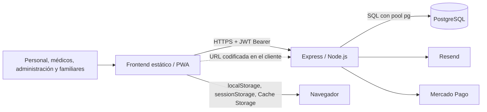

# CuidaDiario PRO B2B — documentación canónica

**Estado documental:** vigente al 30 de septiembre de 2026, con evidencia externa de Railway del 15/09/2026 y prueba independiente de recuperación lógica del 28/09/2026  
**Alcance:** ingeniería inversa del repositorio local más evidencia externa proporcionada; no acredita aquello que se mantiene expresamente como `[NO VERIFICADO]`.  
**Regla de precedencia:** ante una contradicción, prevalece el código ejecutable actual sobre este documento; la divergencia debe registrarse en `ESTADO_Y_PLAN_B2B.md`.

## 1. Objeto y límite de alcance

CuidaDiario PRO es una aplicación web B2B para la gestión operativa de instituciones de cuidado. Permite administrar residentes, equipo, asignaciones, medicamentos y administraciones, tareas y cumplimientos, síntomas, signos vitales, citas, contactos, notas, inventario y documentos.

El sistema procesa datos personales y datos relativos a la salud. Esta descripción técnica **no afirma** que CuidaDiario PRO sea la historia clínica electrónica oficial ni la única historia clínica de una institución.

La aplicación actualmente identificada como usuaria es Residencia Los Aromos. La institución carga, consulta y usa los datos de sus residentes; el proveedor desarrolla, mantiene y aloja técnicamente el software.

> **Límite absoluto:** CuidaDiario B2C queda fuera de alcance. No se deben cambiar sus tablas, rutas ni funcionalidades. Cuando el backend, la base, un secreto, un proveedor o un proceso se comparte, este juego documental lo identifica como **[COMPARTIDO - NO TOCAR B2C]**.

## 2. Fuentes y autoridad

La reconstrucción se basa, en este orden, en:

1. la consigna de documentación y su contexto corregido;
2. `AUDITORIA_SEGURA.md`, que se conserva sin cambios;
3. el código actual de `backend/` y `frontend/`;
4. las dos auditorías técnicas previas realizadas en la conversación;
5. `Analisis_Cuida_Diario_Los_Aromos.pdf`, como requerimientos propuestos por el cliente, no como funcionalidad ya implementada.

El 15/09/2026 se inspeccionó manualmente el panel de Railway, sin abrir Console, ejecutar SQL ni inspeccionar contenidos clínicos. Esa evidencia externa confirma parte de la topología y estado operativo de infraestructura. El 28/09/2026 se ejecutó fuera de Railway una prueba real de `pg_dump` completo de producción y `pg_restore` sobre PostgreSQL local aislado; sólo se comprobaron metadatos, tablas y conteos agregados. No se inspeccionaron datos personales ni contenidos clínicos. Ninguna de ambas verificaciones acredita por sí sola PITR, restaurabilidad de snapshots Railway, backup automático, RPO/RTO, retención/cifrado de copias o contenido de logs. No se inspeccionaron paneles de Resend o Mercado Pago. Las variables de entorno se documentan sólo por nombre, nunca por valor.

## 3. Mapa del repositorio

| Ubicación | Responsabilidad B2B actual |
|---|---|
| `backend/index.js` | Aplicación Express monolítica: rutas, autenticación, permisos, SQL, migraciones, integraciones y tareas periódicas. **[COMPARTIDO - NO TOCAR B2C]** |
| `backend/db.js` | Pool PostgreSQL y TLS. **[COMPARTIDO - NO TOCAR B2C]** |
| `backend/package.json` | Dependencias y comando de inicio. **[COMPARTIDO - NO TOCAR B2C]** |
| `frontend/*.html` | Entrada, autenticación, paneles y páginas B2B; también existen páginas ajenas al producto B2B. |
| `frontend/js/api-b2b.js` | Cliente HTTP B2B, validación local mínima de vigencia del JWT, cierre selectivo de identidad, purga de caché GET B2B heredada y registro del service worker. P0-2 y P0-3 están **[VERIFICADOS EN ENTORNO CONTROLADO — 30/09/2026]**, no en producción; una `cd_offline_queue` heredada queda intacta y sin consumidor. |
| `frontend/js/utils-b2b.js` | Guardia fail-closed de sesión B2B, navegación, roles/permisos, modo compartido, notificaciones y helpers de renderizado contextual seguro. |
| `frontend/js/*` restantes | Controladores de cada pantalla B2B. |
| `frontend/sw.js` | Caché PWA de estáticos y respuestas GET no-B2B; los GET `/api/b2b/` son network-only y se purgan selectivamente. P0-1 está **[VERIFICADO EN PRODUCCIÓN — 29/09/2026]** para el commit `ffb8ef5`. El paquete local P0-2/P0-3/P0-8 cambia los bytes del script para recargar in-place los assets precacheados en `v6`; `login.html` y `admin-panel.html` figuran una sola vez cada uno. Preserva entradas estáticas ajenas y no cambia estrategias; **[VERIFICADO EN ENTORNO CONTROLADO, NO EN PRODUCCIÓN]**. **[COMPARTIDO - NO TOCAR B2C]** |
| `frontend/pages/privacy.html`, `frontend/pages/terms.html` | Declaraciones públicas; algunas no coinciden plenamente con la conducta técnica actual. |
| `documentacion/` | Documentación canónica y antecedentes. No es código de producción. |

## 4. Arquitectura resumida

El frontend usa JavaScript sin framework y consume una URL de backend Railway codificada en `api-b2b.js`. El backend aplica aislamiento principal por `institucion_id`, usa JWT y persiste el dominio en PostgreSQL. Los detalles están en [ARQUITECTURA_B2B.md](ARQUITECTURA_B2B.md).

## 5. Capacidades actuales verificadas

- Alta, login, verificación de correo y recuperación de contraseña.
- Configuración de institución, plan, equipo, roles, permisos y asignaciones.
- Alta, consulta, edición, egreso y desactivación de residentes.
- Medicación programada y registro histórico de administraciones.
- Tareas programadas e historial de cumplimientos.
- Citas, síntomas, signos vitales, contactos, notas y documentos.
- Catálogo/inventario institucional o asociado a un residente e historial de reposiciones.
- Panel, campana de notificaciones, reportes y exportación JSON.
- Código y configuración de suscripciones B2B mediante Mercado Pago —actualmente inactivos/no utilizados por Los Aromos— y correos transaccionales mediante Resend, cuyo estado operativo externo no fue verificado.
- Operación PWA parcial y modo de estación compartida. En el paquete local P0-2/P0-3, una página protegida requiere un JWT B2B localmente vigente; logout/401 retiran identidad y selección activa de estación; las consultas y mutaciones B2B requieren red; no se crean ni reenvían operaciones offline. Una `cd_offline_queue` heredada permanece byte a byte en cuarentena, sin lectura, borrado o transmisión automática. **[VERIFICADO EN ENTORNO CONTROLADO — 30/09/2026; NO VERIFICADO EN PRODUCCIÓN].**
- Renderizado B2B P0-8: datos persistidos, errores, atributos, identificadores y URLs dinámicas usan texto, escape contextual, normalización numérica o listas de protocolos/orígenes permitidos. Payloads HTML/SVG/eventos/URL fueron probados en Chrome sin ejecución. **[VERIFICADO EN ENTORNO CONTROLADO — 30/09/2026; NO VERIFICADO EN PRODUCCIÓN].**

La existencia de una pantalla no implica que todos sus controles de autorización, trazabilidad o persistencia sean suficientes. El estado y las brechas conocidas se mantienen en [ESTADO_Y_PLAN_B2B.md](ESTADO_Y_PLAN_B2B.md).

## 6. Datos B2B que maneja

Las categorías confirmadas incluyen:

- datos identificatorios y de contacto de instituciones, usuarios, residentes y contactos;
- credenciales derivadas y tokens de recuperación/verificación;
- roles, permisos, asignaciones y preferencias;
- datos de ingreso/egreso y cobertura;
- diagnósticos, alergias, antecedentes, médico de cabecera, medicamentos, administraciones, síntomas, signos vitales, citas, notas y documentos;
- tareas de cuidado y sus cumplimientos;
- inventario, reposiciones y atribución nominal de acciones;
- plan, prueba, descuento e identificadores/estado de suscripción.

El detalle de campos, relaciones, retención y eliminación está en [MODELO_DATOS_B2B.md](MODELO_DATOS_B2B.md).

## 7. Producción e integraciones externas

### 7.1 Railway verificado manualmente

En el workspace se observó un único proyecto relevante, `resilient-nature`, entorno `production`. Sus servicios `Postgres` y `cuidadiario-backend` estaban Online, ambos con una réplica en `US East (Virginia, USA)`. PostgreSQL usa el volumen persistente `postgres-volume`; la misma instancia contiene tablas B2B y tablas no B2B: **[COMPARTIDO - NO TOCAR B2C]**.

PostgreSQL dispone de red privada en `postgres.railway.internal` y también de Public Networking/TCP Proxy hacia el puerto 5432. El backend dispone de red privada en `cuidadiario-backend.railway.internal` y del dominio público `cuidadiario-backend-production.up.railway.app` hacia el puerto 8080. La observación de esas superficies no demuestra cuál utiliza cada conexión efectiva ni sus controles adicionales.

El backend está conectado a `edensoftwarework/cuidadiario-backend`, rama `main`, con auto-deploy por push; Railway/Railpack mostró Node 22.22.3.

### 7.2 Hosting frontend verificado

El frontend corresponde al repositorio GitHub `edensoftwarework/cuidadiario-pro`. GitHub Pages figura configurado como **Deploy from a branch**, rama `main`, carpeta `/(root)`, y publica el dominio personalizado `cuidadiario-pro.edensoftwork.com`. La verificación post-despliegue de P0-1 comprobó que los archivos públicos activos coincidían con el commit aprobado.

Cloudflare administra/proxifica el DNS mediante un registro CNAME proxied; no se verificó el target completo. La pantalla observada indicaba **DNS Check in Progress** y no permitía activar **Enforce HTTPS**, pero el acceso HTTPS público funcionó durante la prueba. Estos datos no acreditan logs, región, retención ni política efectiva de caché de Cloudflare. El frontend no está desplegado mediante Cloudflare Pages.

### 7.3 Proveedores y flujos

| Destino | Datos B2B que el código demuestra que recibe | No demostrado |
|---|---|---|
| Railway | Aloja el backend y PostgreSQL compartido en la topología verificada arriba. Puede contener todo el dominio B2B. | Restaurabilidad de sus snapshots, PITR, automatización, retención efectiva, contenido de logs y cifrado efectivo más allá de lo demostrado. |
| Resend | El código enviaría correo y nombre del usuario/administrador; nombre de institución; rol; enlaces con token de verificación o recuperación; recordatorios de prueba. | Estado operativo externo actual; envío de datos de residentes o contenido clínico. |
| Mercado Pago | Integración implementada/configurada pero inactiva en el frontend B2B y no utilizada por Los Aromos. Si se activa, el código enviaría e-mail del pagador, plan/motivo, importe, moneda, recurrencia, URL de retorno e ID de institución. | Operación B2B actual, validez de credenciales/webhooks; envío de residentes o datos clínicos. |
| Web Push | No se encontró una ruta o tabla de suscripciones push B2B. El código push hallado usa el modelo no B2B. **[COMPARTIDO - NO TOCAR B2C]** | Procesamiento de datos B2B por el proveedor push. |
| GitHub Pages + Cloudflare DNS/proxy | El repositorio `edensoftwarework/cuidadiario-pro` publica desde `main` y `/(root)` mediante GitHub Pages en `cuidadiario-pro.edensoftwork.com`. La validación P0-1 comprobó que los archivos públicos coincidían con el commit aprobado. Cloudflare mostró un CNAME proxied; el target completo no fue verificado. HTTPS público funcionó. | Logs, región, caché/retención efectiva, target DNS completo y motivo/estado final de “DNS Check in Progress”. La pantalla no habilitaba “Enforce HTTPS”, lo que no demuestra una falla TLS. No es Cloudflare Pages. |

### 7.4 Recuperación lógica verificada el 28/09/2026

**[VERIFICADO]** Se generó desde una PC Windows un dump lógico completo de la PostgreSQL de producción mediante `DATABASE_PUBLIC_URL`, usando `pg_dump` 18.6 contra PostgreSQL 17.11. El archivo `cuidadiario_produccion_2026-09-28.dump` quedó en formato custom con compresión gzip, base original `railway` y 314 entradas TOC. `pg_restore --list` lo leyó y `pg_restore` lo restauró sin errores ni advertencias en una PostgreSQL local independiente llamada `cuidadiario_restore_test`.

**[VERIFICADO]** En la base aislada se comprobó mediante `\dt` la presencia de tablas B2B y B2C de la instancia compartida **[COMPARTIDO - NO TOCAR B2C]**, y mediante conteos agregados —sin ver datos personales—: 33 instituciones, 82 usuarios, 90 residentes, 304 medicamentos y 12 documentos B2B. Producción no recibió ninguna restauración ni modificación. El archivo original se conserva localmente.

**[NO VERIFICADO]** Esta prueba no demuestra PITR, restaurabilidad de los snapshots propios de Railway, política automática o retención de backups, RPO/RTO, cifrado/custodia/vida útil del dump local ni que todos los mecanismos futuros de continuidad estén resueltos.

## 8. Guía para futuras intervenciones

Antes de diseñar o modificar B2B:

1. leer estos cinco documentos y `AUDITORIA_SEGURA.md`;
2. corroborar el comportamiento en el código actual;
3. mantener el filtro por `institucion_id` y el acceso al residente en toda lectura y escritura;
4. tratar como sensibles tanto PostgreSQL como copias en navegador, descargas, logs, respaldos e integraciones;
5. no reutilizar una migración o helper compartido sin evaluar el impacto B2C;
6. preferir cambios aditivos, reversibles y compatibles con filas existentes;
7. no reescribir ni eliminar datos reales para “normalizar” el modelo;
8. distinguir siempre entre estado actual y propuesta futura.

La producción no es un banco de pruebas. La lógica debe agotarse primero en un entorno controlado. Tras un despliegue frontend, la comprobación productiva debe ser proporcional: revisión/artefactos publicados, finalización de GitHub Pages, dominio, actualización/activación/control del service worker, distribución/caché y un smoke no destructivo. No se repite en producción la matriz XSS, las mutaciones offline ni pruebas que requieran datos o cuentas reales cuando ya quedaron demostradas localmente.

Para cambios futuros de backend o base: implementar y probar primero con backend/PostgreSQL aislados y datos ficticios; ejecutar matrices negativas de tenant, rol, asignación y recurso; comprobar regresión B2C sin modificar B2C; preparar rollback; obtener aprobación humana; desplegar sólo el código aprobado; y limitar producción a un smoke mínimo de despliegue/configuración/integración. Toda migración requiere backup reciente recuperable, ensayo aislado, rollback o forward-fix, aprobación y verificación productiva agregada/no destructiva. No se crea infraestructura adicional sin una necesidad concreta demostrada.

## 9. Índice canónico

- [ARQUITECTURA_B2B.md](ARQUITECTURA_B2B.md): componentes, flujos, autenticación, navegador, integraciones e infraestructura compartida.
- [MODELO_DATOS_B2B.md](MODELO_DATOS_B2B.md): esquema PostgreSQL B2B reconstruido, relaciones, sensibilidad y ciclo de vida.
- [MAPA_API_B2B.md](MAPA_API_B2B.md): inventario de rutas, middleware, permisos, tablas y consumidores frontend.
- [ESTADO_Y_PLAN_B2B.md](ESTADO_Y_PLAN_B2B.md): estado verificado, brechas conocidas, contradicciones y plan ejecutable P0/P1.

## 10. Convenciones documentales

- **[VERIFICADO]:** comprobado en código o mediante evidencia externa identificada.
- **[INFERIDO]:** conclusión técnica razonable que no fue observada directamente.
- **[NO VERIFICADO]:** requiere evidencia adicional; no equivale a una afirmación negativa.
- **[PENDIENTE]:** acción o comprobación abierta.
- **[FUTURO]:** diseño o cambio aún no implementado.
- **[COMPARTIDO - NO TOCAR B2C]:** superficie común cuyo cambio puede afectar B2C.
