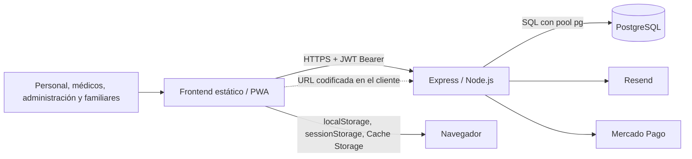

# CuidaDiario PRO B2B — documentación canónica

**Estado documental:** vigente al 3 de octubre de 2026; P0, P1-A y P1-B cerrados en producción; P1-C/P1-D no iniciados  
**Alcance:** ingeniería inversa del repositorio local más evidencia externa proporcionada; no acredita aquello que se mantiene expresamente como `[NO VERIFICADO]`.  
**Regla de precedencia:** ante una contradicción, prevalece el código ejecutable actual sobre este documento; la divergencia debe registrarse en `ESTADO_Y_PLAN_B2B.md`.

## 1. Objeto y límite de alcance

CuidaDiario PRO es una aplicación web B2B para la gestión operativa de instituciones de cuidado. Permite administrar residentes, equipo, asignaciones, medicamentos y administraciones, tareas y cumplimientos, síntomas, signos vitales, citas, contactos, notas, inventario y documentos.

El sistema procesa datos personales y datos relativos a la salud. Esta descripción técnica **no afirma** que CuidaDiario PRO sea la historia clínica electrónica oficial ni la única historia clínica de una institución.

La aplicación actualmente identificada como usuaria es Residencia Los Aromos. La institución carga, consulta y usa los datos de sus residentes; el proveedor desarrolla, mantiene y aloja técnicamente el software.

> **Límite absoluto:** CuidaDiario B2C queda fuera de alcance. No se deben cambiar sus tablas, rutas ni funcionalidades. Cuando el backend, la base, un secreto, un proveedor o un proceso se comparte, este juego documental lo identifica como **[COMPARTIDO - NO TOCAR B2C]**.

## 2. Fuentes y autoridad

La reconstrucción se basa, en este orden, en:

1. la consigna de documentación y su contexto corregido;
2. `AUDITORIA_SEGURA.md`, que se conserva sin cambios;
3. el código actual de `backend/` y `frontend/`;
4. las dos auditorías técnicas previas realizadas en la conversación;
5. `Analisis_Cuida_Diario_Los_Aromos.pdf`, como requerimientos propuestos por el cliente, no como funcionalidad ya implementada.

El 15/09/2026 se inspeccionó manualmente el panel de Railway, sin abrir Console, ejecutar SQL ni inspeccionar contenidos clínicos. El 28/09 se probó una recuperación lógica completa y antes de P1 se restauró el dump fresco `cuidadiario_produccion_2026-10-02_predeploy_p1.dump` en PostgreSQL 18.1 efímero; el gate aislado aprobó 363/363 verificaciones. No se inspeccionaron datos personales ni contenidos clínicos. Estas verificaciones no acreditan por sí solas PITR, restaurabilidad de snapshots Railway, backup automático, RPO/RTO, retención/cifrado/custodia o contenido/retención de logs. No se inspeccionaron paneles de Resend o Mercado Pago. Las variables de entorno se documentan sólo por nombre, nunca por valor.

## 3. Mapa del repositorio

| Ubicación | Responsabilidad B2B actual |
|---|---|
| `backend/index.js` | Aplicación Express monolítica: rutas, autenticación, permisos, SQL, migraciones, integraciones y tareas periódicas. Ejecuta las migraciones históricas y luego las migraciones P1 B2B antes de comenzar a escuchar. **[COMPARTIDO - NO TOCAR B2C]** |
| `backend/db.js` | Pool PostgreSQL y TLS. **[COMPARTIDO - NO TOCAR B2C]** |
| `backend/b2b-p1.js` | Migraciones B2B con journal/checksum, transacciones, auditoría sanitizada, idempotencia, guard de egreso y bridge temporal de sólo lectura para ventanas P1. |
| `backend/package.json` | Dependencias y comando de inicio. **[COMPARTIDO - NO TOCAR B2C]** |
| `backend/tests/p0-c-authorization.test.js` | Arnés local P0-C: PostgreSQL 18 efímero, esquema mínimo y fixtures sintéticos, JWT local, servidor HTTP real y bloqueo de conexiones externas. No es código de producción. |
| `frontend/*.html` | Entrada, autenticación, paneles y páginas B2B; también existen páginas ajenas al producto B2B. |
| `frontend/js/api-b2b.js` | Cliente HTTP B2B, validación local mínima de vigencia del JWT, cierre selectivo de identidad, purga de caché GET B2B heredada, registro del service worker y claves UUID de idempotencia para toma, completar tarea y carga documental. Una `cd_offline_queue` heredada queda intacta y sin consumidor. P0 y el frontend P1 están desplegados. |
| `frontend/js/maintenance-b2b-v2.js` | Guardia visual permanente y exclusivamente B2B. Consulta por red `GET /api/b2b/maintenance-status`, reutiliza el binding léxico `API_B2B.BASE_URL`, no persiste estado y sondea cada 5 s. `B2B_MAINTENANCE_MODE` controla sólo esta capa visual; no sustituye la barrera de mutaciones del bridge P1. **[VERIFICADO EN PRODUCCIÓN — 02/10/2026]** |
| `frontend/js/utils-b2b.js` | Guardia fail-closed de sesión B2B, navegación, roles/permisos, modo compartido, notificaciones y helpers de renderizado contextual seguro. |
| `frontend/js/*` restantes | Controladores de cada pantalla B2B. |
| `frontend/sw.js` | Caché PWA de estáticos y respuestas GET no-B2B; los GET `/api/b2b/` son network-only y se purgan selectivamente. P0-1 está **[VERIFICADO EN PRODUCCIÓN — 29/09/2026]**. El worker P1 del commit `c452c23` conserva las estrategias P0 y fuerza la actualización controlada de `api-b2b.js`; el upgrade P0→P1 aprobó 43 comprobaciones en navegador real. **[COMPARTIDO - NO TOCAR B2C]** |
| `frontend/pages/privacy.html`, `frontend/pages/terms.html` | Declaraciones públicas; algunas no coinciden plenamente con la conducta técnica actual. |
| `documentacion/` | Documentación canónica y antecedentes. No es código de producción. |

## 4. Arquitectura resumida

El frontend usa JavaScript sin framework y consume una URL de backend Railway codificada en `api-b2b.js`. El backend aplica aislamiento principal por `institucion_id`, usa JWT y persiste el dominio en PostgreSQL. Los detalles están en [ARQUITECTURA_B2B.md](ARQUITECTURA_B2B.md).

## 5. Capacidades actuales verificadas

- Alta, login, verificación de correo y recuperación de contraseña.
- Configuración de institución, plan, equipo, roles, permisos y asignaciones.
- Alta, consulta, edición, egreso y desactivación de residentes.
- Medicación programada y registro histórico de administraciones.
- Tareas programadas e historial de cumplimientos.
- Citas, síntomas, signos vitales, contactos, notas y documentos.
- Catálogo/inventario institucional o asociado a un residente e historial de reposiciones.
- Panel, campana de notificaciones, reportes y exportación JSON.
- Código y configuración de suscripciones B2B mediante Mercado Pago —actualmente inactivos/no utilizados por Los Aromos— y correos transaccionales mediante Resend, cuyo estado operativo externo no fue verificado.
- Operación PWA parcial y modo de estación compartida. P0-2/P0-3 requieren JWT B2B localmente vigente en páginas protegidas; logout/401 retiran identidad/estación; consultas y mutaciones B2B requieren red; no se crean ni reenvían operaciones offline. Una `cd_offline_queue` heredada permanece byte a byte en cuarentena, sin lectura, borrado o transmisión automática. **CERRADOS — 30/09/2026:** lógica exhaustiva local y gate productivo proporcional del commit `9ec220c` aprobados.
- Renderizado B2B P0-8: datos persistidos, errores, atributos, identificadores y URLs dinámicas usan texto, escape contextual, normalización numérica o listas de protocolos/orígenes permitidos. Payloads HTML/SVG/eventos/URL fueron probados localmente en Chrome sin ejecución. **CERRADO — 30/09/2026:** commit `9ec220c` desplegado; artefactos y arranque público aprobados mediante smoke proporcional, sin repetir payloads contra producción.
- Autorización backend P0-C (`P0-4` a `P0-7`): el middleware B2B revalida usuario, institución, rol, pertenencia y verificación actuales; documentos, listas, agregados y mutaciones resuelven tenant/residente/asignación/sección antes de exponer o escribir. **[VERIFICADO EN PRODUCCIÓN / CERRADO — 30/09/2026]:** las 232 aserciones aisladas previas no se repitieron; el commit exacto `db4d2bd756c339e010333bd96e173673388710f4` fue desplegado sin migraciones y aprobó el smoke mínimo no destructivo descrito en 7.5.
- Ventana coordinada B2B: endpoint público de estado desplegado en backend `c598d55` y guard permanente v2 desplegado en frontend `ac3e46c`. El micro-gate productivo OFF→ON→OFF del 02/10/2026 aprobó endpoint `no-store`, pestaña abierta, apertura nueva, Reintentar, salida a normal y preservación B2C/no-B2B, sin credenciales, datos reales ni mutaciones.

La existencia de una pantalla no implica que todos sus controles de autorización, trazabilidad o persistencia sean suficientes. El estado y las brechas conocidas se mantienen en [ESTADO_Y_PLAN_B2B.md](ESTADO_Y_PLAN_B2B.md).

## 6. Datos B2B que maneja

Las categorías confirmadas incluyen:

- datos identificatorios y de contacto de instituciones, usuarios, residentes y contactos;
- credenciales derivadas y tokens de recuperación/verificación;
- roles, permisos, asignaciones y preferencias;
- datos de ingreso/egreso y cobertura;
- diagnósticos, alergias, antecedentes, médico de cabecera, medicamentos, administraciones, síntomas, signos vitales, citas, notas y documentos;
- tareas de cuidado y sus cumplimientos;
- inventario, reposiciones y atribución nominal de acciones;
- plan, prueba, descuento e identificadores/estado de suscripción.

El detalle de campos, relaciones, retención y eliminación está en [MODELO_DATOS_B2B.md](MODELO_DATOS_B2B.md).

## 7. Producción e integraciones externas

### 7.1 Railway verificado manualmente

En el workspace se observó un único proyecto relevante, `resilient-nature`, entorno `production`. Sus servicios `Postgres` y `cuidadiario-backend` estaban Online, ambos con una réplica en `US East (Virginia, USA)`. PostgreSQL usa el volumen persistente `postgres-volume`; la misma instancia contiene tablas B2B y tablas no B2B: **[COMPARTIDO - NO TOCAR B2C]**.

PostgreSQL dispone de red privada en `postgres.railway.internal` y también de Public Networking/TCP Proxy hacia el puerto 5432. El backend dispone de red privada en `cuidadiario-backend.railway.internal` y del dominio público `cuidadiario-backend-production.up.railway.app` hacia el puerto 8080. La observación de esas superficies no demuestra cuál utiliza cada conexión efectiva ni sus controles adicionales.

El backend está conectado a `edensoftwarework/cuidadiario-backend`, rama `main`, con auto-deploy por push; Railway/Railpack mostró Node 22.22.3.

### 7.2 Hosting frontend verificado

El frontend corresponde al repositorio GitHub `edensoftwarework/cuidadiario-pro`. GitHub Pages figura configurado como **Deploy from a branch**, rama `main`, carpeta `/(root)`, y publica el dominio personalizado `cuidadiario-pro.edensoftwork.com`. La verificación post-despliegue de P0-1 comprobó que los archivos públicos activos coincidían con el commit aprobado.

El 30/09/2026 se publicó el commit `9ec220c4722e528cda77c9ece3d21cb62bcd7068`. El workflow GitHub Pages `36767900645` terminó `success`. Se verificaron seis artefactos públicos contra el commit —tres JavaScript por hash exacto y tres HTML por hash normalizado descontando únicamente la ofuscación de correo y el beacon de Cloudflare—. Un smoke de 30 checks en Chrome 153.0.8010.48 confirmó instalación/activación/control del service worker, caché `cuidadiario-pro-v6`, distribución de assets, P0-1 y preservación selectiva no-B2B. No se repitieron las 326 aserciones, no se usaron datos/cuentas reales y hubo cero requests al backend y cero mutaciones de aplicación.

El 01/10/2026 se desplegó el endurecimiento backend P0-C en `db4d2bd756c339e010333bd96e173673388710f4`; el 02/10/2026 el endpoint B2B de mantenimiento quedó desplegado en `c598d557f96a43a2ece07f820b8f52c0091d85a0` y el guard frontend corregido/versionado en `ac3e46c9506c02ec62d650fdec4292d8bae7d6a1`. Las 15 entradas B2B cargan `maintenance-b2b-v2.js` después de `api-b2b.js`, y el asset canónico servido coincidió con el aprobado (`SHA-256 0D4081BD7D3A8BC5BABE0CBAF008076F3A6F514408E64DF238F542892190A978`). `sw.js` no fue modificado por este mecanismo y no es el interruptor de mantenimiento.

Cloudflare administra/proxifica el DNS mediante un registro CNAME proxied; no se verificó el target completo. La pantalla observada indicaba **DNS Check in Progress** y no permitía activar **Enforce HTTPS**, pero el acceso HTTPS público funcionó durante la prueba. Estos datos no acreditan logs, región, retención ni política efectiva de caché de Cloudflare. El frontend no está desplegado mediante Cloudflare Pages.

### 7.3 Proveedores y flujos

| Destino | Datos B2B que el código demuestra que recibe | No demostrado |
|---|---|---|
| Railway | Aloja el backend y PostgreSQL compartido en la topología verificada arriba. Puede contener todo el dominio B2B. | Restaurabilidad de sus snapshots, PITR, automatización, retención efectiva, contenido de logs y cifrado efectivo más allá de lo demostrado. |
| Resend | El código enviaría correo y nombre del usuario/administrador; nombre de institución; rol; enlaces con token de verificación o recuperación; recordatorios de prueba. | Estado operativo externo actual; envío de datos de residentes o contenido clínico. |
| Mercado Pago | Integración implementada/configurada pero inactiva en el frontend B2B y no utilizada por Los Aromos. Si se activa, el código enviaría e-mail del pagador, plan/motivo, importe, moneda, recurrencia, URL de retorno e ID de institución. | Operación B2B actual, validez de credenciales/webhooks; envío de residentes o datos clínicos. |
| Web Push | No se encontró una ruta o tabla de suscripciones push B2B. El código push hallado usa el modelo no B2B. **[COMPARTIDO - NO TOCAR B2C]** | Procesamiento de datos B2B por el proveedor push. |
| GitHub Pages + Cloudflare DNS/proxy | El repositorio `edensoftwarework/cuidadiario-pro` publica desde `main` y `/(root)` mediante GitHub Pages en `cuidadiario-pro.edensoftwork.com`. La validación P0-1 comprobó que los archivos públicos coincidían con el commit aprobado. Cloudflare mostró un CNAME proxied; el target completo no fue verificado. HTTPS público funcionó. | Logs, región, caché/retención efectiva, target DNS completo y motivo/estado final de “DNS Check in Progress”. La pantalla no habilitaba “Enforce HTTPS”, lo que no demuestra una falla TLS. No es Cloudflare Pages. |

### 7.4 Recuperación lógica verificada el 28/09/2026

**[VERIFICADO]** Se generó desde una PC Windows un dump lógico completo de la PostgreSQL de producción mediante `DATABASE_PUBLIC_URL`, usando `pg_dump` 18.6 contra PostgreSQL 17.11. El archivo `cuidadiario_produccion_2026-09-28.dump` quedó en formato custom con compresión gzip, base original `railway` y 314 entradas TOC. `pg_restore --list` lo leyó y `pg_restore` lo restauró sin errores ni advertencias en una PostgreSQL local independiente llamada `cuidadiario_restore_test`.

**[VERIFICADO]** En la base aislada se comprobó mediante `\dt` la presencia de tablas B2B y B2C de la instancia compartida **[COMPARTIDO - NO TOCAR B2C]**, y mediante conteos agregados —sin ver datos personales—: 33 instituciones, 82 usuarios, 90 residentes, 304 medicamentos y 12 documentos B2B. Producción no recibió ninguna restauración ni modificación. El archivo original se conserva localmente.

**[NO VERIFICADO]** Esta prueba no demuestra PITR, restaurabilidad de los snapshots propios de Railway, política automática o retención de backups, RPO/RTO, cifrado/custodia/vida útil del dump local ni que todos los mecanismos futuros de continuidad estén resueltos.

### 7.5 Despliegue backend P0-C verificado el 30/09/2026

Antes del push se verificó localmente `cuidadiario_produccion_2026-10-01_pre_p0c.dump`: formato custom legible (`PGDMP`), 10.078.959 bytes, timestamp local `30/09/2026 20:06:44 -03:00`, `pg_restore 18.1 --list` exitoso, 325 líneas y 310 entradas TOC no vacías, incluidas estructuras B2B esperables. No se restauró ni se inspeccionó contenido. Esta copia completa de la base compartida es sensible **[COMPARTIDO - NO TOCAR B2C]**; su cifrado, custodia, retención y restaurabilidad concreta permanecen **[NO VERIFICADO]**.

El commit aprobado `db4d2bd756c339e010333bd96e173673388710f4` se publicó sin force/rebase/amend y `origin/main` quedó en ese SHA. El estado público de GitHub informado por Railway fue `success` para `resilient-nature - cuidadiario-backend`, deployment `af85a53b-67e5-4ed5-8a50-773cc8525b32`. Tres muestras de `/health` devolvieron 200 con uptime creciente; `/api/b2b/auth/me` y `/api/b2b/documentos/0/download`, sin token, devolvieron 401 sin stack ni secreto; la ruta documental incluyó `Cache-Control: no-store, max-age=0, private`, `Pragma: no-cache` y `Expires: 0`. Dos consultas GET con tokens sintéticos inexistentes alcanzaron sólo la lectura de verificación y la respuesta observable fue 400, sin llegar a la rama de actualización. No hubo SQL manual, migraciones, cambios de esquema, requests mutadores, cuentas, residentes ni documentos reales.

Los logs internos de Railway no pudieron inspeccionarse porque la única sesión disponible exigía autenticación; por lo tanto, su contenido y retención continúan **[NO VERIFICADO]**. El estado final `success`, el arranque con uptime continuo, la lectura PostgreSQL controlada y la ausencia de 5xx en el smoke no mostraron crash loop, reinicio ni incompatibilidad evidente de Node/PostgreSQL durante la ventana observada. Esta evidencia cierra P0-4/P0-5/P0-6/P0-7; no equivale a monitoreo histórico ni a una prueba productiva exhaustiva de B2C.

Con los ocho bloques individualmente cerrados, el estado consolidado es **P0 COMPLETO / CLOSED**. P1-A y P1-B fueron implementados, promovidos y verificados posteriormente; las ampliaciones funcionales solicitadas por Los Aromos no se iniciaron.

### 7.6 P1-A + P1-B — preparación controlada y cierre productivo

**[VERIFICADO EN PRODUCCIÓN / CLOSED]** La preparación controlada incorporó migraciones B2B aditivas con checksum, ledger prospectivo append-only, versiones, soft-delete de citas/síntomas/signos/contactos/notas/documentos, guard central de egreso, idempotencia opcional, transacciones para operaciones críticas y un bridge temporal B2B de sólo lectura. El frontend genera una clave UUID por intento de toma, finalización de tarea y carga documental; no se reactivó la cola offline.

Las tres migraciones se ejecutaron dos veces sobre PostgreSQL 18 efímero `cuidadiario_p1_test_*` en loopback. Pasaron 106 aserciones backend P1, 11 frontend P1, 232 de regresión P0-C, 242 regresiones frontend determinísticas P0 y 69 en Chrome controlado: **660 aserciones**. Los fixtures, JWT, claves y documentos fueron sintéticos; el arnés informó cero intentos externos. No hubo conexión a Railway/producción, SQL productivo, Git, commit, push ni deploy.

El bloqueante de distribución PWA quedó **RESUELTO EN ENTORNO CONTROLADO** el 01/10/2026. Un cambio sólo de comentario en `frontend/sw.js` produjo los bytes nuevos necesarios para el ciclo estándar de actualización sin modificar cachés ni estrategias. Chrome 153, con perfil temporal y servidor local, pasó 43 verificaciones del upgrade P0→P1: reemplazó el cliente anterior por `api-b2b.js` P1 (`c458e23e…6b7b79` tanto en disco como servido), generó las keys P1 y preservó P0/no-B2B. Las regresiones actuales aprobaron además P1 frontend 16, P0 determinístico 242, P0-1 Chrome 69 y P0-A Chrome 15. El runtime frontend requerido para un futuro traslado son sólo `frontend/js/api-b2b.js` y `frontend/sw.js`; pruebas y documentos quedan fuera del runtime. Nada de esto fue desplegado.

**Reconciliación y revalidación 02/10/2026:** la comparación detectó que `frontend/sw.js` controlado había quedado reemplazado por los bytes P0 productivos. Se restauró exclusivamente el marcador documental `/P1-B`; el archivo resultante difiere del productivo sólo en ese comentario y conserva idénticas rutas, cachés y estrategias. Hash actual: SHA-256 raw `0AB125822EA1C6D74FC5EB703659E105F7A2750C967CC4453C9FF2DA474E4D32` (normalizado LF `8E05D1CA773F66108F1AA0368378B22188D3D9BBC1F08A7001D99C59BBC5BD8C`). Tras endurecer únicamente el launch/teardown del arnés para el sandbox Windows, Edge 154.0.4258.48 ejecutó 43/43 aserciones: P0 instalado/controlando, `updatefound=1`, activación P1, sustitución efectiva de `api-b2b.js`, idempotencia, purga/network-only B2B, preservación no-B2B y reapertura offline. Todo ocurrió en loopback con estado sintético y perfil temporal eliminado.

La evidencia de los párrafos anteriores fue la base local/predeploy. Después se completaron autorización, preflight, ventana, despliegue, gate estructural y smoke proporcional. Volver al backend pre-P1 después de aplicar el esquema no es un rollback seguro.

El dump predeploy vigente fue `cuidadiario_produccion_2026-10-02_predeploy_p1.dump`: 10.079.205 bytes, 325 líneas TOC y SHA-256 `30656BC093BFE7CD1E02014B176E883E42D462109DF7A57CD8352A4F22388CAB`. El backend productivo quedó en `6502be8b87aacfbb396530e09dbbbf939a6651fc`; el gate estructural final fue `PASS|3|13|13|18|35|4|1|1|0|`. El frontend productivo quedó en `c452c23dfd28baccd9f93cc58936523db793ae0e`; GitHub Pages publicó P1 y el worker quedó activado/controlando. Estado final: bridge `0`, mantenimiento `0`, `/health` saludable y `maintenance:false`.

### 7.7 Micro-gate productivo de mantenimiento B2B — 02/10/2026

El mecanismo operativo previo a P1 quedó **VERIFICADO EN PRODUCCIÓN**. `GET /api/b2b/maintenance-status` respondió 200/no-store durante OFF→ON→OFF. B2C/no-B2B no mostró el overlay y no hubo requests mutantes al backend. Luego se reutilizó para la promoción P1; el estado final confirmado es `B2B_MAINTENANCE_MODE=0`, `B2B_P1_BRIDGE_MODE=0`, `/health` saludable y operación normal.

Dos intentos se abortaron y revirtieron de forma segura: `3dffdcb`→`9251203` dependía de sustituir `sw.js`, impedido por el `max-age=14400` canónico; `a20694e`→`855831f` consultaba `globalThis.API_B2B` aunque la configuración es un binding global léxico. El asset v2 evita reutilizar la copia defectuosa. Esos intentos no forman parte del estado final ni deben repetirse.

## 8. Guía para futuras intervenciones

Antes de diseñar o modificar B2B:

1. leer el handoff/estado y sólo los documentos canónicos materialmente relacionados; la política permanente está en `CONTINUIDAD_CHATGPT_B2B.md`;
2. corroborar el comportamiento en el código actual;
3. mantener el filtro por `institucion_id` y el acceso al residente en toda lectura y escritura;
4. tratar como sensibles tanto PostgreSQL como copias en navegador, descargas, logs, respaldos e integraciones;
5. no reutilizar una migración o helper compartido sin evaluar el impacto B2C;
6. preferir cambios aditivos, reversibles y compatibles con filas existentes;
7. no reescribir ni eliminar datos reales para “normalizar” el modelo;
8. distinguir siempre entre estado actual y propuesta futura.

La producción no es un banco de pruebas. La lógica debe agotarse primero en un entorno controlado. Tras un despliegue frontend, la comprobación productiva debe ser proporcional: revisión/artefactos publicados, finalización de GitHub Pages, dominio, actualización/activación/control del service worker, distribución/caché y un smoke no destructivo. No se repite en producción la matriz XSS, las mutaciones offline ni pruebas que requieran datos o cuentas reales cuando ya quedaron demostradas localmente.

Para cambios futuros de backend o base: implementar y probar primero con backend/PostgreSQL aislados y datos ficticios; ejecutar matrices negativas de tenant, rol, asignación y recurso; comprobar regresión B2C sin modificar B2C; preparar rollback; obtener aprobación humana; desplegar sólo el código aprobado; y limitar producción a un smoke mínimo de despliegue/configuración/integración. Toda migración requiere backup reciente recuperable, ensayo aislado, rollback o forward-fix, aprobación y verificación productiva agregada/no destructiva. No se crea infraestructura adicional sin una necesidad concreta demostrada.

La ventana P1-A/P1-B ya concluyó. Mantenimiento y bridge quedan disponibles para futuras ventanas autorizadas, pero no están activos. El bridge es la barrera técnica de mutaciones y el overlay sólo comunicación visual. Nunca cambiar `sw.js` para alternar la ventana. El siguiente bloque es P1-C; P1-D sigue después. No existe P1-E.

## 9. Índice canónico

- [ARQUITECTURA_B2B.md](ARQUITECTURA_B2B.md): componentes, flujos, autenticación, navegador, integraciones e infraestructura compartida.
- [MODELO_DATOS_B2B.md](MODELO_DATOS_B2B.md): esquema PostgreSQL B2B reconstruido, relaciones, sensibilidad y ciclo de vida.
- [MAPA_API_B2B.md](MAPA_API_B2B.md): inventario de rutas, middleware, permisos, tablas y consumidores frontend.
- [ESTADO_Y_PLAN_B2B.md](ESTADO_Y_PLAN_B2B.md): estado verificado, brechas conocidas, contradicciones y plan ejecutable P0/P1.
- [CONTINUIDAD_CHATGPT_B2B.md](CONTINUIDAD_CHATGPT_B2B.md): handoff y política documental permanente.

## 10. Convenciones documentales

- **[VERIFICADO]:** comprobado en código o mediante evidencia externa identificada.
- **[INFERIDO]:** conclusión técnica razonable que no fue observada directamente.
- **[NO VERIFICADO]:** requiere evidencia adicional; no equivale a una afirmación negativa.
- **[PENDIENTE]:** acción o comprobación abierta.
- **[FUTURO]:** diseño o cambio aún no implementado.
- **[COMPARTIDO - NO TOCAR B2C]:** superficie común cuyo cambio puede afectar B2C.
